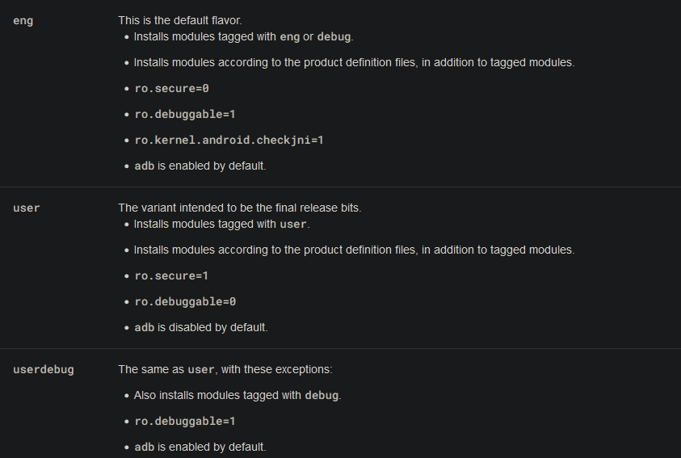

# Android AVD以及Kernel调试问题手册

# Android AVD调试问题

在部分版本的Android AVD中, `adb jdwp`命令以及Android Studio调试器无法无条件调试所有进程, 即使`/system/build.prop`文件中的ro.debuggable属性其值为”1”, 调试器依然无法对所有进程进行调试. 该问题是由于部分AVD是以userdebug而非eng进行编译的.

https://source.android.com/docs/setup/create/new-device

根据官方文档描述, eng与userdebug的部分构建配置不同, userdebug虽然将ro.debuggable值置为1, 但实际上其ro.secure值(在某些AVD设备内)不为0, 此时需要手动修改build.prop文件, 使系统处于eng构建状态, 具体操作如下:

- 修改ro.build.type值为”eng”
- 修改ro.secure值为0
- 修改ro.debuggable值为1

随后将修改后的build.prop推送回/system/build.prop, 重启AVD, 随后可以调试设备内的所有进程

# Android Kernel调试问题

## vmlinux抽取

当对Android AVD Kernel进行调试时, 需要抽取内核中的vmlinux进行静态分析, 在真实设备上, vmlinux可以从/dev目录中读取出的boot.img中进行抽取, 但AVD的内核文件大多被编译为`kernel-ranchu`文件, 该文件实际上可以看作Linux的bzImage文件. 2021年以前的AVD内核文件, 例如API26, 压缩在kernel-ranchu中的vmlinux其压缩方式为gzip, 可以通过binwalk得到ranchu中gzip压缩的魔法值偏移, 随后使用dd命令提取出ranchu中的gzip文件, 再使用gunzip进行解压, 解压后的文件即为vmlinux二进制文件, 该文件为elf格式, 存储内核中的所有二进制代码. 在2021年之后的AVD编译内核中, 压缩算法改为lz4, 可以使用Google指定的最新的extract-vmlinux脚本进行解压.

https://android.googlesource.com/kernel/common/+/refs/heads/android-mainline/scripts/extract-vmlinux

如果要对vmlinux进行patch, 则需要将vmlinux重新压缩回bzImage, 以下脚本可能有用, 暂未验证

[https://github.com/Caesurus/CTF_Writeups/blob/main/2024-04-zImageKernelPatch/scripts/zImage_repacker.py](https://github.com/Caesurus/CTF_Writeups/blob/main/2024-04-zImageKernelPatch/scripts/zImage_repacker.py)

## Kernel调试

由于暂未有需求对vmlinux进行patch, 但直接进行调试仍可以做到. 可以使用GDB对AVD进行调试, Android AVD指定的emulator.exe可以携带-qemu来指定调试参数, 例如-qemu -s -S可以在本地1234端口开启监听, 并在启动时等待GDB进行附加.

使用GDB对内核进行调试时, 如果要使用nexti或者stepi指令, 亦或者通过设置断点以在想要调试的地址/指令处挂住GDB, 就必须手动编译内核, 并开启KGDB配置, 但通常情况下笔者的设备没有编译内核的条件和时间, 故此只能直接使用GDB来附加到没有KGDB配置的AVD内核, 这也意味着此方法没有直接在任意位置挂住GDB的能力.

但即使没有开启KGDB, 直接使用GDB进行附加也可以对内存进行读写, 这包括修改指定的指令信息, 可以利用这一点进行间接的调试, 例如在地址0x1234处存在指令`mov rax, rbx`, 若想要查看rbx的值, 可以通过命令`set *(0x1234+1)=0xcc`设置mov指令的下一条指令为int3(这里假设mov指令的长度为1,具体情况下需要计算真实的指令偏移), 这将使得内核在执行至0x1234处后产生kernel panic, qemu将打印当前堆栈以及寄存器信息, 此时可以得到rbx的内容, 但这种”调试”方法的缺点显而易见, 每次只能进行一次”调试”, 一旦产生kernel panic, 就必须重启设备.

这是笔者使用此方法进行调试时GDB产生的部分数据, 并记录下的笔记, 可以看见kernel panic输出的数据是很全面的.

此外, 使用该方案进行调试时, 需要静态分析vmlinux来确定需要调试的指令, 以及指令对应的地址, 为了方便调试, 需要关闭内核地址布局随机化保护, 使用qemu参数-append nokaslr即可关闭保护. 通过`echo 0>/proc/sys/kernel/kptr_restrict`可以开启内核符号的地址映射, 随后在/proc/kallsyms文件内可以看到无随机化地址的符号与地址信息, 这些信息可以配合IDA分析vmlinux, 并根据需要修改内存中的指令.

若要获取指令的二进制形式, 可以使用该在线工具:[https://shell-storm.org/online/Online-Assembler-and-Disassembler/](https://shell-storm.org/online/Online-Assembler-and-Disassembler/)

//20241001更新

若只进行简单调试, 而不涉及大规模的逻辑修改, 可以直接使用kprobe进行内核插桩, 更复杂的需求或许可以配合kprobe与qemu gdb调试来进行.