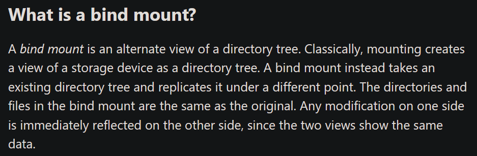

# Android Apex挂载/Patch方案

## 绑定挂载

绑定挂载(Bind mount)可以将指定目录挂载到目标目录上, 使得目标目录共享与指定目录相同的文件节点(inode), 关于绑定挂载的使用, 请查看man7文档: https://man7.org/linux/man-pages/man8/mount.8.html

例如: `mount --bind spefic_folder target_folder` 该命令会将spefic_folder挂载到target_folder上, 当访问target_folder时, 实际上在访问spefic_folder



[https://unix.stackexchange.com/questions/198590/what-is-a-bind-mount](https://unix.stackexchange.com/questions/198590/what-is-a-bind-mount)

## Android Apex

Apex是Android10引入的系统模块安装流程, 系统可以通过该安装流程安装或更新不适用于通用Apk应用模型的系统模块, 例如ART虚拟机, HAL相关的模块. apexd二进制文件是该安装流程的管理程序. 目录`/system/apex`存储着压缩后的capex预置系统模块, 这些模块中的`original_apex`文件将被解压至`/data/apex/decompressed`目录, 随后, 其中的`apex_payload.img`将被挂载至`/apex`目录下, 其中的关键so库文件例如 `libart.so` 也将被挂载至该目录下.

参考链接: [https://source.android.com/docs/core/ota/apex](https://source.android.com/docs/core/ota/apex)

正常情况下, 如果想要更新客制化的libart.so或其它内核文件, 需要自己编译art虚拟机为apex文件, 随后使用adb install命令进行安装, 但经过实验, apexd会校验文件与系统签名, 故此需要对apexd的相应位置进行patch, 绕过校验流程才能进行更新/安装. 或者直接覆盖/system/apex文件下的预置apex文件后重启也可以更新系统模块.

## 无法编译Apex的情况

该情况下的需求是直接对apex目录进行读写, 但实际上/apex目录为只读状态, 故此需要使用绑定挂载策略将精心构造的目录挂载到apex目录下以实现内核文件的更新.

例如以下命令:

```jsx
mount --bind /data/local/tmp/lib64 /apex/com.android.art/lib64/
```

该操作会将tmp/lib64目录挂载到com.android.art模块内的lib64目录下, 正常情况下该apex目录无法进行写操作, 但该操作之后, 系统内的其它模块访问该模块的so库文件时, 会到tmp/lib64目录下寻找so库文件, 这种方案间接地”劫持”了apex目录. 当然, 该方案需要使用 `setenforce 0` 目录来关闭selinux, 否则系统无法开机.

著名Hook框架Magisk也使用了绑定挂载策略来”劫持”系统, 实现非侵入式的系统文件修改.

参考:[https://topjohnwu.github.io/Magisk/details.html](https://topjohnwu.github.io/Magisk/details.html)

写毕于**20240703**