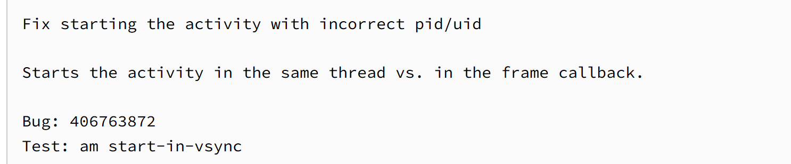
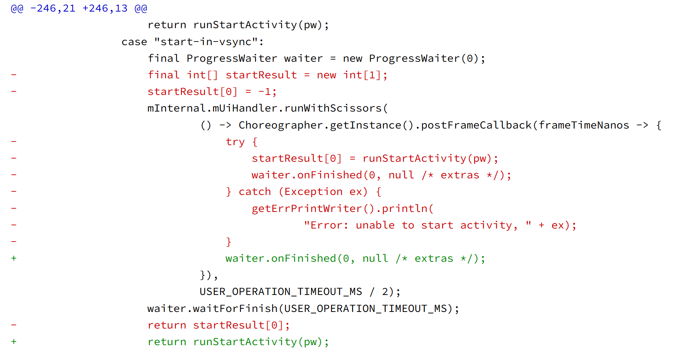
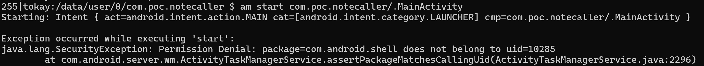
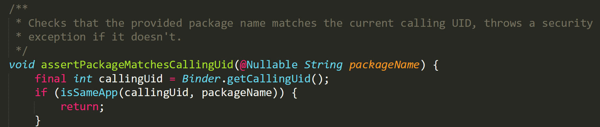
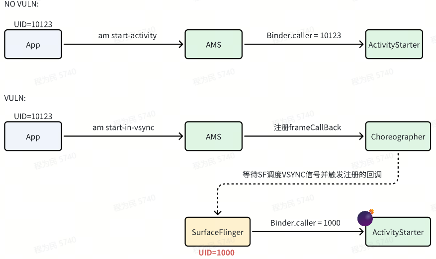
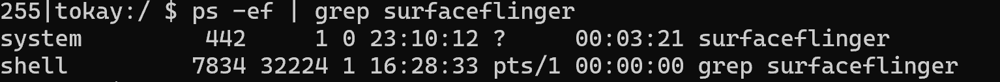
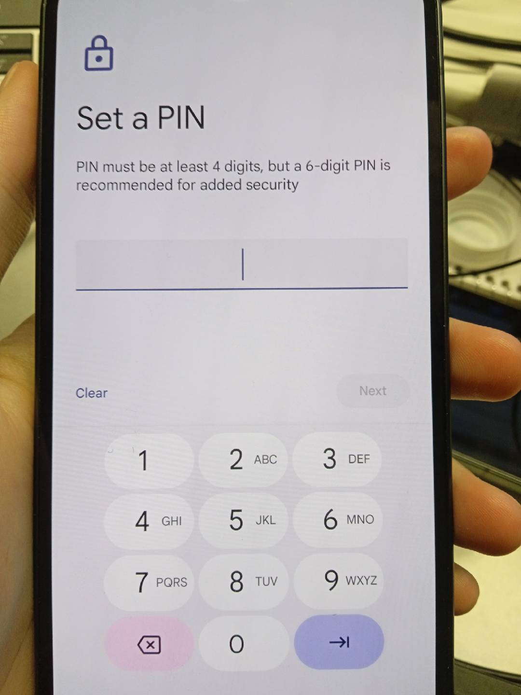

# 背景  
  
注意到一条漏洞线索，并提出在普通权限App中进行利用的假设（**实际测试确实可以进行利用**）。谷歌在9月份公开的漏洞列表中，CVE-2025-32324可以利用“am start-in-vsync”命令来启动任意Activity（尤其是高权限的未导出Activity），达成LaunchAnyWhere。  
原文如下：https://mp.weixin.qq.com/s/N4GXA6DcXB8RR\_KsZX6Wug  
但原文分析有严重错误，文章将漏洞归因于异步执行导致异常未被正确抛出的条件竞争漏洞，**归因过程相当迷惑且和真正的漏洞原因八竿子打不着**，显然是大模型幻觉。  
  
# 漏洞细节  
  
## 分析  
  
https://android.googlesource.com/platform/frameworks/base/+/0fb2788dac393086b7e53fbe05414368ae395d9b%5E%21/#F0  
  
  
观察diff代码以及commit描述，指出该补丁是为了修复启动Activity时携带的错误PID/UID，随后补丁把runStartActivity放在了frameCallBack之外。实际上runStartActivity的传参并不会主动携带进程信息，无论在哪个线程启动活动，传入参数都是一致的，这证明导致PID/UID错误的根因**与线程本身无关**，结合ActivityStarter#executeRequest启动活动时的鉴权细节，那么真正的漏洞原因就非常明显了：**传参不携带进程信息，但Binder携带！** 接下来我们来验证这一点。  
  
  
利用run-as切换身份为任意一个普通的App，随后通过“am start”命令启动一个属于该App的活动，直觉告诉你，通常情况下一定会启动成功对吧，但am会尝试以com.android.shell启动目标活动，接着在assertPackageMatchesCallingUid内断言调用者与com.android.shell是否一致，在判断未通过时抛出“package=com.android.shell does not belong to uid=10285”，那么系统是如何在传参不携带进程信息的情况下知道调用者UID是10285的？答案是Binder.getCallingPid/Uid接口，App通过Binder尝试与系统通讯的过程本身就携带了进程信息。好吧，道理都懂，那么这与补丁将runStartActivity移出frameCallBack线程有任何关系吗？  
   
  
  
请注意，“start-in-vsync”子命令以及该命令的帮助信息告诉我们，该命令会尝试将Activity启动与下一次VSYNC信号的触发进行同步，此时你已经注意到了这一点，并发现了frameCallBack线程由Choreographer进行托管！一切迎刃而解，重点并非frameCallBack线程，**而是VSYNC信号如何被****SurfaceFlinger****调度并触发Choreographer执行frameCallBack线程的**！请看下图：  
暂时无法在飞书文档外展示此内容  
  
显然，SurfaceFlinger的UID=1000，因此通过该子命令可以UID=1000的身份启动任意活动（可带参数）。进一步利用，像某神秘砍价软件那样将自己提权为UID=1000指日可待。  
  
## POC  
  
普通App可以通过漏洞直接启动系统密码重置页。而通常情况下该页面无法启动，即便adb shell（UID=2000）权限也无法启动。  
  
   
