# 深度学习

## 微积分

### 微分与偏导

**一元函数** $$y = f(x) $$  

| 概念 | 符号 | 定义 | 结果类型 |
| --- | --- | --- | --- |
| **导数** | $$f'(x) $$ 或 $$\frac{dy}{dx} $$ | $$\displaystyle\lim\_{\Delta x \to 0}\frac{f(x+\Delta x)-f(x)}{\Delta x} $$ | 函数/数值 |
| **微分** | $$dy $$ | $$dy = f'(x)dx $$ | 无穷小量（含 $$dx $$） |
| **自变量微分** | $$dx $$ | 任意给定的无穷小量 | 无穷小量 |

关系： $$\frac{dy}{dx} = f'(x) \Leftrightarrow dy = f'(x)dx $$  
<br>  

**多元函数** $$z = f(x, y) $$  

| 概念 | 符号 | 定义 | 几何意义 |
| --- | --- | --- | --- |
| **偏导数** | $$\frac{\partial f}{\partial x} $$ | $$\displaystyle\lim\_{\Delta x \to 0}\frac{f(x+\Delta x,y)-f(x,y)}{\Delta x} $$ | 沿 $$x $$ 方向切线斜率 |
| **偏导数** | $$\frac{\partial f}{\partial y} $$ | $$\displaystyle\lim\_{\Delta y \to 0}\frac{f(x,y+\Delta y)-f(x,y)}{\Delta y} $$ | 沿 $$y $$ 方向切线斜率 |
| **全微分** | $$df $$ 或 $$dz $$ | $$df = \frac{\partial f}{\partial x}dx + \frac{\partial f}{\partial y}dy $$ | 切平面上的增量 |

区分  

| 误区 | 纠正 |
| --- | --- |
| 导数 = 微分 | **否**。导数是变化率，微分是增量 |
| 偏微分 = 偏导数 | **否**。偏导数是斜率，"偏微分"非标准术语 |
| $$dx $$ 是算出来的 | **否**。 $$dx $$是自变量，人为给定 |
| $$f(x)dx $$ 是微分 | **否**。 $$f(x)dx $$是积分元， $$f'(x)dx $$才是微分 |

### **梯度场与梯度下降**

| 概念 | 符号 | 定义 | 几何意义 |
| --- | --- | --- | --- |
| **梯度** | $$\nabla f $$ 或 $$\text{grad } f $$ | $$\nabla f = \left( \frac{\partial f}{\partial x\_1}, \frac{\partial f}{\partial x\_2}, \dots, \frac{\partial f}{\partial x\_n} \right)^\top $$ | 指向函数值增长最快的方向，其大小（模长）为该方向的最大变化率。 |\
||
| **梯度场** | $$\mathbf{F} = \nabla f $$ | $$\mathbf{F}(\mathbf{x}) = \left\langle \frac{\partial f}{\partial x}, \frac{\partial f}{\partial y}, \dots \right\rangle $$ | 在定义域内每一点分配一个梯度向量，形成的矢量簇地图，描述整体坡度分布。 |
| **正交性** | $$\nabla f \perp \text{Level Set} $$ | $$\nabla f \cdot d\mathbf{r} = 0 $$ （其中 $$d\mathbf{r} $$ 为等高线切向） | 梯度向量处处垂直于等高线或等值面；即从一处海拔跨越到另一处海拔的最短捷径。 |\
|||

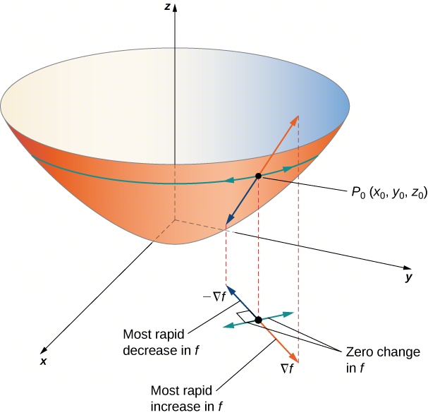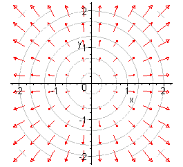  

<br>  

**反向传播**  
以2层，每层单个神经元为例  
第 0 步：前向传播结束  
在求导前，必须锁定这些中间变量的值：  

- $$z\_1 = w\_1 x + b\_1 $$  
	
- $$a\_1 = \sigma(z\_1) $$  
	
- $$z\_2 = w\_2 a\_1 + b\_2 $$  
	
- $$a\_2 = \sigma(z\_2) $$  
	
- $$L = \frac{1}{2}(a\_2 - y)^2 $$  
	

第 1 步：输出层（第 2 层）误差项计算  
计算 $$L $$ 对输出层“源头” $$z\_2 $$ 的总偏导（记为 $$\delta\_2 $$）：  
$$\delta\_2 = \frac{\partial L}{\partial a\_2} \cdot \frac{\partial a\_2}{\partial z\_2} = (a\_2 - y) \cdot \sigma'(z\_2) $$  
<br>  

第 2 步：输出层（第 2 层）参数梯度提取  
利用 $$\delta\_2 $$ 算出该层 $$w $$ 和 $$b $$ 的分量：  

- $$\frac{\partial L}{\partial w\_2} = \delta\_2 \cdot a\_1 $$  
	
- $$\frac{\partial L}{\partial b\_2} = \delta\_2 \cdot 1 $$  
	

<br>  

第 3 步：隐藏层（第 1 层）误差项计算  
利用链式法则穿过第 2 层，计算 $$L $$ 对 $$z\_1 $$ 的总偏导（记为 $$\delta\_1 $$）：  
$$\delta\_1 = \underbrace{\delta\_2}\_{\text{后层误差}} \cdot \underbrace{w\_2}\_{\text{层间权重}} \cdot \underbrace{\sigma'(z\_1)}\_{\text{本层激活导数}} $$  
<br>  

第 4 步：隐藏层（第 1 层）参数梯度提取  
利用 $$\delta\_1 $$ 算出该层 $$w $$ 和 $$b $$ 的分量：  

- $$\frac{\partial L}{\partial w\_1} = \delta\_1 \cdot x $$  
	
- $$\frac{\partial L}{\partial b\_1} = \delta\_1 \cdot 1 $$  
	

<br>  

第 5 步：参数执行更新（梯度下降）  
将上述算出的四个梯度分量代入更新公式：  

- $$w\_2 \leftarrow w\_2 - \eta \cdot \frac{\partial L}{\partial w\_2} $$  
	
- $$b\_2 \leftarrow b\_2 - \eta \cdot \frac{\partial L}{\partial b\_2} $$  
	
- $$w\_1 \leftarrow w\_1 - \eta \cdot \frac{\partial L}{\partial w\_1} $$  
	
- $$b\_1 \leftarrow b\_1 - \eta \cdot \frac{\partial L}{\partial b\_1} $$  
	

<br>  

公式展开  
$$\frac{\partial L}{\partial w\_1} = \underbrace{(a\_2 - y)}\_{\text{L 对 a2}} \cdot \underbrace{\sigma'(z\_2)}\_{\text{a2 对 z2}} \cdot \underbrace{w\_2}\_{\text{z2 对 a1}} \cdot \underbrace{\sigma'(z\_1)}\_{\text{a1 对 z1}} \cdot \underbrace{x}\_{\text{z1 对 w1}} $$  
<br>  

## 机器学习

### 神经网络与深度学习

> 本小节旨在全局性地了解机器学习，提前抛出一些概念，引入后续的学习  

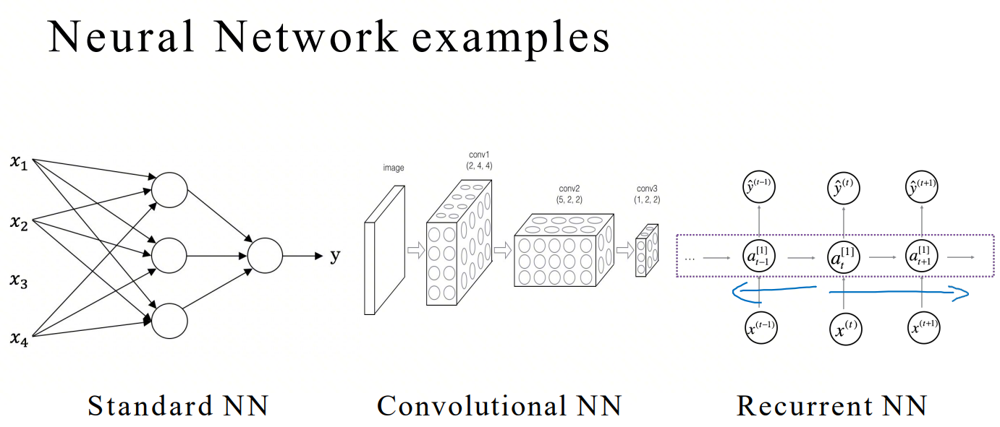  
几个基本的神经网络类型，SNN是最基础的神经网络类型，其中RNN与LLM关系最为密切，Transformer作为LLM最重要的基座，它抛弃了RNN的递归循环逻辑，转而采用了CNN的大规模并行计算范式。但如果要快速了解LLM原理，针对RNN内自回归概念的学习需要占一些比重，针对Transformer的学习则必不可少。  
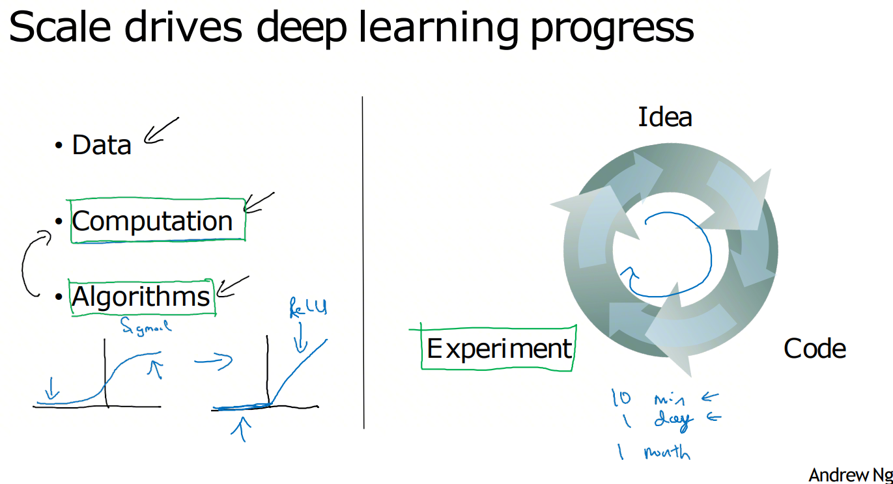  
目前的深度学习领域（包括LLM）广泛采用的激活函数为ReLU及其变体，虽然Sigmoid函数在早期神经网络中占据优势，并曾被认为是模拟人脑神经元的最佳函数（平滑可导，缓慢激活），但随着神经网络的发展，Sigmoid的弊端逐渐显露，其中一个最直观的原因就是它在反向传播中存在严重的梯度消失问题。  
可以想象如果训练过程需要从损失纠正隐藏层的权重和偏置项，就需要从后向前传播对损失函数某个自变量的偏导，问题在于如果选用Sigmoid为激活函数，根据其导数公式 $$\sigma'(x)=\sigma(x)(1-\sigma(x)) $$ 可知其结果的最大值仅为0.25，那么即使网络处于理想情况，最终逐层传播的偏导数结果每经过一层就要至少衰减75%，而在最糟糕情况，每层的入参会趋近于图像的两侧饱和区（接近0或者1），那么偏导结果会迅速趋近于0，无论何种情况，仅需传递数层，梯度就会基本消失，使得整个神经网络的权重更新完全停滞。  

### 线性回归与逻辑回归

> 本节旨在通过两种回归模式引出线性变换以及激活函数的用法，它们是神经元的基本单位  

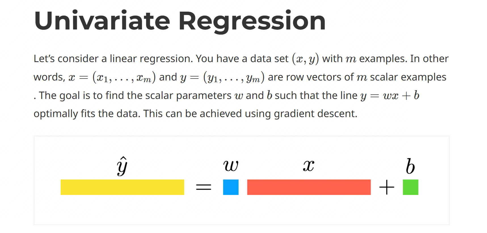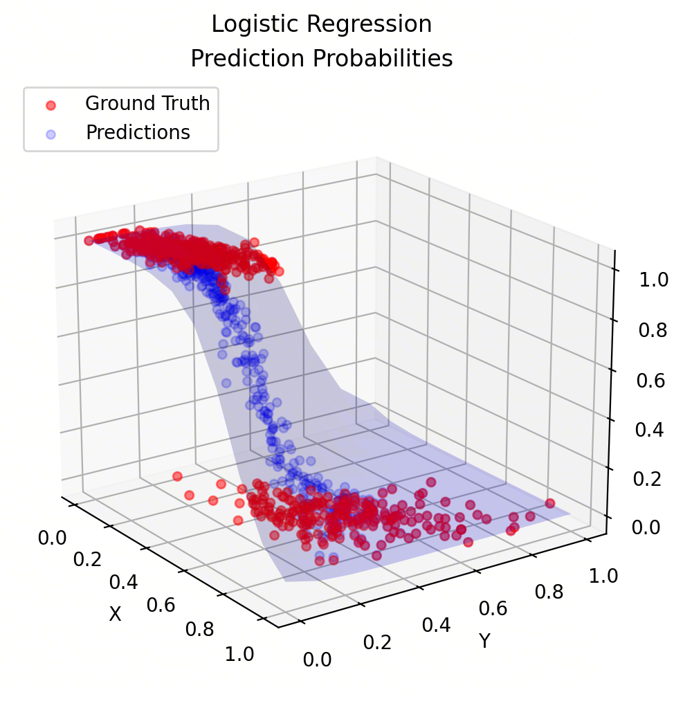  

在早期的机器学习中，为了拟合一片连续的数据，通常会使用到这样一个简单的线性回归模型尝试对后续数据进行预测，其公式为 $$\hat{y}=wx^{T}+b $$，而后为了对样本集进行二分类或概率预测，产生了逻辑回归，其二分类模型同样基于该线性变换得来，公式为 $$\hat{y}=\sigma(wx+b)=\frac{1}{1+e^{-(wx+b)}} $$，通过控制线性变换，Sigmoid函数会将任意输入映射到(0,1)区间，从而预测样本为正样本或者负样本的概率。  
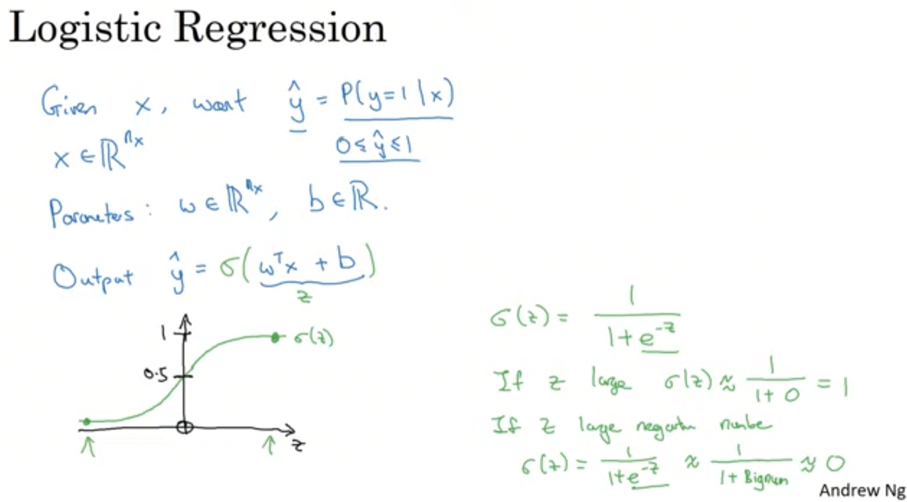  
吴恩达的课件则对逻辑回归进行了更加形象的描述，想象你拥有一批样本集，在线性回归模型根本无法进行二分类的情况下，你转而采用了逻辑回归，并对样本集的所有特征进行了正负打标，使用Sigmoid函数对所有样本特征进行“解释”，理由之一是函数图像的两侧趋近于0或1，这很好地区分开了所有正负样本（可以看到课件右下角对函数性质的描述），其次，通过控制线性变换中的权重w与偏置b，则可以控制函数图像中间平滑部分的“斜率”，“方向”，或者对图像整体进行水平位移，这可以进一步切割正负样本，使每个样本点在函数上的映射都可以表达为该特征是正或负的概率，这样一来，你的目标就是尝试通过学习来不断调整线性变换，并最终拟合样本集，显然这很符合数学直觉。  

### 前向传播与反向传播

> 在了解单个神经元的结构后，我们需要在本节引出如何“组装/使用”神经元，形成可训练可运行的网络  

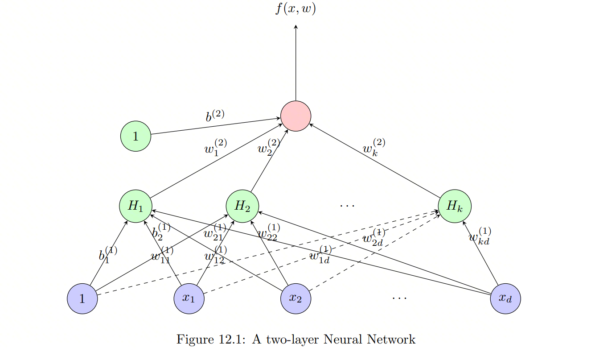  
**前向传播算法**  
$$\begin{aligned} &\text{Forward Pass}(\text{Weights List}, X\_1 = \text{Function Input}): \\ &\quad \text{for } i = 2 \text{ to } m: \\ &\quad \quad X\_i = W\_{i-1, i} \cdot X\_{i-1} \\ &\quad \text{return } X\_m \end{aligned} $$  
**隐藏层计算** $$H\_i = g \left( \[w\_i^{(1)}\]^T x + b\_i^{(1)} \right) $$  
**输出层结果** $$f(x, w) = g \left( \[w^{(2)}\]^T H + b^{(2)} \right) $$  

印度理工大学的CS217对前向传播进行了形象的描述，假设有一个已经训练好的神经网络，并且所有神经元都有恰当的权重与偏置，它们在理论上已经可以使输出函数逼近理想的目标函数，那么向该网络提供一些输入层入参就可以启动前向传播过程。首先隐藏层将取出上一层提供的结果向量，与本层的权重以及偏置进行加权求和，并使用激活函数进行非线性转化得到本层的结果向量，如此往复直至输出层最后进行一次加权求和以及激活函数计算，得到最终的结果（例如分类或者预测）。  
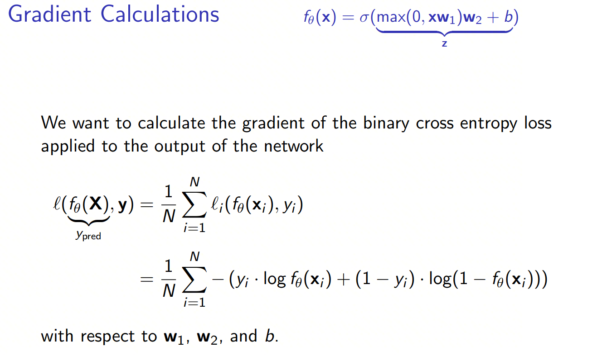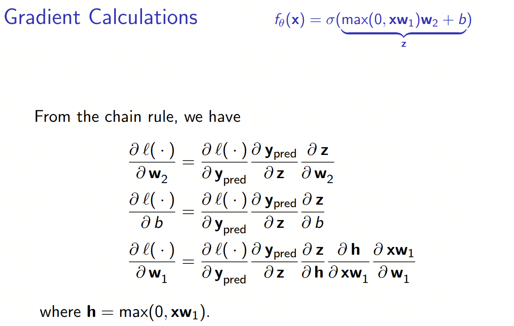  

既然目前我们已经了解了前向传播以及机器学习的基础内容，那么就必定会引出一个问题，权重以及偏置到底该如何调整才能让输出函数尽可能逼近目标。我们显然不可能对多层神经元逐个手动调参，再执行前向传播反复观察拟合效果。一方面，人脑无法在高维张量中精确评估单个神经元权重对最终预测结果的具体影响，另一方面，即便只对某个神经元的权重做微小调整，也可能彻底改变整个网络的预测函数。正因如此，反向传播技术才如此重要，它是模型训练时的绝不可缺少的核心步骤。  
以上两份课件来自CS231n的反向传播讲解，课件假设了一个两层神经网络，其预测函数为 $$f\_\theta(x) $$，损失函数为经典的交叉熵函数 $$\ell(P,Q) $$，而模型训练的目标就是要让 $$\ell(f\_\theta(X),y) $$得出的损失尽可能小（或者说在这个评价体系下尽可能拟合理想情况），那么在数学直觉上，如果要让预测结果 $$f\_\theta $$尽可能落入损失函数的底部最小值，实际上就是在尝试通过 $$\frac{\partial\ell}{\partial f\_\theta} $$评估损失函数特定位置的切面的变化率，以一种“可量化”的方式不断调整 $$f\_\theta $$最终使得损失逼近最小值。  
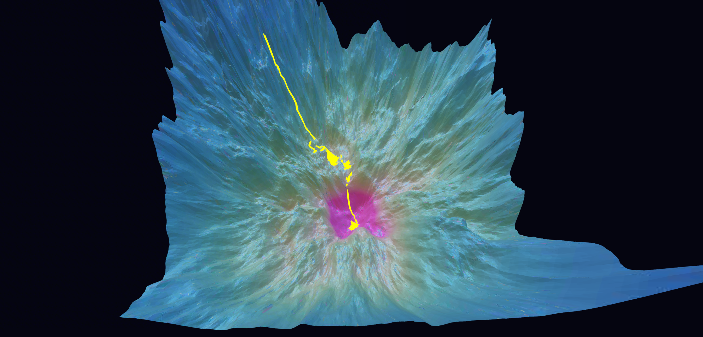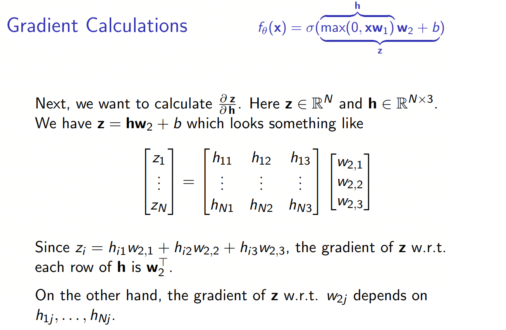  

我们将反向传播过程进行简化，并让交叉熵损失函数可以在三维空间中表示，假定在某一轮训练中，预测值 $$f\_\theta $$落入空间中的随机位置，那么，通过损失函数偏微分结果不断调整预测函数入参，并逼近谷底最小值的过程就是梯度下降，如上图的黄色轨迹很直观地展示了这一过程。新的问题在于，该简化模型将预测函数本身视作一个可直接调整的值，但实际情况下 $$f\_\theta $$的影响因素取决于函数展开后的所有神经元权重与偏置的总结果，因此我们实际上需要在每一轮反向传播中一次性微调所有神经元的权重与偏置，当然，直接对交叉熵复合函数的指定权重或偏置求导是非常困难的，但链式法则极大地化简了这一过程，它将复杂的求导过程从全局逐渐“缩放”到局部（例如对指定权重 $$w $$求导： $$\frac{\partial \ell}{\partial w} = \frac{\partial \ell}{\partial f} \cdot \frac{\partial f}{\partial z} \cdot \frac{\partial z}{\partial w} $$），从复杂的复合函数内抽离出特定权重或偏置的偏导以量化调整幅度，使得每一轮对逐层神经元进行微调是可行的，由于权重以及偏置的微调均依赖上一层神经元的求导结果，这个过程才被形象地称为“反向传播”。  

### 大规模向量计算

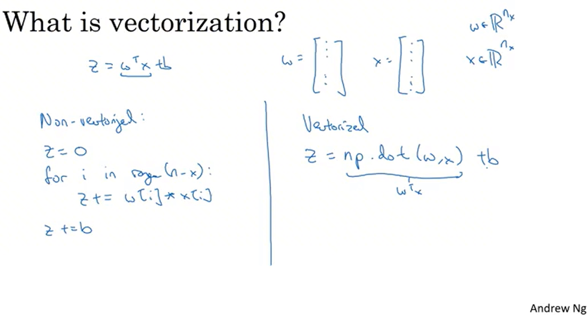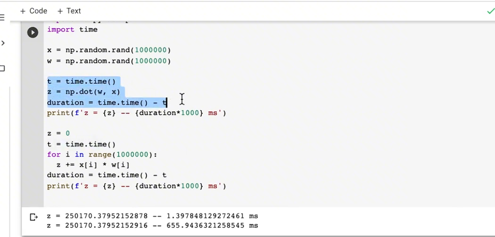  

吴恩达提到，大规模向量计算是机器学习中不可避免的部分，拥有快速计算的能力则对整个神经网络的运行与训练速度起到关键作用。其课件举了两个例子，假设有两个一百万分量的向量要计算点积，其一是利用循环逐步计算并装载计算结果，另一种是直接调用Numpy库的点积函数，结果显而易见，前者大约花费了数百毫秒，而后者仅仅使用了1毫秒左右的时间。但吴恩达没有进一步解释Numpy究竟使用了什么“魔法”来加速计算，因此以下内容为额外补充。  
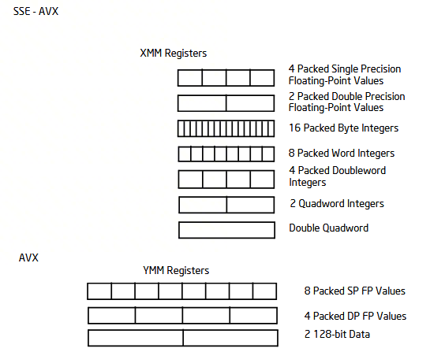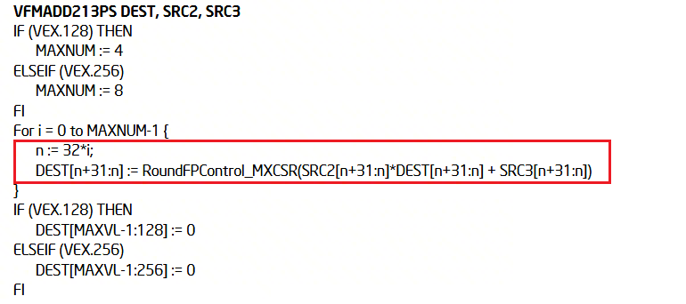  

事实上，Numpy之所以能实现大规模向量的高速计算，主要得益于现代CPU/GPU对SIMD（单指令，多数据操作）并行计算范式的支持。具体到x86平台（为了易于理解），Intel CPU实现的AVX指令集拓展引入了支持256位宽的SIMD寄存器YMM，根据Intel架构文档，相对于通用寄存器，YMM寄存器能够一次性容纳8个单精度浮点数；以拓展指令VFMADD213PS为例，根据架构文档中有关该指令的伪代码实现，操作位宽为256的情况下（VEX.256前缀编码被匹配）指令会并行处理8组每组32位宽长度的数据，这意味着CPU可以在单次指令执行内同时进行8组单精度浮点数的融合乘加运算。因此相比于通用寄存器逐个装载，逐个计算的方式，SIMD 指令一次性并行计算8个分量的效率显著更高；再结合CPU超标量架构（每时钟周期可发射多条 SIMD 指令），整体计算速度会大幅提升。  
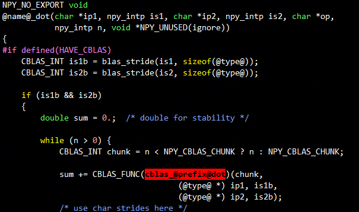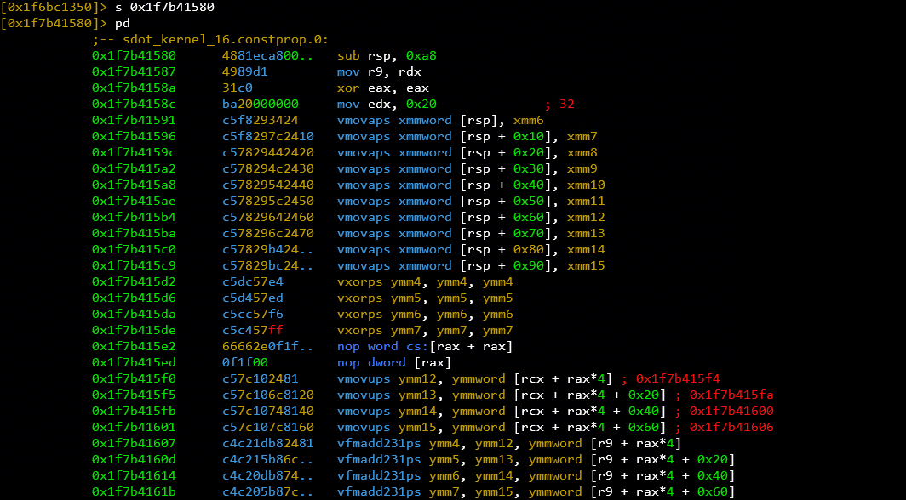  

再具体一些，以Numpy的点积函数dot为例，其内部的核心计算逻辑并非由纯Python实现，而是派发至C++层的BLAS库接口，假定Numpy根据编译环境绑定实现到OpenBLAS计算库，根据arraytypes.c.src模板内@name@\_dot接口的派发逻辑，多维数组的点积计算最终会调用以cblas\_为前缀的BLAS标准函数（如单精度点积对应cblas\_sdot）。其内部的sdot\_kernel内核函数会针对不同CPU指令集（SSE/AVX/AVX2）优化，大量使用 SIMD 指令并行计算，这是Numpy dot函数实现高速计算的核心原因之一。同时，Numpy会根据当前设备的指令集支持，自适应选择最优的 SIMD 指令实现，而非仅局限于Intel的SIMD支持。  

# LLM原理

## 循环神经网络

### 归一化与Softmax回归

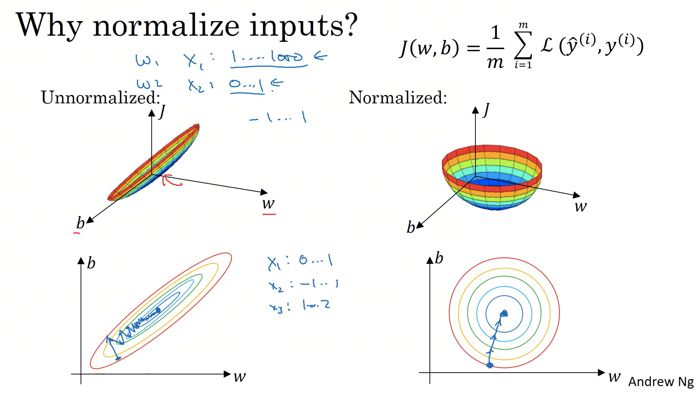  
Softmax函数是深度学习中典型的多分类概率预测函数，它能将输出映射为满足概率空间约束的归一化概率。不过，要理解模型训练的稳定性，我们需要先了解输入特征归一化的意义，以及归一化本身的数学动机。吴恩达首先例举了带有两个特征的向量 $$X $$，规定其特征分量 $$X\_1 $$的样本分布范围很广，例如为0~1000，分量 $$X\_2 $$的样本分布范围则很窄，例如0~1，那么在这类非归一化样本上套用代价函数时，其函数的三维图像会变得非常“狭窄”，这将导致函数梯度场变得“难以”处理，每次反向传播都必须设置一个极其小的学习率来防止震荡或无法收敛的情况发生，并且需要更多的迭代步骤才有可能最终找到最小值，总的来说，如果使用非归一化的样本，模型的训练效率会大幅降低。  
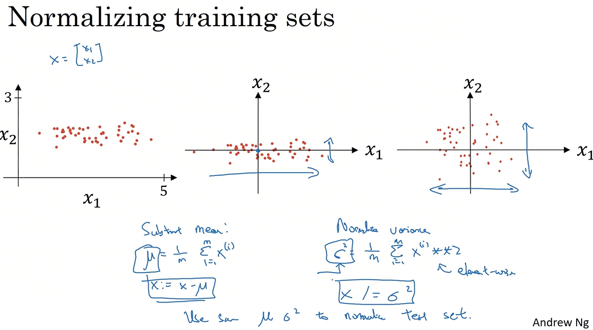  
<br>  

# 参考资料

从零构建GPT https://www.youtube.com/watch?v=kCc8FmEb1nY  
在线的Transformer演示模型 https://poloclub.github.io/transformer-explainer/  
D2L书籍 https://zh.d2l.ai/chapter\_introduction/index.html  
深度学习课件 https://github.com/yuneming/DeepLearningTutorial  
CS230 https://cs230.stanford.edu/syllabus/  
CS109 https://web.stanford.edu/class/archive/cs/cs109/cs109.1264/handouts/syllabus.html  
CS230笔记 https://github.com/fengdu78/deeplearning\_ai\_books  
多元微积分 https://math.etsu.edu/multicalc/prealpha  
Shervine的课件 https://stanford.edu/~shervine/  
神经网络可视化  

- https://www.deeplearning.ai/ai-notes/optimization/index.html  
	
- https://github.com/danielkunin/Deeplearning-Visualizations  
	
- 损失函数下降可视化 https://losslandscape.com/explorer  
	

印度理工大学 CS217 https://www.cse.iitb.ac.in/~swaprava/courses/cs217/scribes/CS217\_2024\_lec12.pdf  
CS231n BackProp https://cs231n.stanford.edu/slides/2025/section\_2.pdf  
<br>  

LLM学习路线 20260220  

```C++
既然你拥有扎实的数学和底层加速基础，我为你剔除了所有重复、琐碎以及过时的内容，直接提取出从底层神经网络跨越到**大语言模型（LLM）**的核心路径。
你可以按照这个清单线性学习。如果遇到某个公式看不懂，再根据我标注的“依赖知识点”去倒查上下文。
第一阶段：通用深度学习补完（LLM 的底层组件）
这部分内容虽然在图像课里，但它们是 LLM 训练和输出的核心数学工具。
CS230 2.8 - Adam 优化算法
核心内容：理解动量（Momentum）和自适应学习率。
为什么必学：LLM 几乎全部使用 Adam 或其变体 AdamW。
CS230 3.8 - 3.9 Softmax 回归与损失函数
核心内容：如何将向量转化为概率分布，以及交叉熵（Cross-Entropy）的计算。
为什么必学：LLM 预测下一个词本质上就是一个“数万分类”的 Softmax 任务。
CS230 3.4 - 3.6 Batch Normalization
核心内容：理解为什么对神经元输出进行“归一化”能加速收敛。
为什么必学：它是 Transformer 中 Layer Norm 的前置理解基础。
第二阶段：从序列到语言模型（LLM 的自回归逻辑）
这一阶段你会从“处理一张图”转变为“处理一串词”。
CS230 第五门课 1.6 - 1.7 语言模型与序列生成
核心内容：理解如何利用前 $n$ 个词预测第 $n+1$ 个词。
为什么必学：这是 GPT（Generative Pre-trained Transformer）中 "G" 的由来。
CS230 第五门课 1.8 - 1.10 RNN 的缺陷与门控机制 (GRU/LSTM)
核心内容：理解梯度消失如何导致模型“失忆”。
为什么必学：理解了 RNN 的失败，你才能明白 Transformer 为什么要用 Attention 彻底颠覆结构。
第三阶段：大模型核心架构（LLM 的真正灵魂）
从这里开始，你将接触现代 LLM 的真实构造。
CS224N Week 1 - Word Vectors (Word2Vec)
核心内容：理解 Embedding 矩阵，看语义如何被压缩成向量。
为什么必学：这是 LLM 的输入层。
CS224N Week 4 - Transformers (Attention is All You Need)
核心内容：全清单最重要一节。自注意力（Self-Attention）、多头注意力（Multi-Head Attention）。
为什么必学：这是目前所有大模型的“发动机”。
CS224N Week 5 - Pretraining & Post-training (RLHF/DPO)
核心内容：模型是如何从“海量阅读”到“学会听话”的转化过程。
为什么必学：解释了为什么对话模型（如 ChatGPT）比原始模型聪明。
第四阶段：工业界落地（LLM 的工程实践）
利用你对大规模向量计算的兴趣，看模型是如何在硬件上跑起来的。
CS224N Week 6 - Efficient Training (LoRA/ZeRO)
核心内容：低秩适配（LoRA）和显存优化技术。
为什么必学：如果你想在自己的显卡上微调一个模型，这是必经之路。
建议的学习逻辑：
先看 1-3：把工具箱准备好。
再看 4-5：搞清楚我们要解决什么问题（预测下一个词）。
重学 6-8：掌握现代大模型的终极解决方案。
扫读 9：了解如何把这些数学公式变成高效的代码和显存占用。
```

<br>  

学习路线建议  

```Java
针对你想要**“理解 LLM 预测下一个文本背后的原理”**这个目标，这份长目录可以被精简为一张“藏宝图”。
以下是为你划定的必看（核心原理）、**扫读（基础工具）和直接跳过（无关内容）**的内容清单：
第一阶段：必看的底层逻辑（建议用 1-2 小时扫读）
第一门课：神经网络和深度学习
这部分是为了让你明白：AI 所谓的“思考”其实就是矩阵乘法和概率筛选。
第一周： 1.2（什么是神经网络）。
第二周： 2.11（向量化）。LLM 跑得快全靠向量化，理解这个才能理解为什么需要 GPU。
第三周： 3.6、3.7（激活函数）。明白 AI 怎么处理非逻辑关系的。
第四周： 4.1、4.5（深层神经网络）。理解“深层”意味着更强的理解力。
第二阶段：LLM 预测机制的起点（必看核心）
第五门课：序列模型（这是你的重灾区，请精读）
这是最直接回答“LLM 怎么预测下一个词”的部分。
第一周：核心中的核心
1.1、1.2（为什么选择序列模型和数学符号）。
1.3（RNN 模型）。虽然 LLM 现在不用 RNN，但它是“逐字处理”逻辑的鼻祖。
1.6、1.7（语言模型和序列生成、采样）。**【极重要】**这就是在解释 GPT 怎么一个字一个字往外蹦的。
1.10（LSTM）。了解它是如何比普通神经网络“记性更好”的。
第二周：解决“不识字”的问题
2.1、2.2、2.4（词表征、词嵌入、嵌入矩阵）。**【极重要】**解释了电脑如何把“猫”变成一组坐标。
2.6（Word2Vec）。理解词与词之间的数学关系。
第三周：现代 LLM 的心脏
3.7、3.8（注意力模型直观理解与模型）。**【绝对核心】**这是 Transformer 的前身，理解了 Attention，你就理解了 LLM 的 80%。
第三阶段：补充工具（按需查阅）
第二门课：改善深层神经网络
如果你看第五门课时，发现有些数学术语（比如 Softmax）不懂，回来查这里：
第三周：3.8、3.9（Softmax 回归）。理解模型最后怎么在几万个词里选概率最高的那一个。
第四阶段：完全不需要看的（直接删除）
第二门课（除 Softmax 外的所有内容）： 都是调优技巧，好奇原理阶段不需要看。
第三门课（全部）： 讲的是如何带团队、做项目决策，与技术原理无关。
第四门课（全部）： 讲的是图像识别、人脸识别。
注：虽然 4.11 提到了 1D 卷积，但对于理解 LLM 来说，直接看第五门课的序列模型效率更高。
你的“速通方案”总结：
先看 5.1.6 和 5.1.7：先建立“预测接龙”的直觉。
再看 5.2.1 到 5.2.4：搞懂文字怎么变成数字。
最后看 5.3.7 和 5.3.8：搞懂注意力机制是怎么一回事。
如果你在这过程中被数学名词卡住了，再回过头去 第一门课 对应的章节补课。
另外，附件里的“深度学习符号指南”建议打印出来放在手边，因为 LLM 的论文和课件里全是这些符号。
```

<br>  