# Build

借助GPT把MT的文档整理为编译与安装脚本，ecs.g3i.16xlarge | 64 cores | 256G Linux Debian 11 开发机编译一次通过。

```Bash
#!/usr/bin/env bash
set -euo pipefail
IFS=$'\n\t'

# ---------------------------
# Configurable variables
# ---------------------------
NUM_JOBS="${NUM_JOBS:-$(getconf _NPROCESSORS_ONLN || echo 4)}"
REPO_URL="${REPO_URL:-https://github.com/facebook/mariana-trench.git}"
MT_DIR="${MT_DIR:-$PWD/mariana-trench}"
VENV_DIR="${VENV_DIR:-$MT_DIR/.venv}"
INSTALL_DIR="$MT_DIR/install"
DEPS_DIR="$MT_DIR/dependencies"

# ---------------------------
# Helper functions
# ---------------------------
die() {
  echo "ERROR: $*" >&2
  exit 1
}

trap 'rc=$?; echo "FAILED (exit $rc) — command: ${BASH_COMMAND}"; exit $rc' ERR

echo "=== Mariana Trench build script ==="
echo "MT_DIR=$MT_DIR"
echo "INSTALL_DIR=$INSTALL_DIR"
echo "DEPS_DIR=$DEPS_DIR"
echo "NUM_JOBS=$NUM_JOBS"

# ---------------------------
# Platform detection
# ---------------------------
OS="$(uname -s)"
case "$OS" in
  Darwin) PLATFORM="macos" ;;
  Linux) PLATFORM="linux" ;;
  *) die "Unsupported platform: $OS" ;;
esac
echo "Platform: $PLATFORM"

# ---------------------------
# Check Homebrew / Linuxbrew
# ---------------------------
BREW_CMD=$(command -v brew || true)
if [ -z "$BREW_CMD" ]; then
  die "Homebrew/Linuxbrew not found. Install it first: https://brew.sh/"
fi
BREW_PREFIX="$($BREW_CMD --prefix)"
echo "Using brew at $BREW_CMD (prefix: $BREW_PREFIX)"

# ---------------------------
# Update brew & install dependencies
# ---------------------------
echo "Updating brew..."
$BREW_CMD update
$BREW_CMD upgrade || true

echo "Installing dependencies..."
if [ "$PLATFORM" = "macos" ]; then
  $BREW_CMD install python3 git cmake zlib boost googletest jsoncpp re2
else
  $BREW_CMD install git cmake zlib boost jsoncpp re2
  $BREW_CMD install googletest --build-from-source || true
  export CMAKE_PREFIX_PATH="${BREW_PREFIX}/opt/jsoncpp:${BREW_PREFIX}/opt/zlib:${CMAKE_PREFIX_PATH:-}"
  if command -v apt-get >/dev/null 2>&1; then
    sudo apt-get update
    sudo apt-get install -y default-jre default-jdk
  else
    echo "Warning: Please ensure Java is installed if running tests."
  fi
fi

# ---------------------------
# Clone or update repo
# ---------------------------
if [ -d "$MT_DIR/.git" ]; then
  echo "Existing git repo found, pulling latest..."
  git -C "$MT_DIR" fetch --all --prune
  git -C "$MT_DIR" pull --rebase
elif [ -d "$MT_DIR" ] && [ "$(ls -A "$MT_DIR")" ]; then
  echo "Directory exists but not a git repo, removing..."
  rm -rf "$MT_DIR"
  git clone "$REPO_URL" "$MT_DIR"
else
  git clone "$REPO_URL" "$MT_DIR"
fi

export MARIANA_TRENCH_DIRECTORY="$MT_DIR"

# ---------------------------
# Create directories
# ---------------------------
mkdir -p "$DEPS_DIR"
mkdir -p "$INSTALL_DIR"

# ---------------------------
# Build fmt 9.1.0
# ---------------------------
cd "$DEPS_DIR"
if [ ! -d "fmt" ]; then
  git clone -b 9.1.0 https://github.com/fmtlib/fmt.git
else
  git -C fmt fetch --all --prune
  git -C fmt checkout 9.1.0 || true
fi
mkdir -p fmt/build
cd fmt/build
cmake -DCMAKE_CXX_STANDARD=17 -DFMT_TEST=OFF -DCMAKE_INSTALL_PREFIX="$INSTALL_DIR" ..
make -j"$NUM_JOBS"
make install

# ---------------------------
# Build Redex
# ---------------------------
cd "$DEPS_DIR"
if [ ! -d "redex" ]; then
  git clone https://github.com/facebook/redex.git
else
  git -C redex fetch --all --prune
fi
mkdir -p redex/build
cd redex/build
cmake -DCMAKE_INSTALL_PREFIX="$INSTALL_DIR" ..
make -j"$NUM_JOBS"
make install

# ---------------------------
# Build Mariana Trench
# ---------------------------
cd "$MARIANA_TRENCH_DIRECTORY"
mkdir -p build
cd build
cmake -DREDEX_ROOT="$INSTALL_DIR" -Dfmt_ROOT="$INSTALL_DIR" -DCMAKE_INSTALL_PREFIX="$INSTALL_DIR" ..
make -j"$NUM_JOBS"
make install

# ---------------------------
# Python virtualenv
# ---------------------------
cd "$MARIANA_TRENCH_DIRECTORY"
python3 -m venv "$VENV_DIR"
source "$VENV_DIR/bin/activate"
pip install --upgrade pip
pip install pyre_extensions fb-sapp || true

python scripts/setup.py --binary "$INSTALL_DIR/bin/mariana-trench-binary" --pyredex "$INSTALL_DIR/bin/pyredex" install

# ---------------------------
# Test wrapper and make check
# ---------------------------
cd "$MARIANA_TRENCH_DIRECTORY/build"
[ -x "./mariana-trench" ] && ./mariana-trench --help || echo "Wrapper not found"
make check -j"$NUM_JOBS"

echo "=== Build completed successfully ==="
echo "Activate virtualenv: source \"$VENV_DIR/bin/activate\""
echo "Mariana Trench installed into: $INSTALL_DIR"
```

如果要方便调试，需要在cmake参数里添加**\-CMAKE\_BUILD\_TYPE=Debug**

# 接口断言失败

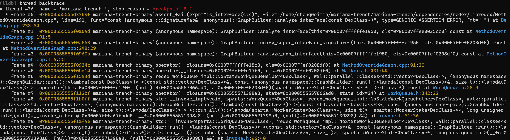
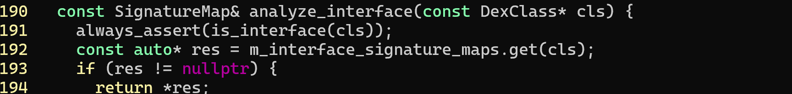
如上堆栈位置报错，报错原因是因为MT将“Lcom/jd/verify/VerifyReportProxy”作为interface解析，在MethodOverrideGraph.cpp内GraphBuilder::analyze\_interface方法处断言失败导致分析流程终止。可以注意到堆栈停在redex内部，这暗示了工具在dex解析上出现错误。
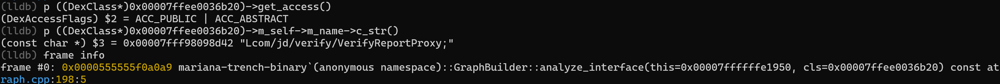
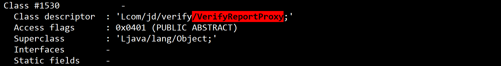
观察报错帧位置解析出错的DexClass，访问其m\_access\_flags可以得知该对象被打标为公开抽象类，明显与接口断言条件不符，使用dexdump进行验证却发现MT打标结果与实际解析结果匹配（0x401），符合预期，那么可以初步排除MT误解析access flag的问题，必然在某处有非预期的情况使得执行意外进入接口处理逻辑。

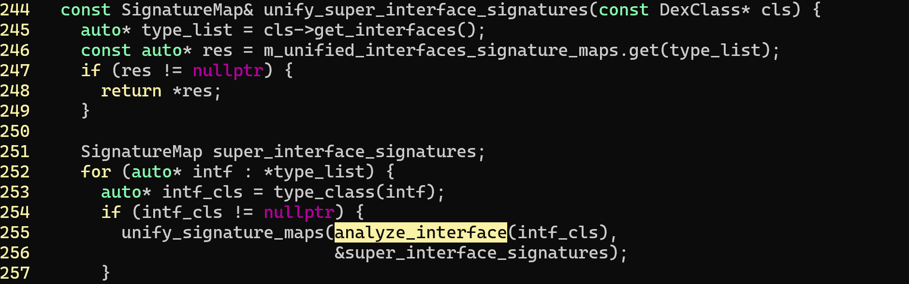
继续向上翻堆栈，需要定位到进入接口处理逻辑的具体场景和处理意图是什么，方便接下来排查。结合堆栈内容和GraphBuilder::unify\_super\_interface\_signatures的处理逻辑可知，错误发生时，MT正在尝试整理某个非接口类实现的全量接口，接口方法是构建完整CG图的必要数据，这一步符合人脑直觉；那么排除符合直觉的场景后就可以快速定位到一个可能的原因，MT在这一步里错误地把打标为ACC\_ABSTRACT的DexClass对象一起塞给analyze\_interface函数处理了。
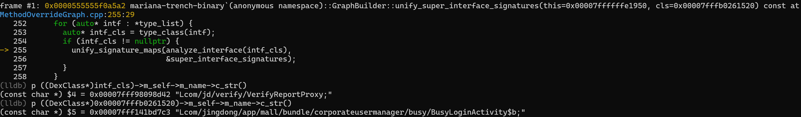
总之跳过去把处理的非接口类抽出来看看到底发生啥了，显然问题发生在"Lcom/jingdong/app/mall/bundle/corporateusermanager/busy/BusyLoginActivity$b;"
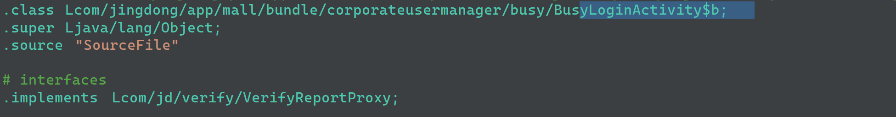

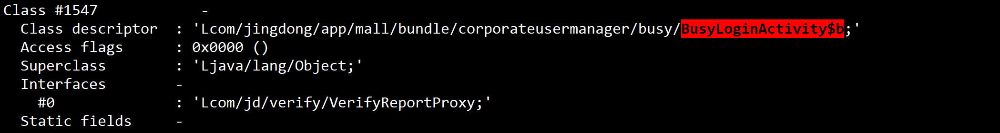
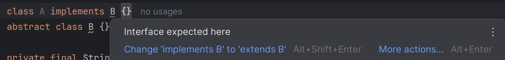
可以看到BusyLoginActivity$b居然把VerifyReportProxy当成接口来implements了！反复确认相关的smali代码以及dexdump的解析结果，均可以相互验证，虽然java编译器是显然不可能让这种代码通过的，但产物显示问题包就是把抽象类当成接口来实现了，那么只能假设编译器出现了bug或者开发者使用了某种hack导致的这种情况。最终MT在DexLoader.cpp内初始化该类之后，自然会导致抽象类在接口断言逻辑处失败，但问题不出在MT的处理逻辑上，因为MT是实际按照dex文件的语义进行解析的，完全符合预期。
其中一种修复方式是在断言之前进行接口判断，将预期外的抽象类排除掉，但这会导致BusyLoginActivity$b的全部信息在CG图内丢失，间接地影响与之相关的所有类，损失过大，因此第二种修复方式是将问题包重打包，将.implements指令改为.super指令，让继承关系恢复正常。

# 压缩类型损坏

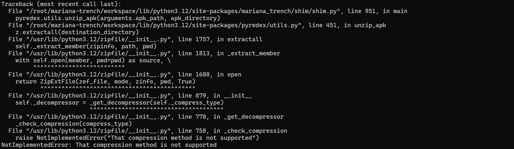
运行命令后MT随即终止，可以看到报错堆栈的入口在pyredex的解压函数unzip\_apk内，在调用ZipFile.extractall后，代码在基础库zipfile内抛出异常并提示不支持问题apk的压缩方法。这里给到两个信息，第一是堆栈至少没有在mariana-trench-binary内部抛出，因此它不太可能是某些指令处理或者类似编译器bug/hack级别的疑难杂症，第二是MT将apk处理过程托管给python脚本，这让调试成本极大降低。
接下来快速调试，快速结束。
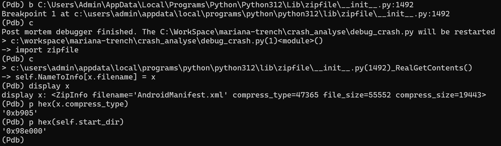
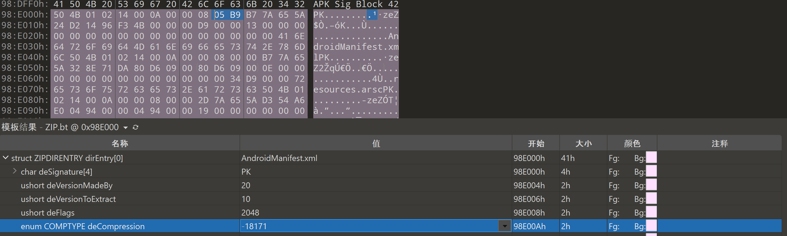
基础库内的ZipFile#\_RealGetContents函数负责解析zip文件的基本信息，既然堆栈报错提示压缩方法不支持，那就直接pdb把断点下到解析位置。运行extractall函数后可以看到明显不符合预期的信息，在apk文件偏移0x98e000位置解析出的首个central dir结构的compress type为0xb905，显然不属于任何已知的压缩类型。
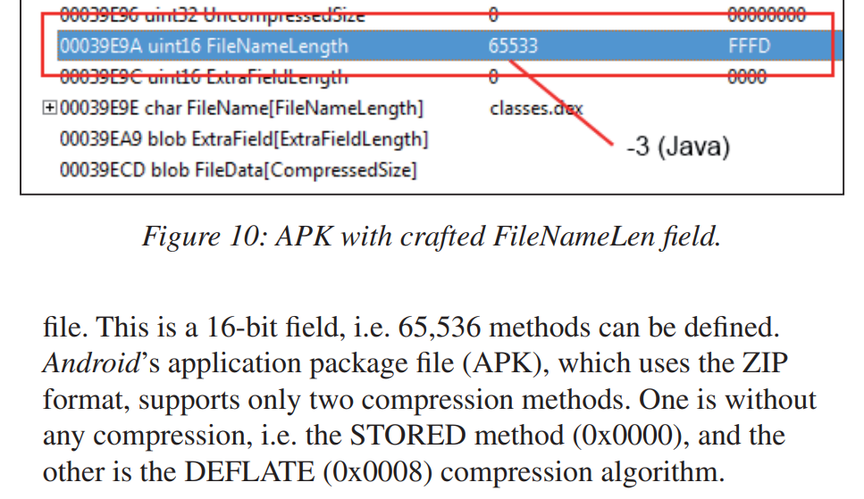
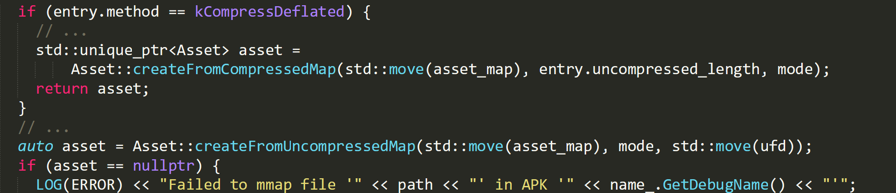
https://android.googlesource.com/platform/frameworks/base/+/master/libs/androidfw/AssetsProvider.cpp
实际上这并不是什么新鲜的对抗技术，早在2014年就有相关论文"LEAVING OUR ZIP UNDONE: HOW TO ABUSE ZIP TO DELIVER MALWARE APPS"提示可以故意损坏压缩结构以对抗严格遵循解压标准的反编译软件（只不过这个技术被黑产哥学了去了），同时，Android系统在解析apk资源时只支持两种压缩模式：STORED（0）或者DEFLATED（8），在解析时如果没有识别到使用了DEFLATED压缩模式，则会强制假定apk使用了STORED模式，得益于这种宽松的解压策略，无论compress type为除了8以外的任何值，最终apk都会fallback到STORED模式进行解压，这也就是为什么Android系统仍可以运行结构受损的apk的原因。
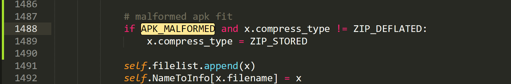
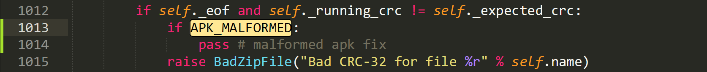
那么修复策略就很简单了，首先在ZipFile#\_RealGetContents内解析压缩结构的位置加一个类似Android解析模式的fallback逻辑，随后在ZipExtFile#\_update\_crc函数内禁用掉CRC校验，就可以成功解压受损apk了。