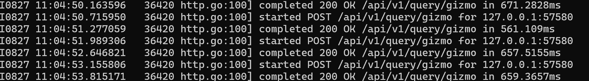
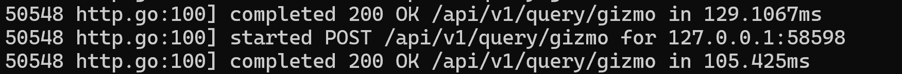
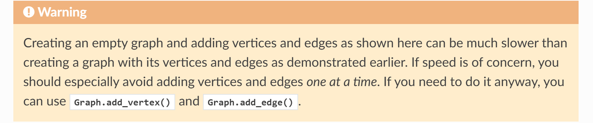

# Foundation  
  
抽象解释框架：Mariana-Trench（MT）  
图数据库：Cayley  
Cayley抽象迭代器原理：https://github.com/gophercon/2015-talks/blob/master/Barak%20Michener%20-%20Cayley:%20Building%20a%20Graph%20Database/Cayley%20-%20Building%20a%20Graph%20Database.pdf  
  
# Benchmark  
  
三方的基准测试文章，多个图数据库对比，比较全面：https://mihai.page/testing-graph-databases/  
本地测试：Win11 32G内存  
Intel64 Family 6 Model 186 Stepping 2 GenuineIntel ~2400 Mhz  
  
## MT  
  
测试规模： AOSP services.jar 8MB  
Dump：--skip-analysis，调用图，反向调用图，方法列表，Override列表  
10秒出结果。Soot在运行10分钟后直接OOM  
  
## Cayley  
  
测试规模：AOSP services 10w个节点 40w条边  
Python手写DFS/BFS，且限制深度的情况下，半小时仍未跑完  
<br>  
  
从某节点反向查询直至末尾，代码如下，全量查询平均650ms，资源紧张时900ms左右  
  
```JavaScript  
var start = "<func40426>";  
function findAll(node) {  
  var path = g.M().in("<call>");  
  var nodes = g.V(start).followRecursive(path).toArray();  
  
  for (var i = 0;i < nodes.length;i++) {  
    var is_end = g.V(nodes[i]).in("<call>").count();  
    if (is_end == 0) {  
      g.emit(g.V(nodes[i]).out("<name>").toValue())  
    }  
  }  
}  
findAll(start)  
```  
  
  
<br>  
  
**注意事项**  
  
1. toArray似乎会带来非常严重的额外性能损耗，编写查询语句时需要注意  
	  
	```Java  
	g.V().all() // 2ms  
	g.V().toArray() // 1s!  
	```  
	  
2. `g.V().all()`只返回前100条数据，原因不明，只能通过getLimit接口强制指定返回数量，这一点文档未明确提及，但toArray确实会打包所有数据，且g.V()进行的其它操作确实会进行全图搜索，而非仅处理前100条数据，唯一需要注意的是，如果结果有100条以上，需要使用getLimit指定-1获取全量结果。  
	  
  
这似乎是一个Bug，且仍未被修复：https://github.com/cayleygraph/cayley/issues/718  
  
3. 在大图中进行查询时需要特别注意语句的编写，以如下两个查询语句为例  
	  
	```Java  
	// 语句1 耗时41s  
	g.V().out("<call>").forEach(function(n){  
	  g.V(n["id"]).out("<call>").all();  
	});  
	// 语句2 耗时13s  
	g.V().out("<call>").out("<call>").getLimit(-1)  
	```  
	  
	  虽然两个查询语句的本质在直觉上都是尝试获取全图所有顶点的第二层调用节点，但实际上语句1在获取了第一层节点后，使用forEach重新对这些节点再次绑定了一个迭代器，使得查询效率为O(n^2)，并且最终查询时间为41秒，而语句2始终只有1个迭代器，性能表现相对较好。  
	  
  
# Develop Specs  
  
## Cayley Specs  
  
本部分记录一些Cayley查询时有用的api，以及一些查询语句。  
此外，Gizmo编程与常规编程不同，编写查询语句时要慎之又慎，尽量避免使用一些“奇技淫巧”或者尝试在Gizmo中使用算法，因为Gizmo以及Cayley API的行为没有被官方文档完全解释，如果非要编写某些算法，那么你在开发过程中就不得不使用某些打包api以灵活地访问某些节点（例如toArray，forEach等等），但这可能会让cayley二次加载大量数据，或尝试对大量数据绑定额外的迭代器，这些都是文档不会明说的细节，虽然使用算法会使得查询过程看似“巧妙”或“聪明”，但实际上会加重单次查询的负担，造成额外损失（详见Cayley的“注意事项”小节）。因此，要尽力避免复杂的编程，使用尽可能笨拙的查询，因为最简单的语句有可能就是性能消耗最低的方案。  
**无论如何，如果不得不在单条语句内进行多次查询，那就进行多次查询，不要尝试优化你的语句！**   
其次，Cayley是一个轻量的图数据库，而非整合了图计算框架的数据库，如果非要进行一些复杂或需要算法的操作，请导出子图自行在中间层操作。  
  
### Apis  
  
- tag：打标，且打标值为到达目前“Tag”时曾经所在的顶点  
	- 假设有A-goto->B，语句g.V("A").out("goto").tag("start\_from").all()返回{id:B, start\_from:B}  
		  
- save/saveR：保存当前节点的宾语或逆谓词标记宾语。  
	- 推荐使用该api进行打标，原因是其语义明确，更加灵活，易于理解，且不会造成行为混乱。  
		  
	- 配合in/out+tag也可以实现类似效果，但该方案尽量不要使用，会造成性能损耗。  
		  
  
### Code  
  
- **提取某节点的全量子图**，同时为每个节点标记源与目标节点  
	  
	```SQL  
	var path = g.M().out("<call>").saveR("<call>","source").save("<call>","target");  
	g.V("<nfunc1>").followRecursive(path).all();  
	```  
	  
	- 20250901更新：由于Cayley的tag重复打标会覆盖旧结果（通常发生在环中），该情况有可能造成followRecursiave时节点的出入度精度丢失，假如有如下情况：某节点的第一层调用存在环，导致第一层调用的tag重复并被覆盖，导致损失，此时有一个临时的解决方法，手动查询一次该节点的第一层调用，进行打标并getLimit输出，随后再进行其它操作，此时由于两者迭代器不同，不同的迭代器不会进行tag覆盖，由此可以获得尽可能全量的结果。  
		  
	  
	```SQL  
	// <func145246> AccountManagerService;.addAccountAsUser  
	g.V("<func145246>").out("<call>").saveR("<call>","call_by").save("<call>","call_to").getLimit(-1);  
	g.V("<func145246>").followRecursive(g.M().out("<call>").saveR("<call>","call_by").save("<call>","call_to")).getLimit(-1)  
	```  
	  
- **提取点到点间的全量子图**，需要注意的是，由于此方案是提取正反子图的交集，因此会有两倍性能损耗（查了两遍），但由于cayley的api本身不够灵活，且尝试在Gizmo中使用算法很有可能会使节点不得不额外绑定迭代器，造成更多的性能浪费，因此取交集应该是目前唯一的方案。  
	  
	```SQL  
	var start = "<nfunc1>";  
	var end = "<nfunc999>"  
	  
	// forward M  
	var path_f = g.M().out("<call>").saveR("<call>","source").save("<call>","target");  
	// reverse M  
	var path_r = g.M().in("<call>");  
	  
	g.V(start).followRecursive(path_f)  
	.and(g.V(end).followRecursive(path_r))  
	.all()  
	```  
	  
- **提取从某点出发的所有路径的叶子节点（底部无环）**，该方法首先建立了两个态射，其中一个态射会保存调用目标，而叶子节点一定没有调用目标，从开始节点查询两个态射，并进行diff操作，其结果即为叶子节点。在10w个节点规模的图中，该语句耗时20ms，主要耗时在于两次态射查询与diff操作。  
	  
	```SQL  
	var start = "<func145246>";  
	  
	// forward M  
	var path_f = g.M().out("<call>");  
	var path_f_to = g.M().out("<call>").save("<call>");  
	  
	g.V(start).followRecursive(path_f).difference(g.V(start).followRecursive(path_f_to)).all();  
	```  
	  
	  此外，绝对不要试图在path\_f态射查询上forEach每个节点，企图在单次查询内就过滤出叶子节点，我在开头已经提过，这会造成额外的迭代器绑定并严重增加耗时！不要幻想在这里让总耗时降低到单次查询耗时，例如如下语句使用forEach进行叶子节点过滤，其总耗时达到110ms左右！  
	  **我再说一遍，除非你能直接优化Cayley数据库本身，否则 不·要·试·图·优·化·你·的·语·句！！**   
	  
	  
	```JavaScript  
	// 反例！绝对不要使用！  
	var start = "<func145246>";  
	  
	// forward M  
	var path_f = g.M().out("<call>");  
	  
	g.V(start).followRecursive(path_f).forEach(function(n) {  
	  var size = g.V(n["id"]).out("<call>").count();  
	  if (size == 0) {  
	    g.emit(n["id"]);  
	  }  
	})  
	```  
	  
  
## Igraph Specs  
  
这里的想法是，避免在Cayley内直接操作图，作为图数据库，我们只需要从大规模图中提取想要的全量子图，例如从10w个节点内提取1k个节点的小图，接着将Igraph作为中间层，对小规模图进行处理，最终输出想要的结果。  
https://python.igraph.org/en/stable/tutorial.html#adding-deleting-vertices-and-edges  
官方文档提及了一个细节，要求开发者最好一次性建图，而非使用add\_vertex或者add\_edges逐个添加顶点或边，这会严重拖慢建图速度，因为每次调用都会触发igraph重新调整图结构（重分配内存，重建索引等等）。  
  
<br>  
  
# Project Code  
  
## Project  
  
// Hide For Now  
<br>  
  
## CG to N-Quads File  
  
// Hide For Now  
  
```Java  
// <func40426> Content;.bindServiceAsUser:  
// <func145246> AccountManagerService;.addAccountAsUser  
```  
  
## Deprecated  
  
传统DFS/BFS算法，速度极慢，10w节点，40w条边规模的图，大约30秒左右搜出一条调用链  
// Hide For Now  
<br>