# MT Basics  
  
## Concept && AbsIntercept  
  
MT（Mariana-Trench）是Facebook团队于2021年开源的静态分析工具。MT结合了抽象解释与污点分析技术，核心部分完全由C++编写，接口由Python预留，分析速度良好，相比于Soot更加稳定，分析AOSP services.jar全量调用图仅10秒。  
关于抽象解释，我个人的理解是抽象解释技术将运行时可能产生的具体值映射到某个抽象域内，将具体问题进行抽象或简化，域内的各个元素均为偏序关系，如此一来，对程序的分析就从具体值的精确分析简化到抽象域间的转换分析了。  
更详细的抽象解释理论可参考如下文章：  
抽象解释的通俗解释，非常好理解：https://zhuanlan.zhihu.com/p/688802443  
CMU15-414中的抽象解释课程，脱离了各种繁杂的术语，可以快速入门：https://www.cs.cmu.edu/~soonhok/talks/20111109.pdf  
熊英飞教授的软件分析课程课件：https://xiongyingfei.github.io/SA/2019/main.htm  
此外，在了解了抽象解释的理论框架后，需要理解抽象解释是如何运用在程序分析中的。同样以我的个人理解为例，抽象解释本身专注于对数据的解释和处理，与传统的程序数据流分析仍有距离，但可与相关技术相结合发挥更好的效果，例如污点分析技术，抽象解释将污点分析过程中值的具体转移问题抽象为域的转移过程，我们不再需要模拟程序产生的所有输入与输出，而是观察值在域间的转移而间接或直接地得知数据流方向。  
腾讯开源的基于抽象解释的二进制分析工具BinAbsInspector间接地印证了我的想法：https://keenlab.tencent.com/zh/2022/04/20/2022-BinAbsInspector-public-release/  
在理解了这一切后，我们可以大致地理解为什么MT的效率与稳定性比Soot高出好几个数量级。  
  
## Official Docs  
  
Facebook团队对MT的介绍：https://engineering.fb.com/2021/09/29/security/mariana-trench/  
MT操作文档 https://mariana-tren.ch/docs/  
  
# Runtime Issues  
  
记录运行MT运行时可能会遇到的问题，以及解决思路。  
  
## Dump Formatter  
  
由于MT是污点分析工具而非框架，因此其不能像Soot那样进行编程式的拓展（比如插入自己的处理阶段），但一些常规的功能仍可在`--help`输出的参数列表内找到，例如生成调用图可使用`--dump-call-graph`参数等等，接着通过一些外部工具或程序对这些输出结果进行消费。  
不过，需要注意的是，由于--dump系列的参数并非MT的主要功能，更多的定位是在于程序本身的调试之用，因此输出的json文件格式可能不能直接结构化地处理。比如其输出的原始调用图文件为如下格式：  
  
```JSON  
{"LUtils;.log:(J)V":{"static":["Landroid/util/Log;.d:(Ljava/lang/String;Ljava/lang/String;)I"]}}  
{"LUtils;.reverseState:()V":{"static":["Landroid/util/Log;.d:(Ljava/lang/String;Ljava/lang/String;)I"]}}  
{"LUtils;.log:(F)V":{"static":["Landroid/util/Log;.d:(Ljava/lang/String;Ljava/lang/String;)I"]}}  
...  
```  
  
可见MT将多个调用关系格式化为json字符，并按行写入文件内，而非将其整合为可直接处理的json格式，此时可以利用`jq`命令进行简单的格式化，例如使用`cat call-graph.json | jq . --slurp`命令将这些多行json合并为单个对象，由此可以更加方便地进行处理。  
下面脚本用于将dump出的关键信息进行格式化与打包。用法：`./pack_script.sh TARGET.apk`  
  
```Bash  
#!/bin/bash  
  
ANALYZE_DIR="analyze"  
  
# Clear workspace first  
rm $ANALYZE_DIR/*.json  
  
echo "Pack $1..."  
  
# MT it first!  
mariana-trench --apk-path $1 --output-directory $ANALYZE_DIR --skip-analysis \  
        --dump-call-graph \  
        --dump-dependencies \  
        --dump-methods  
  
mkdir formatter_tmp  
  
formatter() {  
  for f in $(ls $ANALYZE_DIR/$1*); do  
        # skip first '@generated' mark line  
        tail -n +2 ${f} >> $1_tmp.json  
  done  
  
  echo "[*] $1 Collect Done"  
  
  cat $1_tmp.json | jq . -s -r > ./formatter_tmp/$1.json  
  rm $1_tmp.json  
  echo "[*] $1 Formatter Done"  
}  
  
formatter_nogen() {  
  # no generated tag, just jq it!  
  cat $ANALYZE_DIR/methods.json | jq . -s -r > ./formatter_tmp/$1.json  
  echo "[*] $1 Formatter Done"  
}  
  
formatter call-graph  
formatter dependencies  
formatter_nogen methods  
  
tar -cf mt_formatter.tar ./formatter_tmp/*  
  
echo "[*] All Packed to tar file"  
```  
  
## CallGraph Issue  
  
编写本节的原因是MT的CG图生成有时不全，因此需要对MT进行分析，顺带了解其大致结构。  
通过`--verbosity 5`配置使MT输出详细的调试信息，可知代码块处理，全量流程图与全量调用图生成逻辑处于MarianaTrench::analyze函数内；在此逻辑构建CallGraph对象的同时，其构造函数就会自动对所有控制流内的指令进行分析，分析过程位于CallGraph::process\_instruction函数内。  
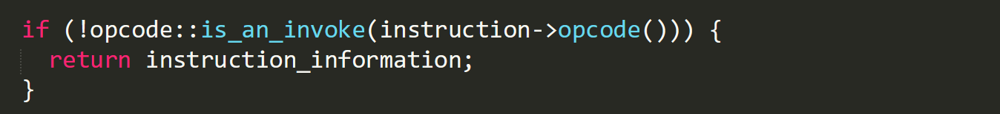  
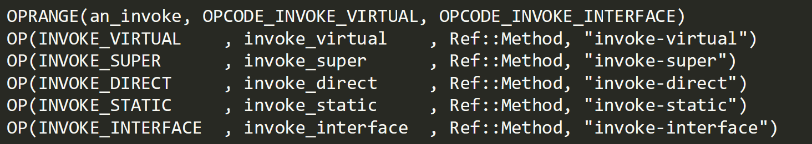  
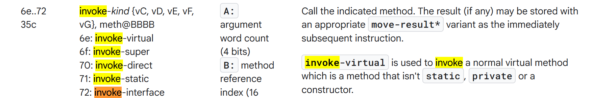  
该流程会忽略所有在构建CG图过程中的无用指令，例如非invoke类以及非field操作类指令，而指令的判断逻辑（例如is\_an\_invoke宏生成函数）位于FaceBook此前开源的另一个字节码处理基础设施ReDex项目内，因此如果需要手动编译MT的话，需要注意引入其它依赖，但这一点官方文档并未提及。ReDex内IROpcodes.def文件的宏调用列表中，OPRANGE宏规定INVOKE\_VIRTUAL到INVOKE\_INTERFACE之间的所有指令均为invoke类型指令，对照谷歌提供的[Dalvik Bytecode列表](https://source.android.com/docs/core/runtime/dalvik-bytecode)来看，显然invoke指令都覆盖到了，这一点没有问题，那么CG生成问题自然就出现在后续的指令处理过程中。  
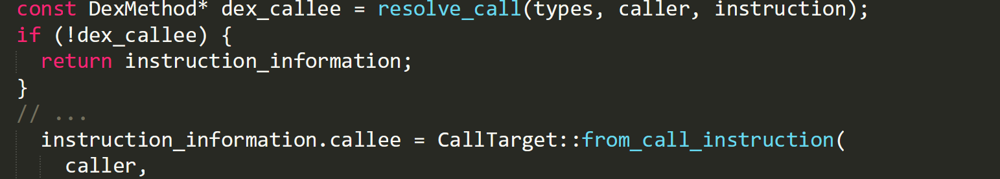  
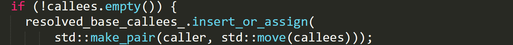  
CallGraph::resolve\_call会尝试处理当前的invoke指令，预期情况下此函数会返回一个可处理的DexMethod对象，接着MT会把这个对象的callee提取出来塞进当前的指令信息里，顺带在指令信息不为空的情况下同样把callee推入resolved\_base\_callees\_数组内，而最终输出的CG图与此数组是强相关的（详见CallGraph::dump\_call\_graph函数）。但问题是，即便手动确认了正在处理的invoke指令的确拥有一个方法对象后（本地dex文件中存在此指令，并且调试MT时指令的方法对象不为空），有时resolve\_call返回的也会是null。  
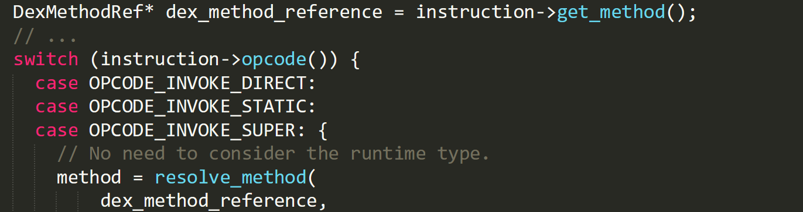  
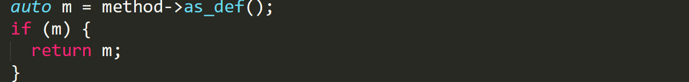  
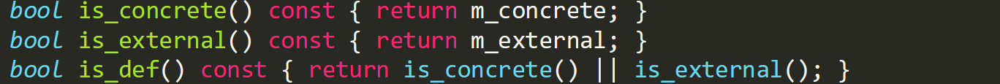  
问题出在指令方法对象的处理上，虽然IRInstruction::get\_method的确返回了一个对象，但该对象是“方法**引用对象**（DexMethodRef）”而非对象实例本身，ReDex规定引用对象可能指向一个真实的方法定义，但也有可能纯碎是一个未定义的符号，虽然ReDex会尝试通过as\_def将引用对象转换为真正的实例对象，但转换为实例对象的前提是引用对象的m\_concrete或者m\_external成员之一为True；根据DexMethodRef内的代码逻辑可知，两者分别用于标记当前方法是否为被分析文件内已定义的**具体**方法，亦或是在文件内无法找到的，由Android SDK或框架文件提供的**外部**方法，无论如何，这两种方法都被认为是一个真实的方法定义，那么两者均为False的情况就很明显了：  
  
1. 未配置`--system-jar-configuration-path`参数，外部方法无法被找到，导致方法引用对象无法实例化  
	  
2. 单个进程将多个apk作为模块加载，apk之间的代码相互依赖，这种情况经常在某些系统进程或应用内出现，在某些apex模块内也可以被找到，该情况下单纯配置android.jar无法解决，需要手动补全环境  
	  
  
简单来说，MT生成的CG图若存在缺失，很可能是由于一些外部方法无法在给定的参数中被找到，因此导致方法引用对象实例化失败（成为一个未定义的符号）；那么是否有一些简便的方法可以在无需补全环境的情况下尽可能生成完整的CG图呢，例如Soot框架就支持调配某些参数构建虚方法以补全CG，很遗憾的是MT并不携带这类参数，因此，如果要做到“构建虚方法”，只能修改源代码的引用转换逻辑，使其成为“虚方法”。  
  
## DexMagic Issue  
  
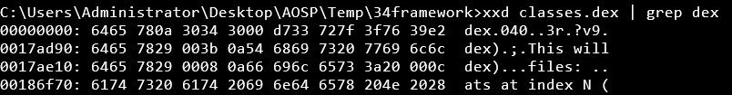  
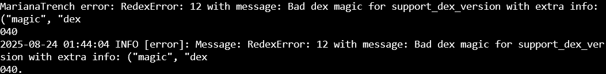  
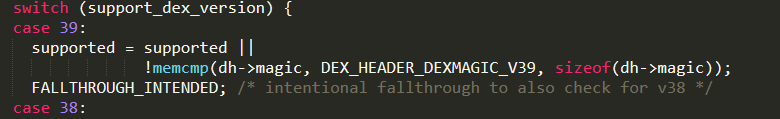  
如图，当尝试分析Android14的services.jar中的dex文件时，MT直接抛出dex魔数错误，并提示不支持解析dex040版本；从ReDex的版本判断逻辑上可知，当前可支持的最高解析版本为dex039，但问题是039是从Android9开始支持的，相比于当前的版本已经非常老旧，从ReDex十分频繁的提交记录上来看，Facebook官方还在积极维护此项目，但他们始终不添加040版本的判断逻辑。  
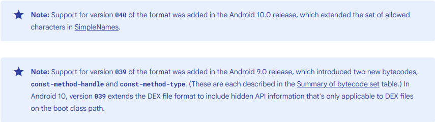  
每次dex版本的更新通常意味着新特性，尤其是新指令的引入，因此dex解析器也必须要适配这些新指令的解析方法，不过幸运的是040相比039的改动不大，这意味着**将039的解析逻辑应用于040也是完全可行的**，或许Facebook只是不想理会这种幼稚的问题，所以迟迟不引入040的判断逻辑。总之，手动修改dex头部的魔数即可。  
  
# Model Configuration  
  
https://mariana-tren.ch/docs/customize-sources-and-sinks/  
MT可以自行创建[规则文件](https://github.com/facebook/mariana-trench/blob/main/configuration/rules.json)以指定Source与Sink，但是两者的定义需要由模型文件指定（例如规定哪类方法的返回为Source），因此在编写规则文件前，需要自行按需编写模型文件。官方在源码内给出了默认的模型文件示例，本地模型文件一般位于MT所在目录中的configuration文件夹内，可自行修改或添加默认模型，源码如下：  
https://github.com/facebook/mariana-trench/tree/main/configuration/model-generators  
同时，可以通过修改`default_generator_config.json`文件或者利用命令行参数来指定需要默认引用的模型，其它规则文件同理。  
<br>  
  
<br>