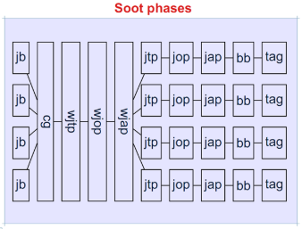

# Soot Doc Note
20250723
## Soot Basic

### Official Doc

https://github.com/soot-oss/soot/wiki/  
https://www.bodden.de/tag/soot-tutorial/  
https://www.brics.dk/SootGuide/sootsurvivorsguide.pdf  
https://soot-oss.github.io/soot/docs/4.6.0/options/soot_options.html#section_1  
https://soot-oss.github.io/soot/docs/4.6.0/jdoc/index.html

### Basics Concept

- Jimple：Soot特有的三地址中间表示，大多数分析都在Jimple层进行，非常重要
- Shimple：是Jimple的SSA（[静态单赋值](https://en.wikipedia.org/wiki/Static_single-assignment_form)）格式变体

## Soot Options

此节不再介绍命令行模式下的Soot参数配置，而是对开发过程中的参数调配进行介绍。需要注意的是，所有Soot的通用参数均可以通过`Options.v()`单例进行调配，例如参数“-allow-phantom-elms”的对应配置代码应该为“set_allow_phantom_elms”。此外，本节不介绍所有参数，仅介绍开发过程中应该用到的参数。  

- set_whole_program：对全程序进行分析
- set_allow_phantom_elms：允许Soot自动地创建虚拟类与方法
- set_process_dir：设置要在哪个目录下查找class
- set_process_jar_dir：设置要在哪个目录下查找jar，该选项设置后可能由于Soot本身的bug无法正常解析jar，直接使用process_dir即可。

如果需要调配阶段选项，例如cg.cha此类，需要通过`PhaseOptions.v()`单例进行调配。例如代码`PhaseOptions.v().setPhaseOption("cg.cha", "on")`启用cg.cha阶段选项。  
- 阶段的开启与关闭需要通过“enabled:true”或者“enabled:false”来调控

## Soot Phase

Soot在处理字节码时会经历多个阶段（Phase），开发者可以通过控制Soot选项人为地关闭或者开启其中一个或者多个阶段。对于每个阶段的描述，可见Dr.Bodden的早期博客：https://www.bodden.de/2008/11/26/soot-packs/ ；以及使用-pl参数列出每个阶段的简要概述。  

在代码层面上，每个阶段由“Pack”实例实现，Pack实例则是Transformer基础对象的集合，这些Transformer可以被认定为是阶段中的子阶段（subphase）。  

对于Soot Phase的理解便于后续开发时对程序分析精度/程度的具体控制，甚至对Phase进行额外的自定义控制。

### Phase Desc
```
 jb                            Creates a JimpleBody for each method
    jb.dtr                       Reduces chains of catch-all traps
    jb.ese                       Removes empty switch statements
    jb.ls                        Local splitter: one local per DU-UD web
    jb.sils                      Splits primitive locals used as different
                                 types
    jb.a                         Aggregator: removes some unnecessary copies
    jb.ule                       Unused local eliminator
    jb.tr                        Assigns types to locals
    jb.ulp                       Local packer: minimizes number of locals
    jb.lns                       Local name standardizer
    jb.cp                        Copy propagator
    jb.dae                       Dead assignment eliminator
    jb.cp-ule                    Post-copy propagation unused local eliminator
    jb.lp                        Local packer: minimizes number of locals
    jb.ne                        Nop eliminator
    jb.uce                       Unreachable code eliminator
    jb.tt                        Trap Tightener
    jb.cbf                       Conditional branch folder
 jj                            Creates a JimpleBody for each method directly
                               from source
    jj.ls                        Local splitter: one local per DU-UD web
    jj.sils                      Splits primitive locals used as different
                                 types
    jj.a                         Aggregator: removes some unnecessary copies
    jj.ule                       Unused local eliminator
    jj.tr                        Assigns types to locals
    jj.ulp                       Local packer: minimizes number of locals
    jj.lns                       Local name standardizer
    jj.cp                        Copy propagator
    jj.dae                       Dead assignment eliminator
    jj.cp-ule                    Post-copy propagation unused local eliminator
    jj.lp                        Local packer: minimizes number of locals
    jj.ne                        Nop eliminator
    jj.uce                       Unreachable code eliminator
 wjpp                          Whole Jimple Pre-processing Pack
    wjpp.cimbt                   Replaces base objects of calls to
                                 Method.invoke() that are string constants by
                                 locals
 wspp                          Whole Shimple Pre-processing Pack
 cg                            Call graph constructor
    cg.cha                       Builds call graph using Class Hierarchy
                                 Analysis
    cg.spark                     Spark points-to analysis framework
    cg.paddle                    Paddle points-to analysis framework
 wstp                          Whole-shimple transformation pack
 wsop                          Whole-shimple optimization pack
 wjtp                          Whole-jimple transformation pack
    wjtp.mhp                     Determines what statements may be run
                                 concurrently
    wjtp.tn                      Finds critical sections, allocates locks
    wjtp.rdc                     Rename duplicated classes when the file
                                 system is not case sensitive
 wjop                          Whole-jimple optimization pack
    wjop.smb                     Static method binder: Devirtualizes
                                 monomorphic calls
    wjop.si                      Static inliner: inlines monomorphic calls
 wjap                          Whole-jimple annotation pack: adds
                               interprocedural tags
    wjap.ra                      Rectangular array finder
    wjap.umt                     Tags all unreachable methods
    wjap.uft                     Tags all unreachable fields
    wjap.tqt                     Tags all qualifiers that could be tighter
    wjap.cgg                     Creates graphical call graph.
    wjap.purity                  Emit purity attributes
 shimple                       Sets parameters for Shimple SSA form
 stp                           Shimple transformation pack
 sop                           Shimple optimization pack
    sop.cpf                      Shimple constant propagator and folder
 jtp                           Jimple transformation pack: intraprocedural
                               analyses added to Soot
 jop                           Jimple optimization pack (intraprocedural)
    jop.cse                      Common subexpression eliminator
    jop.bcm                      Busy code motion: unaggressive partial
                                 redundancy elimination
    jop.lcm                      Lazy code motion: aggressive partial
                                 redundancy elimination
    jop.cp                       Copy propagator
    jop.cpf                      Constant propagator and folder
    jop.cbf                      Conditional branch folder
    jop.dae                      Dead assignment eliminator
    jop.nce                      Null Check Eliminator
    jop.uce1                     Unreachable code eliminator, pass 1
    jop.ubf1                     Unconditional branch folder, pass 1
    jop.uce2                     Unreachable code eliminator, pass 2
    jop.ubf2                     Unconditional branch folder, pass 2
    jop.ule                      Unused local eliminator
 jap                           Jimple annotation pack: adds intraprocedural
                               tags
    jap.npc                      Null pointer checker
    jap.npcolorer                Null pointer colourer: tags references for
                                 eclipse
    jap.abc                      Array bound checker
    jap.profiling                Instruments null pointer and array checks
    jap.sea                      Side effect tagger
    jap.fieldrw                  Field read/write tagger
    jap.cgtagger                 Call graph tagger
    jap.parity                   Parity tagger
    jap.pat                      Colour-codes method parameters that may be
                                 aliased
    jap.lvtagger                 Creates color tags for live variables
    jap.rdtagger                 Creates link tags for reaching defs
    jap.che                      Indicates whether cast checks can be
                                 eliminated
    jap.umt                      Inserts assertions into unreachable methods
    jap.lit                      Tags loop invariants
    jap.aet                      Tags statements with sets of available
                                 expressions
    jap.dmt                      Tags dominators of statement
 gb                            Creates a GrimpBody for each method
    gb.a1                        Aggregator: removes some copies, pre-folding
    gb.cf                        Constructor folder
    gb.a2                        Aggregator: removes some copies, post-folding
    gb.ule                       Unused local eliminator
 gop                           Grimp optimization pack
 bb                            Creates Baf bodies
    bb.lso                       Load store optimizer
    bb.sco                       Store chain optimizer
    bb.pho                       Peephole optimizer
    bb.ule                       Unused local eliminator
    bb.lp                        Local packer: minimizes number of locals
    bb.ne                        Nop eliminator
 bop                           Baf optimization pack
 tag                           Tag aggregator: turns tags into attributes
    tag.ln                       Line number aggregator
    tag.an                       Array bounds and null pointer check
                                 aggregator
    tag.dep                      Dependence aggregator
    tag.fieldrw                  Field read/write aggregator
 db                            Dummy phase to store options for Dava
    db.transformations           The Dava back-end with all its
                                 transformations
    db.renamer                   Apply heuristics based naming of local
                                 variables
    db.deobfuscate               Apply de-obfuscation analyses
    db.force-recompile           Try to get recompilable code.
```

本小节仅记录每个Phase的在Soot运行过程中的作用，方便后续开发时进行参考。需要注意的是，-pl列出的阶段列表并非绝对是从上至下依次进行的，有些阶段可能是交替进行的。  
* jb：将每个方法体转换为对应的JimpleBody  
* jj：从源码创建JimpleBody
* wjpp：Jimple预处理阶段，在jb结束但cg还未开始的时机，只有在whole-program模式开启时才启用
* wspp：Shimple预处理阶段
* cg：全程序调用图分析
    - all-reachable：设置所有可触达的函数为入口
    - cg.cha：CHA算法的精度非常糟糕，但文档描述说是速度较快（确实从理论上来看比较快，但实际测试随便找了个程序去分析也没快多少，CHA算法理论：[ClassHierarchyAnalysis](https://people.cs.vt.edu/~ryder/6304/lectures/ClassHierarchyAnalysis-week3.pdf)）
    - cg.spark：Spark是一种指针分析框架，精度较于CHA是很高的，具体原理看Ondrej的论文：[Scaling Java Points-To Analysis using SPARK](https://plg.uwaterloo.ca/~olhotak/pubs/cc03.pdf)
    - 此外，cg.cha是默认开启的，建议关闭后换spark
* wstp：全程序Shimple转化阶段，启用whole-shimple的情况下默认开启
* wsop：全程序Shimple优化阶段，启用whole-shimple的情况下默认开启
* wjtp：全程序Jimple转化阶段，启用whole-program的情况下默认开启
* wjop：全程序Jimple优化阶段，启用whole-program的情况下默认开启
* wjap：全程序Jimple注解阶段，启用whole-program的情况下默认开启，由于暂时不清楚该阶段的更多细节，因此仅引用文档描述
    - 引用自文档：有些分析不直接转换 Jimple 主体，而是用标签注释语句或值。Whole-Jimple 注释包为全程序模式下面向注释的分析提供了一个平台。
* jtp，jop，jap：单方法精度下的Jimple分析阶段

下图是Dr.Bodden在博客内使用一张图描述了部分Phase的先后顺序，此外，博客还明确强调jb阶段也就是Jimple表示的创建阶段必须是固定且不能变动的，而在实际测试中也证实，关闭jb阶段后Soot的其余阶段也将完全无法进行。  



### Insert Phase

Dr.Bodden在其博客内还提及，开发者除了控制阶段的开关，还可以自行在阶段内插入自定义的转化器。例如下面的代码示例，示例在wjtp阶段内插入一个自定义转换器，其名为“wjtp.myTransform”，该全程序分析阶段应该采用SceneTransformer转换器，便以通过场景对象（Scene）来在分析过程中访问程序。  

```java
public static void main(String[] args) {
  PackManager.v().getPack("wjtp").add(
      new Transform("wjtp.myTransform", new SceneTransformer() {
        protected void internalTransform(String phaseName,
            Map options) {
          System.err.println(Scene.v().getApplicationClasses());
        }
      }));
  soot.Main.main(args);
}
```

Soot插入的自定义转化器分为两种：  
- SceneTransformer：`String phaseName, Map<String, String> options`
- BodyTransformer：`Body b, String phaseName, Map<String, String> options`
- 转换器需要实现内部接口internalTransform

SceneTransformer的操作单位为全程序，通过Scene.v()进行操作，而BodyTransformer的操作单位精确到单方法，由参数Body提供访问方法的实例。~~注意，通过`getPack(xxx).add`插入的转化器只能添加进现有阶段的末尾。~~

## Soot Sample

Soot的程序示例由源码内的tutorial/guide/examples提供，目前未找到公开文档详细讲解所有API的使用，可以参照示例程序进行代码编写，此处仅记录开发过程中需要使用到的官方用例或自己写的用例。

### Misc Sample

```java
Options.v().set_whole_program(true);
Options.v().set_allow_phantom_elms(true);
Options.v().set_allow_phantom_refs(true);
Options.v().set_process_dir(Collections.singletonList("C:/WorkSpace/Soot/soot_test_sample/Utils.jar"));
Scene.v().loadNecessaryClasses(); // 在指定process_dir后，如果要提前地处理某些SootClass或者方法，需要使用loadNecessaryClasses进行加载
```

### Call Graph

```java
// 官方用例
           List<String> argsList = new ArrayList<String>(Arrays.asList(args));
           argsList.addAll(Arrays.asList(new String[]{
                           "-w",
                           "-main-class",
                           "testers.CallGraphs",//main-class
                           "testers.CallGraphs",//argument classes
                           "testers.A"                        //
           }));
        

           PackManager.v().getPack("wjtp").add(new Transform("wjtp.myTrans", new SceneTransformer() {

                @Override
                protected void internalTransform(String phaseName, Map options) {
                       CHATransformer.v().transform();
                       SootClass a = Scene.v().getSootClass("testers.A");

                       SootMethod src = Scene.v().getMainClass().getMethodByName("doStuff");
                       CallGraph cg = Scene.v().getCallGraph();

                       Iterator<MethodOrMethodContext> targets = new Targets(cg.edgesOutOf(src));
                       while (targets.hasNext()) {
                           SootMethod tgt = (SootMethod)targets.next();
                           System.out.println(src + " may call " + tgt);
                       }
                }
                   
           }));

           args = argsList.toArray(new String[0]);
           
           soot.Main.main(args);
        }
```

```java
// 自定义用例
                Options.v().set_whole_program(true);
                Options.v().set_allow_phantom_elms(true);
                Options.v().set_allow_phantom_refs(true);
                
                Options.v().set_process_dir(Collections.singletonList("C:/WorkSpace/Soot/soot_test_sample/Utils.jar"));
                
                PhaseOptions.v().setPhaseOption("cg.cha", "enable:false");
                PhaseOptions.v().setPhaseOption("cg.spark", "enabled:true");
                
                Scene.v().loadNecessaryClasses();
                
                List<SootMethod> entryMethod = new ArrayList<SootMethod>();
                
                for (SootClass sootClz : Scene.v().getClasses()) {
                        if (sootClz.getName().equals("Utils")) {
                                for (SootMethod sootMethod : sootClz.getMethods()) {
                                        System.out.println(sootClz.getName() + "#" + sootMethod.getName());
                                        entryMethod.add(sootMethod);
                                }
                        }
                }
                
                Scene.v().setEntryPoints(entryMethod);
                
                PackManager.v().getPack("wjtp").insertBefore(new Transform("wjtp.collectCg", new SceneTransformer() {
                        
                        @Override
                        protected void internalTransform(String var1, Map<String, String> var2) {
                                // TODO Auto-generated method stub
                                CallGraph callGraph = Scene.v().getCallGraph();
                                for (SootMethod entry : entryMethod) {
                        Targets targets = new Targets(callGraph.edgesOutOf(entry));
                        while (targets.hasNext()) {
                            SootMethod tgt = (SootMethod)targets.next();
                            System.out.println(entry + " may call " + tgt);
                        }

                                }
                        }
                }), "wjtp.mhp");
                
                PackManager.v().runPacks();
                
                System.out.println("[*] DONE!");
```

## Soot Additional Info

此节记录了部分Soot的额外资讯，这些资讯或许还未被用到或者暂时用途不明，但也可能也是后续开发过程中仍要注意的部分，因此创建此节进行额外记录。资讯以如下格式进行记录
```
* 资讯描述【记录时间】
    - 资讯来源
    - 其它资讯来源或者额外补充
```

- Soot的中间表示不止Jimple一类，还有Baf，Grimp以及Shimple【20250722】
    - https://www.brics.dk/SootGuide/sootsurvivorsguide.pdf
    - [Soot的论文](https://soot-oss.github.io/soot/resources/sable-paper-1999-1.pdf)对其它中间表示进行了包括设计动机在内的详细描述
- Soot允许添加自定义的IR【20250722】
    - https://soot-oss.github.io/soot

