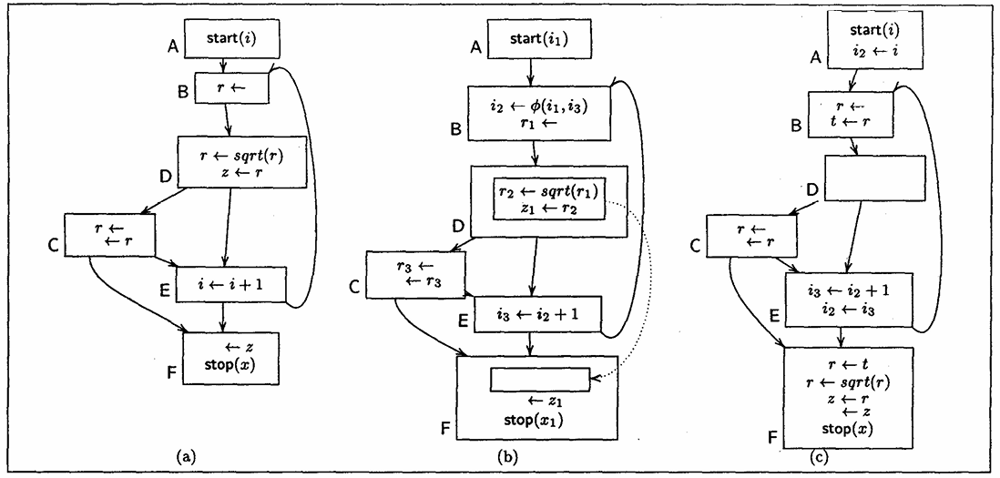
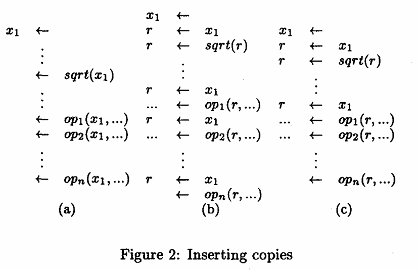
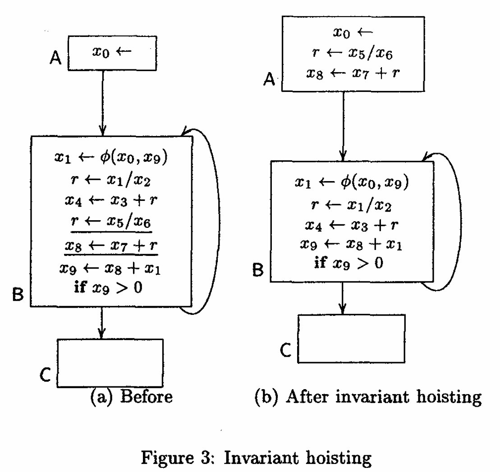
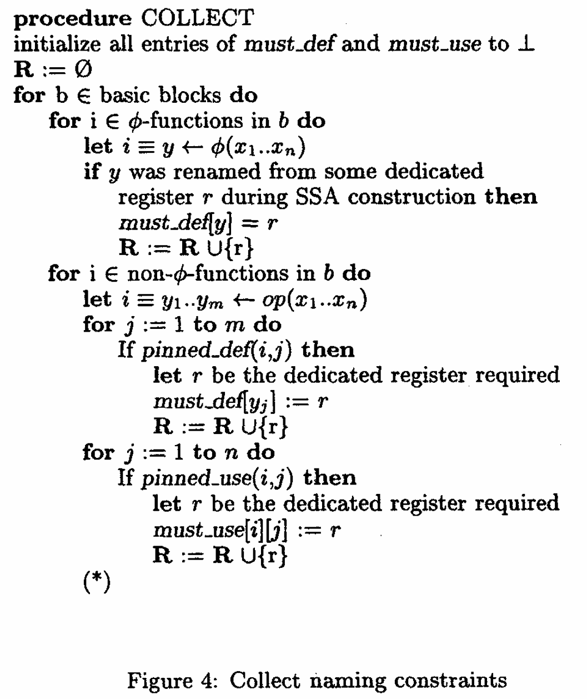
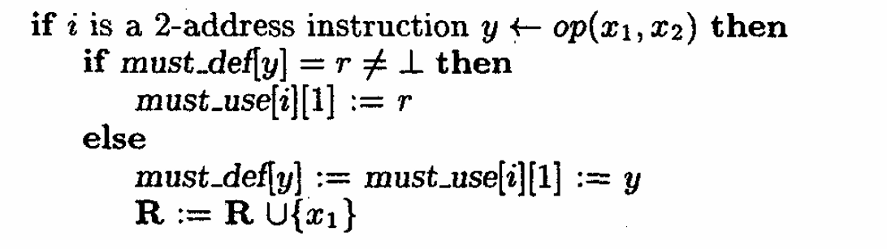
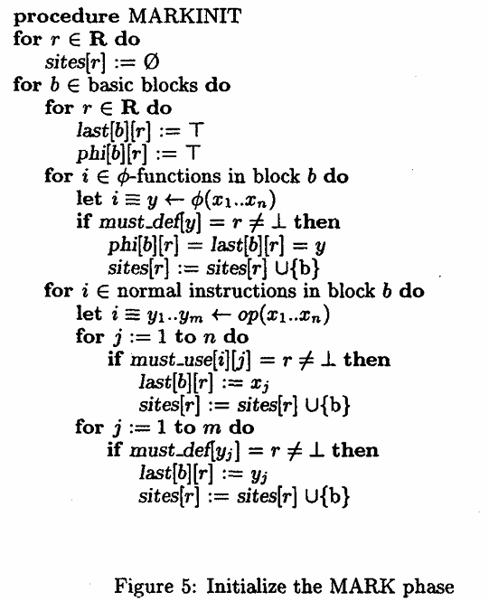

**Static single assignment form for machine code**  
https://dl.acm.org/doi/pdf/10.1145/301631.301667  
阅读过程中，我们规定引用块用来表达对上文任意内容的解读，并且规定解读可以随时进行，例子如下  
  
```Java  
论文片段 XXXX  
> 论文的个人解读 YYY  
```  
  
由于论文作者为SMLNJ函数式语言项目负责人，且论文方法被运用于该语言的编译后端MLRISC中，因此额外新增对SMLNJ编译后端的分析。 20251021  
- [SMLNJ 分析](https://github.com/MG1937/InformalNotes/blob/main/SMLNJ/SMLNJ_Analyse/SMLNJ_Analyse.md)
  
# Introduction  
  
  
SSA分析在编译器优化领域相当常用，但由于SSA抽象掉了对物理寄存器的引用，因此不能直接应用于机器码分析中。该节中还提及了数个在机器码上进行SSA的挑战，以上图为例，论文作者假定了一个程序的控制流，并且指定该程序只使用寄存器r，来模拟在机器码中的情况，SSA可以通过抽象出r1，r2，r3这样的概念，进行优化操作，比如将D中的死代码移入F块以加速执行，但问题在于，优化完成后，输出产物时一定是需要将r系列寄存器重命名回r本身的，但这样一来程序就完全丢失了原语义（虽然在SSA分析中是合法的，因为r系列寄存器指向不同的值）。  
为了解决这类问题，论文提及其对SSA进行了两个拓展：  
  
1. 尽量将SSA名称重命名为物理寄存器名字  
	  
2. 检查并修复潜在的命名冲突（这个应该就是为了解决语义丢失的），通过额外插入复制指令，保留特定寄存器的值来实现。  
	  
  
随后作者提及了机器码下的寄存器的一些限制与约束，这些需要在进行SSA时注意：  
  
1. 调用约定：caller与callee会保留一些寄存器作为传参或返回值（比如经典的x64调用约定，传参r9,r8,rdx,rcx,剩余参数压栈），这些寄存器不能处理。  
	  
	> 但实际上进行VMP分析时，调用约定是不固定的，这一点可以在反混淆时选择性忽略。  
	  
2. Runtime system：论文提到运行时系统可能会选取几个专用寄存器和客户端程序通讯。例如，在SML/NJ 运行时系统中，专用寄存器被保留用于各种运行时数据，包括当前异常处理程序、分配指针和堆限制指针等。  
	  
	> 没有遇到过这种情况，可以忽略。  
	  
3. 垃圾收集：编译器可能会指定某些寄存器进行垃圾回收操作。  
	  
	> 没有遇到过这种情况，可以忽略。  
	  
4. 架构指定寄存器：提及x86架构会要求整数除法指令必须使用eax，edx寄存器对来保存被除数和余数。因此谨慎处理。  
	  
	> 这一点需要注意  
	  
5. CISC指令：x86这样的CISC架构指令通常提供双地址以及栈操作指令，当SSA处理回机器码时，需要注意寄存器命名以及栈分配操作，尤其是双地址指令拥有一个约束，即其源操作数之一必须与目标操作数具有相同的名称。  
	  
	> 论文关于双地址的指令约束描述有点模糊，我的理解是运算类的指令例如`add eax, ecx`，`sub eax, ecx`的实际效果应该是eax = eax op ecx，因此其源操作数之一确实要与目的操作数相同，但`mov eax, ecx`这样的寄存器复制指令显然不受该条件约束，那么在实际进行SSA分析时就要根据指令类型判断是否有该约束了。  
	  
  
# Contirbutions  
  
作者提及这类与机器码相关的寄存器命名问题有一个简单且通用的解法，那就是在SSA转换回机器码的时候**跟踪分配到物理寄存器中的值**。假设有某个值x之前被分配到寄存器r中，且在后续某个使用点变得不可用，那么我们就标记该使用点需要修复并插入补偿复制指令。利用SSA形式的结构，这个过程基本上可以在线性时间内完成。  
  
> 这里的后续思路可以借鉴，但论文提到对某些值需要插入补偿指令，考虑到论文是对机器级IR进行的SSA分析，所以可以随时插值，但对纯二进制进行的分析不保证可以随时插入补偿指令，因为这有可能导致指令失效或者偏移变动，因此我们在借鉴该思路对纯二进制进行SSA分析的时候，仅关注可以直接安全擦除的指令，对于其它指令先放弃处理。  
  
我们不在SSA表达中对代码变动施加限制，相反，我们直接无视所有在SSA中的命名约束，让输出与对专用寄存器的依赖和反依赖不在IR中进行显式表示，实际上，可以默认对专用寄存器进行重新排序。当SSA转回机器码时，我们设计了一种算法来矫正所有语义违背，同时，通过对变量的跟踪与定位，算法还将尝试减少等价插值指令的数量。  
  
> SSA本质上就是一种IR，进行SSA分析时，确实是将机器码额外抽象了一个中间层，因此在中间层本来就不需要特意遵循命名约束。  
  
第三节会讨论以往在SSA处理专用寄存器的工作  
第四节讨论本工作具体的算法  
第五节给基础算法做出一些提升建议  
第六节展示一些实验成果  
第七节进行总结。  
  
# Previous Approaches  
  
## Naive Copies  
  
  
在SSA中容纳低级代码的一种常见方法就是使用低级但不统一的机器级别表示，在这种表示中，多数机器指令可以一对一映射到每个SSA操作中，并且在代码中不对物理寄存器进行引用。直接处理专用寄存器的指令，例如调用或返回，则被抽象为更高级的伪指令，这样一来，物理寄存器就不会直接出现在代码中。例如，提供了一个复杂的调用指令，隐藏了调用约定的实际机制，从而使其不影响SSA形式。在从SSA构建CFG时，如果一条指令必须定义或使用一个专用寄存器，就会针对该寄存器生成对应语义的复制语句。  
  
> 我对这部分的理解是，该方法为SSA专门定制了一种只处理单一虚拟变量而非专用寄存器的IR，同时，为了解决SSA转回机器码时受到的命名约束问题，IR将一些复杂的，需要使用到专用寄存器的原子指令抽象为数个复制操作与一个代表运算操作的伪指令，以此屏蔽在SSA层面对专用寄存器的直接交互，因此，在SSA分析阶段不会受到寄存器命名约束，约束处理被推迟到IR转回机器码的重构阶段，这使得问题变得简单且容易解决（生成等价的复制指令，即朴素复制），但代价是复制操作带来的额外性能损失。  
  
这种方法适用于编译器后端，但对论文的目的来说太过苛刻，现代编译器通常会使用到数个专用寄存器，在SSA分析后的代码重构阶段对这些寄存器进行一比一复制会生成过多插值语句。例如在Figure 2(a)中，虚拟变量x1被使用了n + 1次，假设sqrt指令从寄存器r中读取操作数或者写入结果，并且指令op1到opn都从寄存器r中读取操作数，那么在Figure 2(b)中的大量朴素复制指令序列就会被生成，因为寄存器r与虚拟变量x是活跃范围是相互交错的。而论文的方法则按需进行复制，最终生成Figure 2(c)中的指令序列。  
  
> 论文提及的朴素复制造成的问题，在仅考虑擦除指令的情况下似乎影响不大，虽然对论文不适用，但反混淆方面依然可以参考。  
  
## Dedicated Registers As Special Resources  
  
另一种解决方案是建立SSA名称与专用寄存器名称间的显式映射，并对后者保留多赋值。为了避免代码重构时导致的冲突问题，可以固定对专用寄存器进行读写的指令，使得它们的位置保持相对不变。然而，我们发现对专用寄存器进行读写的指令非常多，因此，这种“近似”SSA的方法会显著降低基于SSA的算法的有效性，因为引用专用寄存器的指令不能移动。  
  
> SSA分析进行困难的方法可以减少参考  
  
## Keeping Track of All Dependences  
  
  
另一种作者曾经考虑但最终放弃的方法是，在类似SSA的稀疏表示中显式地表示由于专用寄存器造成的输出依赖与反依赖。通过将这些约束在IR中表达为额外的边，就有可能在SSA优化识别出这些约束的情况下保留专有寄存器。然而，包含这些额外边会在编译时带来额外的工程和空间成本，并使许多没有考虑这些约束的SSA优化算法变得复杂。它还会施加一些仅仅是命名造成的额外约束。  
例如，在Figure 3(a)的指令序列中，r作为一个专用寄存器用以保存除数指令的结果值，由于代码块B中定义与使用寄存器r的语句间持有显式的输出依赖与反依赖，因此它们无法被优化为Figure 3(b)这样的指令序列。  
  
> 我感觉这样的方法脱离了稀疏表示的本质，由于约束过多使得工程成本激增，结果就导致SSA算法运用变得更加困难  
  
# Our Method  
  
## Building the SSA Graph  
  
论文的SSA结构将每条指令都看作单独的SSA节点，为了考虑可以产生多个结果的指令，每个SSA节点可以有多个入参与调用结果。例如，所有SSA输出都被标注了一个语义组合表达式，该表达式由一组固定的低级、类型化原语构建而成，如“add”（加法）、“subtract”（减法）、“shift”（移位）、“multiply”（乘法）或“memory operation”（内存操作）。诸如值编号、代数重新关联、常量折叠、强度削弱等SSA优化由这些组合子定义的语义知识驱动。  
我们向节点的出入口插入start以及stop伪指令以表示活跃输入与输出的约束。我们的CFG重建算法简单将这些伪指令看作def或use固定寄存器的指令，并使用处理固定寄存器的相同机制来重新生成调用或者参数传递寄存器的复制语句。  
  
> 最开始我感觉这个和朴素复制好像区别不大，但仔细想想，朴素复制是为了屏蔽专用寄存器，推迟处理过程到重建阶段，但这个方法通过两个伪指令给每个指令节点都维护了一个def-use的映射表，而非盲目插值。显然这种方法不会像“keep tracking”节提及的方法那样增加新的依赖边，而是通过多结果+语义注解来保留SSA稀疏表示的本质。  
  
易失寄存器是指那些可能被其它线程以并发方式读取或更新的寄存器，为了保证SSA算法不在此类寄存器上进行优化或转译，我们在每个指令节点中的此类寄存器上指定了一些固定的source以及sink。  
  
> 这个可能没必要运用到反混淆里  
  
我们发现最小SSA形式对于机器表示来说不切实际，因为它需要过多的空间，所以我们的SSA形式是剪枝的：也就是说，仅在变量 x 的定义点的迭代支配边界（iterated dominance frontiers）所确定的 “活跃汇合点”（live confluent point）处，为该变量插入 φ 函数（φ-function）。  
  
> 这段原文实在太绕了，所以借助了GPT进行翻译。首先，参考[wikipedia对SSA的定义](https://en.wikipedia.org/wiki/Static_single-assignment_form#Variations_that_reduce_the_number_of_%CE%A6_functions)，最小SSA要求在程序的所有汇合点均插入φ函数，但由于机器码通常包含大量分支，循环，汇合点数量远大于高级语言的表示，因此按照最小SSA要求，φ函数的插入数量会非常巨大。  
> 因此论文方法对SSA进行了剪枝，仅在满足以下两个条件的汇合点进行插入：  
>   
> 1. 变量在该汇合点仍然在后续有被使用（即为活跃），否则没有必要再插入φ函数  
> 	  
> 2. 在该变量定义的迭代支配边界插入φ，迭代支配边界指从变量定义点出发，通过多次扩展 “支配边界”（定义点能影响到的最远程序点范围）  
> 	  
>   
> 下面是一个通俗解释的伪代码用例  
>   
> ```Java  
> 块A：x1 = 1（定义x的第一个版本x1）  
>       分支到块B或块C  
> 块B：x2 = x1 + 1（定义x的第二个版本x2）  
>       分支到块D（汇合点）  
> 块C：（无x的定义）  
>       分支到块D（汇合点）  
> 块D：func(x)（使用x，x在块D存活）  
> ```  
>   
> 仅会在块D（汇合点）为x插入φ函数（合并x1和x2），因为x在块D存活，且块D为x定义可达的最远块；不会在块B或者块C插入φ，因为块B非最远可达块，块C无活跃变量x，没有必要插入。  
  
## The Machine Code Reconstruction Algorithm  
  
在所有SSA优化阶段结束后，开始执行机器码重构算法，算法包含3个阶段，COLLECT，MARK以及RECONSTRUCT。  
  
- **COLLECT**：收集程序中专用寄存器施加的约束。这些约束有两类：must\_def\[x\] = r 或 must\_use\[i\]\[k\] = r。第一种表示SSA名称x的定义必须是固定的，即它必须将结果存储在寄存器r中；第二种约束表示指令i的第k个输入操作数必须是寄存器r。由于一个操作数可能在多个地方被使用，我们允许一个名称有固定或非固定使用的组合，must\_def\[x\] = ⊥ 表示x的定义可以任意重命名；must\_use\[i\]\[k\]同理。  
	  
  
> 我们主要关注COLLECT阶段的实现  
  
- **MARK**：识别程序中所有寄存器命名约束违反原始程序语义的地方。对于固定变量x的每次使用，我们检查其值是否在寄存器must\_def\[x\]中可用。这通过跟踪每个程序点上专用名称中可用的值来实现。这个阶段标记程序中所有不满足此条件的地方。  
	  
- **RECONSTRUCT**：在重构阶段将所有SSA名称重命名为专用寄存器，并为 φ 函数插入复制语句。同时插入复制语句来修复上一阶段发现的所有语义违反情况。  
	  
  
## The Collect Phase  
  
Figure 4展示了COLLECT阶段的算法，它简单扫描了程序内的所有指令，寻找所有必须使用固定寄存器的操作数，同时更新must\_def与must\_use表。如果在SSA优化阶段正确维护了两个表，则可以忽略此步骤。另一方面，我们还将所有专用寄存器存入集合R。  
我们假定下面的方法是机器架构描述的一部分：  
pinned\_def(i, j)与pinned\_use(i, j) 均代表第i条指令的第j个操作数是否固定  
  
  
> 需要注意一下论文内类似 y <- op(x1, x2) 表达式的含义是：通过操作符 op（如加法、乘法、内存加载等）对源操作数 x₁ 和 x₂ 执行计算，将计算结果存储到目标 y 中。  
  
为了处理双地址指令，论文还向COLLECT阶段算法中标记(\*)的部分插入以下语句。  
  
这部分额外的逻辑处理了以下任务：首先检查指令i的目的数是否已经被固定到物理寄存器r，如果是的话，则指定操作数x1固定到同样的寄存器r；否则，我们将SSA名称y作为一个新资源，并将源操作数y和目标操作数x1都分配给这个名称。  
  
> must\_def与must\_use的作用与SSA概念中的use/def不同，传统SSA的核心是为每个值分配唯一名称，确保高级表示中每条语句的原变量对应def中的唯一虚拟变量，而use则仅引用这个唯一虚拟变量，其本质是值导向的抽象表示；而must\_def/use则强调“must”这个字眼，强制机器表示下SSA必须适配专用寄存器的固定规则。  
> 再来看看这段算法中的表述，must\_def\[y\] = r 要求SSA变量y的定义结果必须存储在物理寄存器r中，以x86指令集中的除数指令DIV为例，假定除以8位无符号数，那么根据IA32手册中的定义，DIV指令要求被除数放置在AX寄存器内，商存储在AL内，余数存储在AH内，这些指令强制指定的寄存器就是论文所指的“固定的专用寄存器”，如果在指令语义上y为商，就有must\_def\[y\] = EAX，定义该除数的返回已经被固定到EAX寄存器上了，同时也有must\_use\[DIV\]\[1\] = EAX，代表该指令的操作数也已经被固定到EAX上了。  
  
## The Mark Phase  
  
  
MARK阶段确定每个SSA名称x的每个use是否引用了正确的值，即便x最终被分配给某个物理寄存器r。如果多个SSA名称被映射到同一个物理寄存器，这种不变式可能会被破坏，因为一个定义现在可能会覆盖另一个定义。当这种情况发生时，我们将相应的指令标记为需要修复。  
  
> 这里的“不变式”指的是“SSA变量需要指向正确值”的规则，不管后续如何将 SSA 变量 “映射” 到物理寄存器（比如把 SSA 的x1，x2都分配给物理寄存器eax），每个 SSA 变量的 “引用场景”（比如指令里用x1），都必须拿到x1本身的值，不能因为都存在eax里，就把x2的值当成x1用。  
  
有一条指令 i ≡ y1 ... ym <- op(x1...xn) 在某个位置k处引用了物理寄存器r，那么有 must\_def\[yk\] = r 或者 must\_use\[i\]\[k\] = r。显然，要保证程序正确，寄存器 r = must\_use\[i\]\[k\] 在指令i处引用的值必须为 xk。类似的，由 r = must\_def\[yk\] 定义的值必须为 yk。  
<br>  
