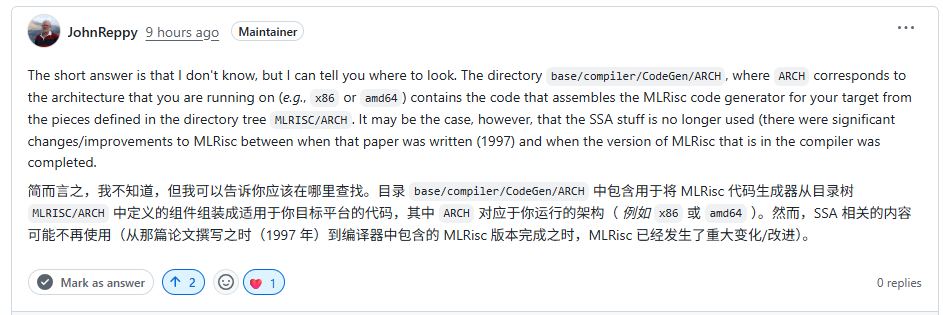
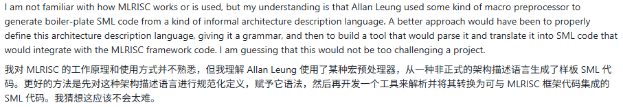
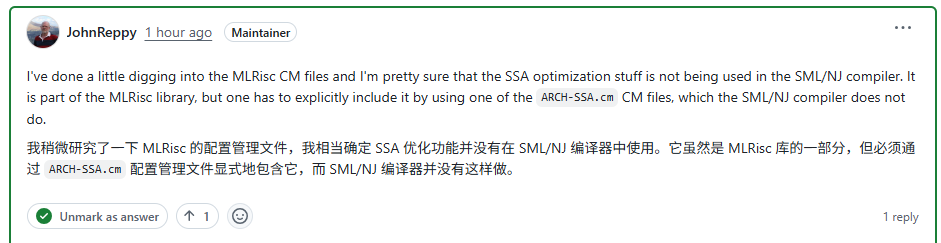
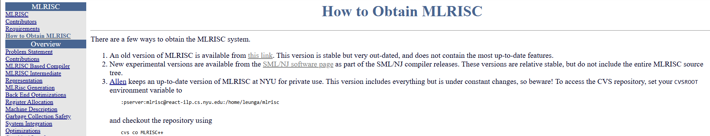
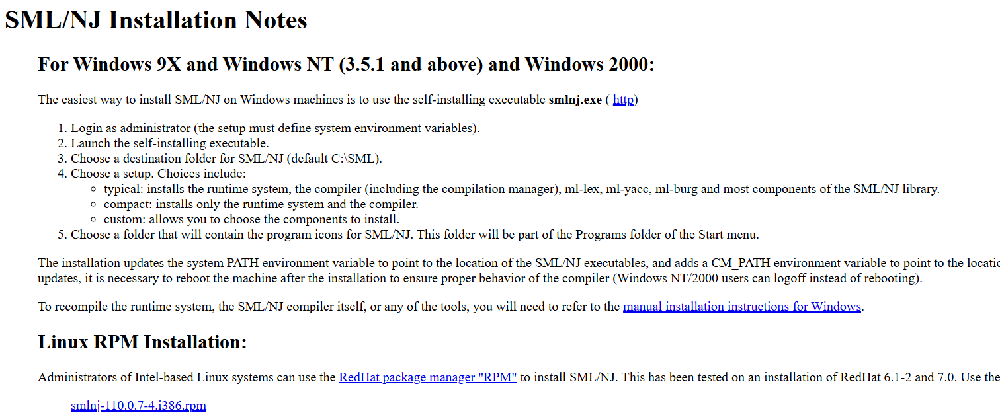
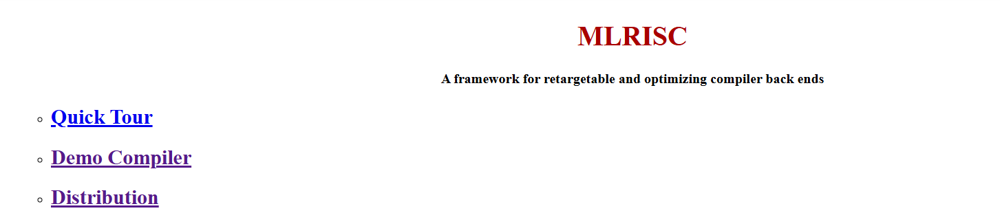
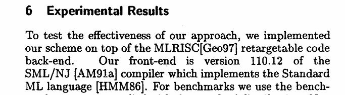

# TODO  
  
[x] MLRISC 构建 1021  
	  
[x] SML 语法整理 1023  
	  
[x] MLRISC IR 观察可行性 1026  
	  
[x] View-ssa 功能可行性 ❌  
	  
[ ] MLRISC IR SSA 如何进行  
	  
  
# 项目构建  
  
## 环境  
  
windows环境的编译流程相当麻烦，因为install.bat编译脚本无法自动拉取或解压tar文件，因此需要提前将所有源文件手动下载并解压在指定目录内才能进行编译；且windows环境的脚本没有错误检查机制，因此即便运行过程出错（并且大概率出错），也不会停止编译和安装，这会导致脚本尝试在错误的目录往错误的文件覆盖写内容，这将会导致大量文件丢失，非常危险；此外，windows环境的安装脚本可能还有其它没踩到的坑，试错成本很高，没有必要尝试。  
优先推荐在linux环境下进行编译，linux版本的编译过程仅仅需要config.tar一个文件即可，其它源文件以及编译过程全部自动化拉取，相比之下非常方便。  
  
## 编译smlnj  
  
https://smlnj.org/dist/working/  
smlnj的每个版本均有对应的INSTALL文件介绍编译流程，以旧版本110.79为例：  
编译指南位于 https://smlnj.org/dist/working/110.79/INSTALL  
  
1. 设定安装目录在环境变量"d"中，安装版本在"v"中  
	  
	```Plain  
	$ d=/usr/share/smlnj     # or whatever you like  
	$ v=110.79               # or whatever is the version you desire  
	```  
	  
2. 拉取并解压config.tgz文件  
	  
	```Plain  
	$ wget http://smlnj.cs.uchicago.edu/dist/working/$v/config.tgz  
	$ gunzip <config.tgz | tar xf -  
	```  
	  
3. 编辑config/targets文件以设定需要使用到的模块，默认以最小安装需求进行编译。  
	  
4. 运行config/install.sh进行编译  
	  
  
<br>  
  
每个模块都有对应的需求文件，如下表：  
  
```Plain  
          if you select...         |    ... you need   
      ---------------------------------------------------------------  
          (always)                 | boot.<arch>-<os>.tgz  
                                   | runtime.tgz  
                                   |  
          src-smlnj                | MLRISC.tgz  
                                   | cm.tgz  
                                   | compiler.tgz  
                                   | smlnj-lib.tgz  
                                   | ml-yacc.tgz  
                                   | system.tgz  
                                   |  
          old-basis                | old-basis.tgz  
                                   |  
          ml-yacc                  | ml-yacc.tgz  
                                   |  
          ml-lex                   | ml-lex.tgz  
                                   |  
          ml-burg                  | ml-burg.tgz  
            requires: ml-lex       |  
                                   |  
          smlnj-lib                | smlnj-lib.tgz  
                                   |  
          pgraph-util              | cm.tgz  
                                   |  
          cml                      | cml.tgz  
            requires: smlnj-lib    |  
                                   |  
          cml-lib                  | cml.tgz  
                                   |  
          eXene                    | eXene.tgz  
            requires: cml, cml-lib |  
                                   |  
          ckit                     | ckit.tgz  
                                   |  
          ml-nlffi-lib             | ml-nlffi-lib.tgz  
                                   |  
          ml-nlffigen              | ml-nlffigen.tgz  
            requires: smlnj-lib,   |  
                      ckit         |  
                                   |  
          mlrisc-tools             | MLRISC.tgz  
                                   |  
          nowhere                  |  
            requires: mlrisc-tools |  
                                   |  
          doc                      | doc.tgz  
```  
  
## 编译boot  
  
boot文件一般由smlnj官网直接提供而无需进行额外编译，但如果需要深入研究MLRISC后端，就需要编译/调试相关的代码，这部分代码在构建后是以MLRISC.cm文件的形式存放于boot目录内的。注意，这里的cm文件并非是以文本格式存在的编译预配置文件，而是smlnj启动引导过程中用到的构建后二进制产物。  
smlnj的INSTALL编译指南内并没有写明如何从源码编译boot cm文件，但github的smlnj项目内写有详细的boot编译指南。  
首先，boot编译指南没有明说的是，编译前需要配置config/targets文件并加上src-smlnj模块的编译需求，随后再次运行install.sh，让脚本将system.tgz源码拉取并解压到base目录下，随后便可以跟随编译指南构建boot。  
https://github.com/smlnj/smlnj?tab=readme-ov-file#recompiling-the-system  
编译指南在Recompiling the System章节有详细介绍。  
适配旧版本后，执行以下命令即可  
  
1. 编译boot文件  
	  
  
```Plain  
cd base/system  
./cmb-make ../../bin/sml  
```  
  
2. 安装boot文件  
	  
  
```Plain  
./makeml  
./installml  
```  
  
# SMLNJ 语法  
  
目前找到的最全的SML教程为Standard ML‘97的在线笔记，资源如下：  
https://homepages.inf.ed.ac.uk/stg/NOTES/notes.pdf  
  
```Markdown  
# Standard ML（SML '97）语法即查表格  
## 1. 基础关键字与绑定语法  
| 语法形式                                                                 | 描述                                                                 | 示例（来自文档）                                                                 | 备注                                                                 |  
|--------------------------------------------------------------------------|----------------------------------------------------------------------|----------------------------------------------------------------------------------|----------------------------------------------------------------------|  
| `val <id> = <exp>`                                                       | 非递归值绑定，将标识符绑定到表达式结果                                 | `val succ = fn x => x + 1`、`val x = 0`                                          | 大小写敏感；多次绑定同一标识符会覆盖；非 imperative 赋值（仅重新绑定） |  
| `val rec <id> = <exp>`                                                   | 递归值绑定，仅用于定义递归函数                                         | `val rec sum' = fn 1 => 1 | n => sum'(n-1) + n`                                          | 非函数无法递归；`fun` 是其语法糖（推荐用 `fun` 定义递归函数）         |  
| `fun <id> <pat> = <exp> | ...`                                                                 | 函数定义语法糖（隐含 `val rec fn`），支持多分支模式匹配                     | `fun sum n = n * (n + 1) div 2`、`fun insert (x, []) = [x] | insert (x, h::t) = ...` | 自带递归属性，无需显式加 `rec`；支持模式匹配分支                      |  
| `fn <pat> => <exp> | ...`                                                                 | 匿名函数字面量，支持多分支模式匹配                                           | `fn x => x + 1`、`fn (d, m, y, c) => (floor (2.61*real m - 0.2) + ...) mod 7`    | 函数应用通过“并列”实现（如 `(fn x=>x+1) 4`）；参数需括号包裹复杂表达式 |  
| `local <decls> in <decls> end`                                           | 局部声明块，`local` 内声明仅在 `in` 块可见（用于隐藏辅助定义）           | `local val floor = Real.floor val real = Real.fromInt in val zeller = ... end`    | 可共享辅助函数但不暴露；`local`/`in` 块均可为空                      |  
| `let <decls> in <exp> end`                                               | 表达式内局部声明，`let` 内声明仅作用于 `in` 后的表达式                     | `let val b = size base val digit = fn n => str (String.sub(base, n)) in ... end`   | 用于临时绑定变量/函数，简化复杂表达式；声明后必须跟表达式             |  
  
  
## 2. 数据类型定义与操作语法  
### 2.1 自定义数据类型（datatype）  
| 语法形式                                                                 | 描述                                                                 | 示例（来自文档）                                                                 | 备注                                                                 |  
|--------------------------------------------------------------------------|----------------------------------------------------------------------|----------------------------------------------------------------------------------|----------------------------------------------------------------------|  
| `datatype <id> = <constr> | <constr> of <type>`                                                  | 定义新数据类型及构造函数（无参/带参）                                         | `datatype colour = red | blue | green`、`datatype inttree = empty | node of int * inttree * inttree` | 构造函数不可重定义内置类型（如 `bool`）；无参构造函数为“nullary 构造函数” |  
| `datatype 'a <id> = <constr> | <constr> of 'a * 'a <id>`                                            | 参数化（泛型）数据类型，`'a` 为类型变量（替代希腊字母 α）                     | `datatype 'a list = nil | :: of 'a * 'a list`、`datatype 'a ttree = empty | node of 'a * ('a*'a) ttree * ('a*'a) ttree` | 列表（list）是预定义参数化 datatype；类型变量用 `'a, 'b` 等标识 |  
| `datatype <id> = <constr> and <id> = <constr>`                           | 相互递归数据类型定义                                                   | `datatype int_exp = plus of int_term * int_term and int_term = times of int_factor * int_factor` | 用于定义依赖彼此的类型（如表达式语法树）                             |  
| `abstype 'a <id> = <constr> with <decls> end`                            | 抽象数据类型（ADT），隐藏构造函数，仅暴露 `with` 内接口                   | `abstype 'a set = null | ins of 'a * 'a set with val emptyset = null val addset = ins end` | 禁止外部通过模式匹配解构；不自动支持 equality，需手动实现 `equal` 函数 |  
| `abstype <id> withtype <type_alias> = <type> with <decls> end`            | 带类型缩写的抽象数据类型，`withtype` 绑定类型别名                         | `abstype dynarray withtype element = S.T with fun update (i, x) = ... end`       | `withtype` 仅在 abstype 内生效，用于简化类型表达                     |  
  
### 2.2 内置复合数据类型  
| 语法形式                                                                 | 描述                                                                 | 示例（来自文档）                                                                 | 备注                                                                 |  
|--------------------------------------------------------------------------|----------------------------------------------------------------------|----------------------------------------------------------------------------------|----------------------------------------------------------------------|  
| `(<exp1>, <exp2>, ..., <expn>)`                                          | 元组（tuple），元素可不同类型，本质是“带编号字段的 record”               | `(1, true)`、`(d, m, y, c)`（四元组）                                            | 类型表示为 `t1 * t2 * ... * tn`（如 `int * bool`）；无“子类型”关系（如 `int*real` 与 `int*real*bool` 无关） |  
| `{<key1> = <exp1>, <key2> = <exp2>, ...}`                                 | 记录（record），带命名字段，字段类型需显式/推断                           | `{initial = #"S", surname = "Gilmore", age = 40}`                                | 类型表示为 `{key1: t1, key2: t2, ...}`；通过 `#key` 访问字段（如 `#surname lecturer`） |  
| `[]` / `[<exp1>, <exp2>, ...]`                                           | 列表（list）字面量，`[]` 为空列表，`[a,b]` 是 `a :: b :: nil` 的语法糖     | `[]`、`[1,2,3]`、`["Monday", "Tuesday"]`                                        | 列表元素必须同类型；`::` 为“cons”运算符（右结合，优先级 5）；`nil` 是空列表构造函数 |  
| `#[<exp1>, <exp2>, ...]`                                                 | 向量（vector）字面量，固定长度、随机访问（区别于列表的顺序访问）           | `#[2,4,8,16,32]`、`#["Sunday", "Monday"]`                                        | 类型表示为 `'a vector`；通过 `Vector.sub(v, i)` 访问下标（从 0 开始）；无模式匹配构造函数 |  
  
  
## 3. 模式匹配语法  
| 语法形式                                                                 | 描述                                                                 | 示例（来自文档）                                                                 | 备注                                                                 |  
|--------------------------------------------------------------------------|----------------------------------------------------------------------|----------------------------------------------------------------------------------|----------------------------------------------------------------------|  
| `<constr>`                                                               | 构造函数模式，匹配对应构造函数的值                                       | `fn red => 1 | blue => 2 | green => 3`、`fun last [x] = x`                        | 需覆盖所有可能构造函数（否则编译器警告“非穷举”）                     |  
| `_`                                                                      | 通配符模式，匹配任意值（忽略具体值）                                     | `fn 1 => "Monday" | 2 => "Tuesday" | _ => "Sunday"`、`fun member (x, _::t) = ...` | 用于“catch-all”分支或忽略无关值；不可单独绑定变量                     |  
| `<id> as <pat>`                                                          | `as` 模式，绑定标识符到匹配的模式整体                                     | `fun insert (x, l as h::t) = if x <= h then x::l else h::insert(x, t)`            | 避免重复解构（如 `l` 绑定 `h::t` 整体，无需重新组合列表）             |  
| `<pat1> | <pat2>`                                                             | 多模式分支，用 `|` 分隔不同匹配分支                                       | `fun nth ([], _) = raise Subscript | nth (h::t, 0) = h | nth (_::t, n) = nth(t, n-1)` | 分支按“first-fit”原则匹配（前面分支匹配后不执行后续）                 |  
| `(<pat1>, <pat2>, ...)` / `{<key1> = <pat1>, ...}`                       | 元组/记录模式，解构复合类型的值                                           | `val (x, y) = (6,7)`（元组解构）、`fun initials (p: {initial: char, surname: string}) = (#initial p, ...)` | 记录模式需匹配字段名；元组模式需匹配元素数量                         |  
| `case <exp> of <pat1> => <exp1> | <pat2> => <exp2>`                                                     | `case` 表达式，显式模式匹配分支                                           | `case m > n of true => e | false => g (reduce(...), f n)`、`case f h of SOME v => v | NONE => ...` | 派生形式（本质是 `fn` 应用）；替代多分支 `if-else`                   |  
  
  
## 4. 函数进阶语法  
### 4.1 函数参数与调用  
| 语法形式                                                                 | 描述                                                                 | 示例（来自文档）                                                                 | 备注                                                                 |  
|--------------------------------------------------------------------------|----------------------------------------------------------------------|----------------------------------------------------------------------------------|----------------------------------------------------------------------|  
| `<fn_exp> <arg_exp>`                                                     | 函数应用，通过“并列”实现（无括号/逗号）                                   | `succ 4`、`(fn x => x+1) ((fn x => x+1) 4)`、`rev [1,2,3]`                     | 左结合（如 `f a b = (f a) b`）；复杂参数需括号包裹（如 `f (a + b)`） |  
| `op <infix_op>`                                                          | 将中缀运算符转为前缀函数                                               | `op +`（等价于 `fn (x,y) => x+y`）、`reduce (op *, 1, 1, n, fn x => x)`          | 支持所有中缀运算符（`+, -, *, div, @, ::` 等）；`(op *)` 需空格避免与注释冲突 |  
| `infix <prec> <op>` / `infixr <prec> <op>`                               | 声明中缀/右结合中缀运算符及优先级（1-9，数字越大优先级越高）               | `infixr 5 ::`、`infix 4 @`                                                      | 内置 `::` 为右结合（infixr 5），`@` 优先级与 `::` 相同；可修改优先级（不推荐） |  
  
### 4.2 高阶函数与柯里化  
| 语法形式                                                                 | 描述                                                                 | 示例（来自文档）                                                                 | 备注                                                                 |  
|--------------------------------------------------------------------------|----------------------------------------------------------------------|----------------------------------------------------------------------------------|----------------------------------------------------------------------|  
| `<fn> : (<a> -> <b>) -> <c>`                                             | 高阶函数（参数为函数）                                                 | `val reduce = fn (g, e, m, n, f) => ...`（`g` 和 `f` 为函数参数）                | 文档中 `reduce`、`twice`、`iter` 均为高阶函数；函数可作为参数/返回值 |  
| `fn <x> => fn <y> => <exp>`                                              | 柯里化（curried）函数，返回函数作为结果                                 | `val twice = fn f => fn x => f(f x)`、`val iter = fn 0 => (fn f => fn x => x) | n => (fn f => fn x => f (iter (n-1) f x))` | 柯里化函数支持部分应用（如 `val addtwo = twice (fn x => x+1)`）       |  
| `val curry = fn f => fn x => fn y => f(x,y)`                             | 柯里化转换函数，将“元组参数函数”转为柯里化函数                             | `val add = curry op +`、`add 3 4`（等价于 `op + (3,4)`）                        | 对应 `uncurry` 函数：`val uncurry = fn f => fn (x,y) => f x y`       |  
| `f o g`                                                                 | 函数组合（functional order），`(f o g)(x) = f(g(x))`                     | `val tentimes = fn s => cons (10 * head s, tentimes o tail s)`、`compose (f,g) = f o g` | 内置运算符 `o`（小写字母 O）；左结合；需确保 `g` 的返回类型匹配 `f` 的参数类型 |  
  
### 4.3 常用高阶函数模板  
| 语法形式                                                                 | 描述                                                                 | 示例（来自文档）                                                                 | 备注                                                                 |  
|--------------------------------------------------------------------------|----------------------------------------------------------------------|----------------------------------------------------------------------------------|----------------------------------------------------------------------|  
| `fun map f [] = [] | map f (h::t) = f h :: map f t`                                         | `map` 函数：将函数应用于列表所有元素，返回新列表                               | `map (fn x => x*2) [1,2,3]`（结果 `[2,4,6]`）、`map String.sub (["abc", "def"], 0)` | 类型为 `('a -> 'b) -> 'a list -> 'b list`；保留列表长度             |  
| `fun foldr g e [] = e | foldr g e (h::t) = g (h, foldr g e t)`                               | `foldr`（右折叠）：从列表右侧累积计算，`e` 为单位元                           | `fun sum' s = foldr (fn (x,y) => 1+y) 0 s`、`fun sort' s = foldr insert [] s`    | 类型为 `('a * 'b -> 'b) -> 'b -> 'a list -> 'b`；`g` 为二元累积函数 |  
| `fun foldl g e [] = e | foldl g e (h::t) = foldl g (g (h,e)) t`                               | `foldl`（左折叠）：从列表左侧累积计算，顺序与 `foldr` 相反                     | `fun listrev s = foldl (fn (x,y) => x::y) [] s`（反转列表）                     | 适用于 commutative 操作；非 commutative 操作结果与 `foldr` 不同     |  
  
  
## 5. 类型系统语法  
### 5.1 类型表示与约束  
| 语法形式                                                                 | 描述                                                                 | 示例（来自文档）                                                                 | 备注                                                                 |  
|--------------------------------------------------------------------------|----------------------------------------------------------------------|----------------------------------------------------------------------------------|----------------------------------------------------------------------|  
| `'a` / `'b`                                                              | 类型变量，表示“任意类型”（泛型）                                         | `val id = fn x: 'a => x: 'a`、`datatype 'a list = nil | :: of 'a * 'a list`      | 文档中 `'a` 对应希腊字母 α；类型变量仅在泛型场景使用                 |  
| `''a`                                                                    | 相等类型（equality type），表示“支持 equality 运算的类型”                 | `fun member (x: ''a, l: ''a list) = ...`、`type ''a set = ''a -> bool`            | 函数类型、异常类型不支持 equality；`''a` 打印时带两个前缀单引号       |  
| `<exp> : <type>`                                                         | 类型约束，显式指定表达式类型（覆盖类型推断）                               | `val c: int list ref = ref []`、`val x = (100: BigInt.int)`                        | 用于类型推断歧义场景（如 `ref []` 需约束为 `int list ref`）；避免默认重载歧义 |  
| `type <id> = <type>`                                                     | 类型缩写（别名），纯语法糖（不创建新类型）                                 | `type person = {initial: char, surname: string, age: int}`、`type 'a delayed = unit -> 'a` | 不可递归（如 `type 'a tree = node of 'a * 'a tree * 'a tree` 非法，需用 `datatype`） |  
| `type ('a, 'b) <id> = <type>`                                            | 多参数类型缩写                                                         | `type ('a, 'b) lookup = ('a * 'b) list`、`type ('a, 'b) pair = 'a * 'b`          | 用于表示依赖多个类型变量的复合类型                                   |  
  
### 5.2 类型推断与多态  
| 语法形式                                                                 | 描述                                                                 | 示例（来自文档）                                                                 | 备注                                                                 |  
|--------------------------------------------------------------------------|----------------------------------------------------------------------|----------------------------------------------------------------------------------|----------------------------------------------------------------------|  
| `let val <id> = <exp> in <exp1>, <exp2> end`                             | Let-多态（let-polymorphism）：`let` 绑定的标识符可多类型实例化           | `let val id = fn x => x in (id 3, id true) end`（`id` 同时为 `int->int` 和 `bool->bool`） | `fn` 绑定无此特性（如 `(fn id => (id 3, id true)) (fn x=>x)` 非法）  |  
| `val <id> = <exp>`（无类型约束）                                          | 类型推断：SML 自动计算表达式类型，无需显式声明                           | `val succ = fn x => x+1`（推断为 `int -> int`）、`val pair = fn x => (x,x)`（推断为 `'a -> 'a * 'a`） | 强静态类型；类型错误在编译期发现；避免冗余类型声明                   |  
| `default overloading`                                                    | 默认重载：运算符/函数根据上下文默认选择类型（如 `+` 默认为 `int` 类型）   | `fun square x = x * x`（推断为 `int -> int`）、`fun ordered (x,y) = x < y`（推断为 `int * int -> bool`） | 重载优先级：`int` > `word`/`real`；可通过类型约束修改（如 `square (2.0: real)`） |  
  
  
## 6. Imperative 特性语法  
### 6.1 引用与赋值  
| 语法形式                                                                 | 描述                                                                 | 示例（来自文档）                                                                 | 备注                                                                 |  
|--------------------------------------------------------------------------|----------------------------------------------------------------------|----------------------------------------------------------------------------------|----------------------------------------------------------------------|  
| `ref <exp>`                                                               | 引用（reference）：创建可修改的内存单元，返回 `'a ref` 类型               | `val n = ref 0`（`int ref`）、`val f = ref (fn x => x)`（`('a -> 'a) ref`）        | 必须初始化；`ref 0 <> ref 0`（两个不同引用单元）；支持指针 equality |  
| `! <ref_exp>`                                                             | 解引用：获取引用单元存储的值                                             | `!n`（获取 `n` 的值）、`fun inc r = r := !r + 1`（通过解引用修改值）              | 类型为 `'a ref -> 'a`；空引用无定义（编译期禁止未初始化引用）         |  
| `<ref_exp> := <exp>`                                                     | 赋值：修改引用单元的值，返回 `unit` 类型（仅副作用）                       | `n := 5`、`r := !r * !n`、`fun ifac N = let val n = ref N in while !n <>0 do (i := !i * !n; n := !n-1) end` | 类型为 `'a ref * 'a -> unit`；`unit` 类型仅值 `()`（空记录 `{}` 语法糖） |  
  
### 6.2 循环与顺序执行  
| 语法形式                                                                 | 描述                                                                 | 示例（来自文档）                                                                 | 备注                                                                 |  
|--------------------------------------------------------------------------|----------------------------------------------------------------------|----------------------------------------------------------------------------------|----------------------------------------------------------------------|  
| `while <cond_exp> do <exp>`                                              | `while` 循环：`cond_exp` 为 `bool` 类型，`exp` 为循环体（副作用）         | `while !n <> 0 do (i := !i * !n; n := !n - 1)`、`while not (TextIO.endOfStream is) do ...` | 派生形式（本质是递归函数）；循环体无返回值（`unit` 类型）；需显式修改状态（如引用） |  
| `<exp1>; <exp2>`                                                         | 顺序组合：先执行 `exp1`（忽略结果），再执行 `exp2`（返回其结果）           | `n := 5; !n`（结果 `5`）、`(TextIO.output (stdOut, s); TextIO.closeOut stdOut)`  | 括号可选（复杂场景需括号）；`exp1` 通常为副作用操作（赋值、IO）       |  
  
### 6.3 数组与 IO  
| 语法形式                                                                 | 描述                                                                 | 示例（来自文档）                                                                 | 备注                                                                 |  
|--------------------------------------------------------------------------|----------------------------------------------------------------------|----------------------------------------------------------------------------------|----------------------------------------------------------------------|  
| `Array.array (<size>, <init_exp>)`                                       | 创建数组：固定大小，初始值为 `init_exp`，类型 `'a Array.array`             | `val arr = Array.array (5, 0)`（`int Array.array`）                               | 数组下标从 0 开始；随机访问（O(1) 时间）；区别于列表（顺序访问）     |  
| `Array.sub (<arr>, <idx>)` / `Array.update (<arr>, <idx>, <exp>)`        | 数组访问/修改：`sub` 获取下标值，`update` 修改下标值                       | `Array.sub (arr, 2)`、`Array.update (arr, 3, 10)`                                | 下标越界 raise `Subscript` 异常；`update` 返回 `unit` 类型            |  
| `TextIO.openIn <filename>` / `TextIO.openOut <filename>`                  | 文件 IO：打开输入/输出流，类型 `TextIO.instream`/`TextIO.outstream`       | `val is = TextIO.openIn "data.txt"`、`val os = TextIO.openOut "output.txt"`      | 打开失败 raise `Io` 异常；需用 `TextIO.closeIn`/`TextIO.closeOut` 关闭流 |  
| `TextIO.inputN (<is>, <n>)` / `TextIO.output (<os>, <str>)`              | 文本读写：`inputN` 读 `n` 个字符，`output` 写字符串到流                     | `val s = TextIO.inputN (is, 10)`、`TextIO.output (TextIO.stdOut, "Hello")`       | `TextIO.stdIn`/`TextIO.stdOut` 为标准输入/输出流；`inputN` 返回字符串 |  
| `BinIO.openIn <filename>` / `BinIO.output (<os>, <vec>)`                 | 二进制 IO：打开二进制流，读写 `Word8Vector.vector` 类型数据                 | `val is = BinIO.openIn "binary.dat"`、`BinIO.output (os, Word8Vector.fromList [0w65, 0w66])` | 用于处理二进制文件（如 Base64 解码）；需 `Word8` 结构辅助             |  
  
  
## 7. 异常处理语法  
| 语法形式                                                                 | 描述                                                                 | 示例（来自文档）                                                                 | 备注                                                                 |  
|--------------------------------------------------------------------------|----------------------------------------------------------------------|----------------------------------------------------------------------------------|----------------------------------------------------------------------|  
| `exception <id>` / `exception <id> of <type>`                             | 异常定义：无参/带参异常构造函数，属于 `exn` 类型                           | `exception Empty`、`exception Subscript`、`exception Io of string`               | 异常不可重定义；`exn` 类型不支持 equality；构造函数可用于模式匹配     |  
| `raise <exn>`                                                             | 抛出异常：中断当前执行，触发异常处理                                       | `fun hd [] = raise Empty | hd (h::t) = h`、`fun nth ([], _) = raise Subscript`   | 抛出的异常需被 `handle` 捕获，否则程序终止；异常可携带数据（如 `raise Io "File not found"`） |  
| `<exp> handle <exn1> => <exp1> | <exn2> => <exp2>`                                                     | 捕获异常：`exp` 执行失败时，匹配异常并执行对应处理表达式                         | `hd [] handle Empty => #" "`、`memberset (x, s) handle Subscript => false` | 按分支顺序匹配；`_` 可捕获所有异常（如 `exp handle _ => default`）   |  
| `fun tester f x = SOME (f x) handle _ => NONE`                            | 异常封装：将“可能抛异常的函数”转为“返回 `option` 类型的函数”                 | `val hd_tst = tester hd`、`hd_tst []`（返回 `NONE`）、`hd_tst [1]`（返回 `SOME 1`） | `option` 类型为 `datatype 'a option = NONE | SOME of 'a`；避免直接抛异常 |  
  
  
## 8. 模块系统语法  
### 8.1 签名（Signature）  
| 语法形式                                                                 | 描述                                                                 | 示例（来自文档）                                                                 | 备注                                                                 |  
|--------------------------------------------------------------------------|----------------------------------------------------------------------|----------------------------------------------------------------------------------|----------------------------------------------------------------------|  
| `signature <id> = sig <decls> end`                                       | 签名定义：指定结构（structure）的接口，声明类型、值、函数的可见性与类型       | `signature Set = sig type ''a set val emptyset : ''a set val addset : ''a * ''a set -> ''a set end` | 签名可隐藏结构内部定义；结构需“匹配”签名（满足接口要求）             |  
| `signature <id> = sig include <sig> sharing type <t1> = <t2> end`        | 签名继承与共享约束：`include` 导入其他签名，`sharing` 声明类型等价           | `signature DYNARRAY = sig include SET sharing type element = T end`              | 用于关联参数与结果类型（如 `element = T`）；确保类型一致性           |  
| `signature <id> = sig eqtype <id> end`                                    | 相等类型签名：声明类型支持 equality（`eqtype`）                             | `signature SIG = sig eqtype T end`、`functor Dynarray (S: SIG) = ...`            | `eqtype` 仅在签名中使用；对应结构的类型需支持 equality               |  
  
### 8.2 结构（Structure）  
| 语法形式                                                                 | 描述                                                                 | 示例（来自文档）                                                                 | 备注                                                                 |  
|--------------------------------------------------------------------------|----------------------------------------------------------------------|----------------------------------------------------------------------------------|----------------------------------------------------------------------|  
| `structure <id> = struct <decls> end`                                    | 结构定义：封装类型、值、函数的命名空间（模块）                             | `structure Set = struct type ''a set = ''a list val emptyset = [] val addset = op :: end` | 结构内声明通过 `Structure.id` 访问（如 `Set.addset`）；生成性（`struct ... end` 每次生成新结构） |  
| `structure <id> :> <sig> = struct <decls> end`                            | 结构约束：将结构与签名绑定（opaque 约束），隐藏签名外的定义                 | `structure Set :> Set = struct type ''a set = ''a list val emptyset = [] ... end` | Opaque 约束：签名外的类型/值不可见；区别于透明约束（`:`，暴露内部类型） |  
| `open <structure>`                                                       | 打开结构：将结构内的标识符导入当前命名空间，无需前缀访问                     | `open List`、`open TextIO`、`functor REFRESH (S: SIG) = struct open S end`      | 避免重复写 `Structure.id`；`open` 后的结构标识符优先级高于当前命名空间 |  
  
### 8.3 函子（Functor）  
| 语法形式                                                                 | 描述                                                                 | 示例（来自文档）                                                                 | 备注                                                                 |  
|--------------------------------------------------------------------------|----------------------------------------------------------------------|----------------------------------------------------------------------------------|----------------------------------------------------------------------|  
| `functor <id> (<arg>: <sig>) = struct <decls> end`                        | 函子定义：参数化模块，输入结构返回新结构（模块级“函数”）                     | `functor Dynarray (S: SIG) = struct abstype dynarray withtype element = S.T ... end` | 函子参数需指定签名；生成性（每次应用生成新结构）；不可递归/柯里化     |  
| `functor <id> (eqtype <t>) = struct <decls> end`                          | 简化函子：直接参数化类型（派生形式，等价于参数为结构）                       | `functor Dynarray (eqtype T) = struct abstype dynarray withtype element = T ... end` | 避免手动定义参数结构（如 `struct type T = string end`）；更简洁       |  
| `structure <id> = <functor> (<arg_struct>)`                               | 函子应用：将结构作为参数传入函子，生成新结构                               | `structure String = struct type T = string end`、`structure StringDynarray = Dynarray (String)` | 参数结构必须匹配函子的签名；生成的结构继承函子的接口                 |  
| `functor <id> (structure A: <sig> and B: <sig> sharing type A.t = B.t) = ...` | 多参数函子与共享约束：多个结构参数，声明类型等价                             | `functor Override (structure A1: DYNARRAY and A2: DYNARRAY sharing type A1.element = A2.element) = ...` | 确保多参数结构的类型兼容（如 `A1.element = A2.element`）             |  
```  
  
# MLRISC IR 观测  
  
mlrisc-ir.sml  
  
```Plain  
functor MLRISC_IR  
   (structure CFG         : CONTROL_FLOW_GRAPH  
    structure CDG         : CONTROL_DEPENDENCE_GRAPH  
    structure Loop        : LOOP_STRUCTURE  
    structure GraphViewer : GRAPH_VIEWER  
    structure Util        : CFG_UTIL  
       sharing Loop.Dom = CDG.Dom  
       sharing Util.CFG = CFG  
   ) : MLRISC_IR =  
struct  
  
...  
  
   type cfg  = CFG.cfg  
   type IR   = CFG.cfg  
  
...  
  
   val layouts = ref [] : (string * (IR -> L.layout)) list ref  
     
   fun findLayout name =  
   let fun f [] = (print ("[Can't find "^name^"]\n"); raise NoLayout)  
         | f((x,layout)::rest) = if x = name then layout else f rest  
   in  f(!layouts) end  
  
   fun view name IR = GraphViewer.view(findLayout name IR)   
           handle NoLayout => ()  
```  
  
根据源码分析MLRISC\_IR结构的组成，结论与直觉相悖，虽然该结构在源码内被命名为“IR”，但其与常规意义上的IR结构不同，它不以简单的操作码或操作数组成，而是由CFG结构以及其它复合视图组件组成，换句话说，MLRISC\_IR本质上是一个功能增强的CFG容器。结构内提供了view函数以便直观地观测MLRISC\_IR，该函数会借助GraphViewer.view函数来打印CFG。  
CFG内部的单个节点反而揭示了MLRISC后端所使用的真正的IR，其节点结构名为INSTRUCTIONS，这是一种机器级IR，与真实的汇编结构基本一致，支持多架构（包括X86），结构内有多个功能丰富的子结构  
  
- CELL：可以管理寄存器分配，标记寄存器类型（通用寄存器、浮点寄存器、条件码寄存器等）  
	  
- CELLS\_BASIS：CELLS的基础实现，提供基本的单元操作和类型定义  
	  
- operand：操作数，支持多架构，可以表示寄存器，立即数，内存引用等等  
	  
- addressing\_mode：标记寻址模式  
	  
- ea：标记用于内存访问的地址  
	  
- instr：指令类型，同样支持多架构  
	  
  
其它datatype例如LIVE，KILL分别表示当前指令活跃或非活跃寄存器，通常用在SSA阶段的数据流分析功能中。  
  
```Plain  
signature INSTRUCTIONS =  
sig  
   structure C   : CELLS  
   structure CB  :CELLS_BASIS = CellsBasis  
   type operand             (* operands supported by architecture *)  
   type addressing_mode                        (* addressing mode *)  
   type ea              (* effective address for accessing memory *)  
   type instr                       (* architecture instructions  *)  
     
   datatype instruction =                   (* partially abstract *)  
       LIVE of {regs: C.cellset, spilled: C.cellset}  
     | KILL of {regs: C.cellset, spilled: C.cellset}  
     | COPY of   
         {k: CB.cellkind,   
          sz: int,                                       (* in bits *)  
          dst: CB.cell list,   
          src: CB.cell list,  
          tmp: ea option      (* = NONE if |dst| = |src| = 1 *)  
         }  
     | ANNOTATION of {i: instruction, a: Annotations.annotation}  
     | INSTR of instr  
end  
```  
  
因此，观测MLRISC IR等同于观测CFG内部的IR节点，MLRISC会根据目标架构选择合适的Emitter，以x86Asm.sml中的X86AsmEmitter为例，GraphViewer.view最终会将CFG中的每条IR通过emit函数等价映射为对应架构的指令，最终MLRISC IR在X86架构下以如下形式呈现，因此，观测MLRISC IR又几乎等同于直接观测SML转换后的汇编。  
同理，由于MLRISC IR的结构几乎等同于汇编，以其它形式观测该IR的意义不大，虽然论文“SSA for machine code”中强调的是对机器级IR进行处理，但论文方法又被作者明确用于MLRISC后端中，因此该论文也可以被间接视作可以直接对汇编进行处理。  
  
```Java  
[ after instruction selection ]  
BLOCK 0 [1.000000]  
        .align  2  
L0:  
        succ:     1:false[0.000000], 2:true[0.000000]  
        pred:     3:entry[0.000000]  
        cmpl    12(%esp), %edi  
        /* branch(1/1000) */  
        ja      L1  
BLOCK 1 [1.000000]  
        /* Liveout:  GP={%256 %esp %edi %ebp %edx %ecx %ebx %esi}  */  
        succ:     4:exit[0.000000]  
        pred:     0:false[0.000000]  
        movl    76(%esp), %514  
        movl    %esi, %515  
        movl    %ebx, %516  
        movl    %ecx, %517  
        movl    %edx, %518  
        movl    %ebp, %519  
        movl    $130, (%edi)  
        movl    $3, 4(%edi)  
        leal    4(%edi), %521  
        movl    %515, %esi  
        movl    %516, %ebx  
        movl    %517, %ecx  
        movl    %518, %edx  
        movl    %521, %ebp  
        addl    $8, %edi  
        jmp     *%esi  
BLOCK 2 [1.000000]  
        /* Liveout:  GP={%8 %9 %esi %ebx %ecx %edx %ebp}  */  
L1:  
        succ:     4:jump[0.000000]  
        pred:     0:true[0.000000]  
        jmp     L2  
ENTRY 3 [0.000000]  
        succ:     0:entry[0.000000]  
EXIT 4 [0.000000]  
        pred:     2:jump[0.000000], 1:exit[0.000000]  
```  
  
# CFG 可视化  
  
```Go  
structure M = Control.MLRISC;  
  
M.mlrisc := true;  
  
M.getString "viewer" := "dot";  
  
M.getFlag "view-outline" := true;  
  
M.getFlag "view-IR" := true;  
  
M.getInt "min-blocks" := 0;  
  
M.getFlag "verbose" := true;  
  
M.mlrisc_phases := ["cluster->cfg","view-cfg","view-ssa","view-ssacfg","cfg->ssa"];  
  
M.getFlag "dump-initial-cfg" := true;  
  
M.getFlag "cfg-graphical-view" := true;  
```  
  
# SSA 观测  
  
快速总结，结论就是在AMD64架构上的MRISC SSA功能很可能并未被使用到，SSA相关的代码仅仅是未被删除的历史遗留，经测试在删除SSA相关的所有代码后（整个SSA以及Glue文件夹）cmb-make依旧能够完整编译，并且sml功能未受影响，因此，至少在AMD64架构上，SSA功能并未被开启。  
https://github.com/orgs/smlnj/discussions/329  
  
通过与SMLNJ开发者的讨论得知，由于论文“SSA for Machine Code”发布之时（1997年）到MLRISC的证实版本之间相隔了数年，其功能已经发生了重大变化，因此他们并不清楚MLRISC中SSA模块是否被启用，并据此给出了该功能很可能已不再使用的结论。这一结论符合我们之前的测试预期。而且，开发者的回答不局限于AMD64这一种架构，这或许意味着在所有架构中，SSA功能均未被启用。  
  
其次，开发者还提及，论文作者Allan Leung可能使用了某种未知语言（通过观察源码，符合描述的或许是.mdl文件，MDLGen相关的逻辑也与此描述相符），并通过宏将其处理为SML，并合入某个MLRISC分支进行测试。结合原论文的上下文来看，Allan可能仅仅是借助某个MLRISC分支进行了基准测试，以证明其论文方法的优势。这意味着，Allan的改动很可能并未被合入主线功能（或者，代码虽被合入，但功能未被启用，这也能解释为何代码中存在SSA的相关逻辑）。  
  
  
开发者还提及一个线索，SSA的cm相关文件需要在对应的架构cm文件中被引用，但实际引用后无法进行编译，会出现许多依赖和路径问题，并且cm中声明的许多sml/sig文件均缺失（例如mlrisc-ssa.sml根本不存在），且在早期版本无法找到。  
  
http://web.archive.org/web/20000917015406/http://www.cs.nyu.edu/leunga/www/MLRISC/Doc/html/availability.html  
  
http://web.archive.org/web/20090224184054/http://smlnj.org/install/index.html  
  
http://web.archive.org/web/20001011172223/http://cm.bell-labs.com/cm/cs/what/smlnj/doc/MLRISC/quick-tour/index.html  
  
通过论文引用的 WebArchive 链接，可以找到一个非常早期的 SMLNJ 110.0.7 安装包，这是目前唯一能找到的早期版本。在Win7虚拟机上运行后，发现其基础库与Runtime均不存在MLRISC后端，根据论文对MLRISC SSA的实现细节可知其使用的版本为110.12，但该版本目前已无法找到。同样，在 WebArchive 页面中还发现了一个早期的 MLRISC 源码，但从其代码结构来看，并未包含 SSA 相关逻辑。该页面中还有一个名为mlriscTriger的源码资源也已无法下载且没有备份。论文作者也未曾提及SSA代码是否有提交到主线。  
综上所述，修复MLRISC SSA功能的成本过高，故此放弃，即便如此，还是可以通过静态查看SSA残留代码相关的逻辑来分析其原始功能与实现细节，只不过由于功能未被开启，因此这部分代码无法调试。  
<br>  
