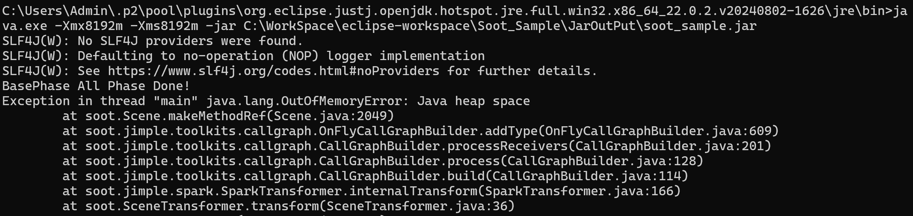

# Soot Dev Note
20250723  
## 终止开发
Soot的性能以及分析能力极其糟糕，在分析8MB左右的service.jar时，在配置8GB的虚拟机堆大小的情况下耗时10分钟依然OOM，并且其spark分析过程会在on-fly-cg环节出错，并且会在某些情况下将局部变量加入全局引用对象内，然后导致抛出异常，同时，其健壮性也极其糟糕，在大多数情况下，分析过程中如果抛出异常，会导致全部分析过程终止，而不是保留异常创建虚类继续分析，会经常出现分析数十分钟后抛错从而导致进度全部丢失，调试代价很高。同时，即便关闭许多子功能，例如强连通图分量分析，RTA等，也依然无法避免抛错与OOM，在经过一个上午的调试后，决定不再使用SOOT框架。  
  
## Project Structure
- analyze
  - handler 多功能句柄处理模块，单个句柄能串联多个阶段
    - BaseHandler 句柄基类
    - CallGraphHandler 调用图生成句柄
  - phase 多阶段调控模块
    - PhaseBaseHandler 调控基类
    - CallGraphPhase 调用图生成
  - utils 工具模块
    - OptionsUtils.java：参数初始化/Options调整
    - StoreUtils.java：临时对象存储  

## Thoughts
### CFG Store
使用Gson序列化存储  
层级 Pkg-\>Clz-\>Method  
调用图存储数据结构  
```json
{
  "com": [
    {
      "subpkg1": [
        {
          "leafpkg1_1": [
            {
              "Clz1": [
                {
                  "SrcMethod1": [
                    "TgtMethod1",
                    "TgtMethod2"
                  ],
                  "SrcMethod2": [
                    "TgtMethod1",
                    "TgtMethod2"
                  ]
                }
              ],
              "Clz2": [
                {
                  "SrcMethod1": [
                    "TgtMethod1",
                    "TgtMethod2"
                  ],
                  "SrcMethod2": [
                    "TgtMethod1",
                    "TgtMethod2"
                  ]
                }
              ]
            }
          ]
        }
      ],
      "subpkg2": [
        {
          "leafpkg": []
        }
      ]
    }
  ]
}
```
测试样例
```json
{
  "no_pkg": [
    {
      "Main": [
        {
          "<Main: void main(java.lang.String[])>": [
            "<java.lang.AbstractStringBuilder: void <clinit>()>",
            "<java.lang.StringBuilder: void <init>(java.lang.String)>",
            "<java.lang.String: java.lang.String valueOf(java.lang.Object)>",
            "<java.lang.System: long nanoTime()>",
            "<Main: boolean equals(java.lang.CharSequence,java.lang.CharSequence)>",
            "<java.lang.String: void <clinit>()>",
            "<java.lang.System: void <clinit>()>",
            "<java.lang.StringBuilder: java.lang.StringBuilder append(java.lang.String)>",
            "<java.lang.String: java.lang.String[] split(java.lang.String)>"
          ]
        },
        {
          "<Main: void <init>()>": [
            "<java.lang.Object: void <init>()>"
          ]
        },
        {
          "<Main: void appendEscapedSQLString(java.lang.StringBuilder,java.lang.String,boolean)>": [
            "<java.lang.Character: void <clinit>()>",
            "<java.lang.Character: boolean isLowSurrogate(char)>",
            "<java.lang.Character: boolean isHighSurrogate(char)>"
          ]
        },
        {
          "<Main: void sendReq()>": [
            "<java.net.URL: void <clinit>()>",
            "<java.io.BufferedWriter: void <init>(java.io.Writer)>",
            "<java.io.OutputStreamWriter: void <init>(java.io.OutputStream)>",
            "<java.lang.StringBuilder: void <init>(java.lang.String)>",
            "<java.net.URL: void <init>(java.lang.String)>",
            "<java.lang.AbstractStringBuilder: void <clinit>()>",
            "<java.io.BufferedWriter: void close()>",
            "<java.lang.StringBuilder: java.lang.StringBuilder append(java.lang.String)>",
            "<java.net.URL: java.net.URLConnection openConnection()>",
            "<java.lang.String: byte[] getBytes()>"
          ]
        },
        {
          "<Main: java.lang.String getRandom(int)>": [
            "<java.util.Random: void <clinit>()>",
            "<java.lang.StringBuffer: void <init>()>",
            "<java.util.Random: void <init>()>",
            "<java.lang.AbstractStringBuilder: void <clinit>()>",
            "<java.lang.StringBuffer: void <clinit>()>",
            "<java.lang.StringBuffer: java.lang.StringBuffer append(char)>",
            "<java.lang.StringBuffer: java.lang.String toString()>",
            "<java.util.Random: int nextInt(int)>",
            "<java.lang.String: char charAt(int)>"
          ]
        },
        {
          "<Main: java.lang.Object name()>": [
            "<java.lang.Boolean: void <clinit>()>",
            "<java.lang.Boolean: void <init>(boolean)>"
          ]
        },
        {
          "<Main: boolean equals(java.lang.CharSequence,java.lang.CharSequence)>": [
            "<java.lang.String: int length()>",
            "<java.lang.String: boolean equals(java.lang.Object)>",
            "<java.lang.String: char charAt(int)>"
          ]
        }
      ]
    },
    {
      "Main$Suber": [
        {
          "<Main$Suber: void <init>(Main)>": [
            "<java.lang.Object: void <init>()>"
          ]
        }
      ]
    },
    {
      "TestSmali": [
        {
          "<TestSmali: void <init>()>": [
            "<java.lang.Object: void <init>()>"
          ]
        },
        {
          "<TestSmali: void dumpdex(byte[])>": [
            "<java.io.File: void <clinit>()>",
            "<java.io.FileOutputStream: void <init>(java.io.File)>",
            "<java.io.File: void <init>(java.lang.String)>",
            "<java.io.FileOutputStream: void <clinit>()>",
            "<java.io.FileOutputStream: void write(byte[])>",
            "<java.io.FileOutputStream: void close()>",
            "<java.lang.Throwable: void printStackTrace()>"
          ]
        },
        {
          "<TestSmali: void loged(java.lang.String)>": [
            "<java.lang.System: void <clinit>()>",
            "<java.lang.StringBuilder: void <init>(java.lang.String)>",
            "<java.lang.AbstractStringBuilder: void <clinit>()>",
            "<java.lang.StringBuilder: java.lang.StringBuilder append(java.lang.String)>"
          ]
        }
      ]
    },
    {
      "Utils": [
        {
          "<Utils: void <clinit>()>": [
            "<java.lang.AbstractStringBuilder: void <clinit>()>",
            "<java.lang.StringBuilder: void <init>(java.lang.String)>",
            "<java.lang.String: java.lang.String valueOf(java.lang.Object)>",
            "<java.lang.String: void <clinit>()>",
            "<android.os.Build$VERSION: void <clinit>()>",
            "<java.lang.StringBuilder: java.lang.StringBuilder append(java.lang.String)>",
            "<java.lang.StringBuilder: java.lang.StringBuilder append(int)>"
          ]
        },
        {
          "<Utils: void <init>()>": [
            "<java.lang.Object: void <init>()>"
          ]
        },
        {
          "<Utils: void setStateToFalse()>": [
            "<Utils: void <clinit>()>",
            "<android.util.Log: int d(java.lang.String,java.lang.String)>"
          ]
        },
        {
          "<Utils: void setStateToTrue()>": [
            "<Utils: void <clinit>()>",
            "<android.util.Log: int d(java.lang.String,java.lang.String)>"
          ]
        },
        {
          "<Utils: void initStateToTrue()>": [
            "<Utils: void <clinit>()>",
            "<android.util.Log: int d(java.lang.String,java.lang.String)>"
          ]
        },
        {
          "<Utils: void reverseState()>": [
            "<Utils: void <clinit>()>",
            "<android.util.Log: int d(java.lang.String,java.lang.String)>",
            "<java.lang.StringBuilder: void <init>(java.lang.String)>",
            "<java.lang.AbstractStringBuilder: void <clinit>()>",
            "<java.lang.StringBuilder: java.lang.StringBuilder append(boolean)>"
          ]
        },
        {
          "<Utils: boolean getState()>": [
            "<Utils: void <clinit>()>"
          ]
        },
        {
          "<Utils: void log(java.lang.Object,java.lang.Object)>": [
            "<java.lang.String: void <clinit>()>",
            "<android.util.Log: int d(java.lang.String,java.lang.String)>",
            "<java.lang.StringBuilder: void <init>()>",
            "<java.lang.String: void <init>(java.lang.String)>",
            "<java.lang.AbstractStringBuilder: void <clinit>()>",
            "<Utils: void <clinit>()>",
            "<java.lang.StringBuilder: java.lang.StringBuilder append(java.lang.Object)>"
          ]
        },
        {
          "<Utils: void log(java.lang.Object,int)>": [
            "<java.lang.String: void <clinit>()>",
            "<android.util.Log: int d(java.lang.String,java.lang.String)>",
            "<java.lang.StringBuilder: void <init>()>",
            "<java.lang.String: void <init>(java.lang.String)>",
            "<java.lang.AbstractStringBuilder: void <clinit>()>",
            "<Utils: void <clinit>()>",
            "<java.lang.StringBuilder: java.lang.StringBuilder append(java.lang.Object)>"
          ]
        },
        {
          "<Utils: void log(java.lang.Object,long)>": [
            "<java.lang.String: void <clinit>()>",
            "<android.util.Log: int d(java.lang.String,java.lang.String)>",
            "<java.lang.StringBuilder: void <init>()>",
            "<java.lang.String: void <init>(java.lang.String)>",
            "<java.lang.AbstractStringBuilder: void <clinit>()>",
            "<Utils: void <clinit>()>",
            "<java.lang.StringBuilder: java.lang.StringBuilder append(java.lang.Object)>"
          ]
        },
        {
          "<Utils: void log(java.lang.Object,float)>": [
            "<java.lang.String: void <clinit>()>",
            "<android.util.Log: int d(java.lang.String,java.lang.String)>",
            "<java.lang.StringBuilder: void <init>()>",
            "<java.lang.String: void <init>(java.lang.String)>",
            "<java.lang.AbstractStringBuilder: void <clinit>()>",
            "<Utils: void <clinit>()>",
            "<java.lang.StringBuilder: java.lang.StringBuilder append(java.lang.Object)>"
          ]
        },
        {
          "<Utils: void log(java.lang.Object,boolean)>": [
            "<java.lang.String: void <clinit>()>",
            "<android.util.Log: int d(java.lang.String,java.lang.String)>",
            "<java.lang.StringBuilder: void <init>()>",
            "<java.lang.String: void <init>(java.lang.String)>",
            "<java.lang.AbstractStringBuilder: void <clinit>()>",
            "<Utils: void <clinit>()>",
            "<java.lang.StringBuilder: java.lang.StringBuilder append(java.lang.Object)>"
          ]
        },
        {
          "<Utils: void log(java.lang.Object)>": [
            "<java.lang.String: void <clinit>()>",
            "<android.util.Log: int d(java.lang.String,java.lang.String)>",
            "<java.lang.String: void <init>(java.lang.String)>",
            "<Utils: void <clinit>()>",
            "<java.lang.String: java.lang.String toString()>"
          ]
        },
        {
          "<Utils: void log(int)>": [
            "<Utils: void <clinit>()>",
            "<android.util.Log: int d(java.lang.String,java.lang.String)>",
            "<java.lang.StringBuilder: void <init>(java.lang.String)>",
            "<java.lang.AbstractStringBuilder: void <clinit>()>",
            "<java.lang.StringBuilder: java.lang.StringBuilder append(int)>"
          ]
        },
        {
          "<Utils: void log(float)>": [
            "<Utils: void <clinit>()>",
            "<android.util.Log: int d(java.lang.String,java.lang.String)>",
            "<java.lang.StringBuilder: void <init>(java.lang.String)>",
            "<java.lang.AbstractStringBuilder: void <clinit>()>",
            "<java.lang.StringBuilder: java.lang.StringBuilder append(float)>"
          ]
        },
        {
          "<Utils: void log(long)>": [
            "<Utils: void <clinit>()>",
            "<android.util.Log: int d(java.lang.String,java.lang.String)>",
            "<java.lang.StringBuilder: void <init>(java.lang.String)>",
            "<java.lang.AbstractStringBuilder: void <clinit>()>",
            "<java.lang.StringBuilder: java.lang.StringBuilder append(long)>"
          ]
        },
        {
          "<Utils: void log(boolean)>": [
            "<Utils: void <clinit>()>",
            "<android.util.Log: int d(java.lang.String,java.lang.String)>",
            "<java.lang.StringBuilder: void <init>(java.lang.String)>",
            "<java.lang.AbstractStringBuilder: void <clinit>()>",
            "<java.lang.StringBuilder: java.lang.StringBuilder append(boolean)>"
          ]
        },
        {
          "<Utils: void sleep(int)>": [
            "<Utils: void <clinit>()>",
            "<android.util.Log: int d(java.lang.String,java.lang.String)>",
            "<java.lang.Thread: java.lang.Thread currentThread()>",
            "<java.lang.StringBuilder: void <init>(java.lang.String)>",
            "<java.lang.Thread: void sleep(long)>",
            "<java.lang.Thread: void <clinit>()>",
            "<java.lang.AbstractStringBuilder: void <clinit>()>",
            "<java.lang.Thread: java.lang.String getName()>",
            "<java.lang.StringBuilder: java.lang.StringBuilder append(java.lang.String)>"
          ]
        },
        {
          "<Utils: java.lang.String handleLinkedHashMap(java.util.LinkedHashMap)>": [
            "<java.lang.AbstractStringBuilder: void <clinit>()>",
            "<java.lang.StringBuilder: void <init>(java.lang.String)>",
            "<java.lang.String: java.lang.String valueOf(java.lang.Object)>",
            "<java.lang.String: void <clinit>()>",
            "<java.lang.StringBuilder: java.lang.StringBuilder append(java.lang.String)>"
          ]
        },
        {
          "<Utils: java.lang.String specialObject(java.lang.Object)>": [
            "<Utils: void <clinit>()>",
            "<Utils: java.lang.String handleLinkedHashMap(java.util.LinkedHashMap)>",
            "<java.lang.Object: java.lang.Class getClass()>",
            "<java.lang.Class: java.lang.String getName()>"
          ]
        },
        {
          "<Utils: java.lang.String getFieldsAndReturn(java.lang.Object)>": [
            "<java.lang.AbstractStringBuilder: void <clinit>()>",
            "<java.lang.StringBuilder: void <init>(java.lang.String)>",
            "<java.lang.String: java.lang.String valueOf(java.lang.Object)>",
            "<Utils: java.lang.String specialObject(java.lang.Object)>",
            "<Utils: java.lang.String getFieldsAndReturn(java.lang.Object)>",
            "<java.lang.String: void <clinit>()>",
            "<Utils: void <clinit>()>",
            "<java.lang.StringBuilder: java.lang.StringBuilder append(java.lang.String)>",
            "<java.lang.Throwable: java.lang.String getMessage()>",
            "<java.lang.NullPointerException: java.lang.String getMessage()>",
            "<java.lang.String: java.lang.String toString()>"
          ]
        },
        {
          "<Utils: void getFields(java.lang.Object)>": [
            "<Utils: void <clinit>()>",
            "<android.util.Log: int d(java.lang.String,java.lang.String)>",
            "<java.lang.StringBuilder: void <init>(java.lang.String)>",
            "<Utils: java.lang.String getFieldsAndReturn(java.lang.Object)>",
            "<java.lang.AbstractStringBuilder: void <clinit>()>",
            "<java.lang.StringBuilder: java.lang.StringBuilder append(java.lang.String)>"
          ]
        },
        {
          "<Utils: void printCallStack()>": [
            "<Utils: void <clinit>()>",
            "<android.util.Log: int d(java.lang.String,java.lang.String)>",
            "<android.util.Log: java.lang.String getStackTraceString(java.lang.Throwable)>",
            "<java.lang.Throwable: void <init>()>",
            "<java.lang.Thread: java.lang.Thread currentThread()>",
            "<java.lang.StringBuilder: void <init>(java.lang.String)>",
            "<java.lang.Throwable: void <clinit>()>",
            "<java.lang.Thread: void <clinit>()>",
            "<java.lang.AbstractStringBuilder: void <clinit>()>",
            "<java.lang.Thread: java.lang.String getName()>",
            "<java.lang.StringBuilder: java.lang.StringBuilder append(java.lang.String)>"
          ]
        },
        {
          "<Utils: void printCallingPidAndUid()>": [
            "<Utils: void <clinit>()>",
            "<android.util.Log: int d(java.lang.String,java.lang.String)>",
            "<android.os.Binder: int getCallingUid()>",
            "<java.lang.StringBuilder: void <init>(java.lang.String)>",
            "<android.os.Binder: int getCallingPid()>",
            "<java.lang.AbstractStringBuilder: void <clinit>()>",
            "<java.lang.StringBuilder: java.lang.StringBuilder append(int)>"
          ]
        }
      ]
    }
  ],
  "java": [
    {
      "lang": [
        {
          "Thread": [
            {
              "<java.lang.Thread: void exit()>": [
                "<jdk.internal.vm.StackableScope: void <clinit>()>",
                "<jdk.internal.misc.TerminatingThreadLocal: void threadTerminated()>",
                "<jdk.internal.vm.StackableScope: void popAll()>",
                "<java.lang.ThreadLocal: void <clinit>()>",
                "<jdk.internal.misc.CarrierThreadLocal: void <clinit>()>",
                "<jdk.internal.misc.TerminatingThreadLocal: void <clinit>()>",
                "<java.lang.Thread: jdk.internal.vm.ThreadContainer threadContainer()>",
                "<java.lang.Thread: void clearReferences()>"
              ]
            },
            {
              "<java.lang.Thread: void <init>(java.lang.ThreadGroup,java.lang.Runnable)>": [
                "<java.lang.Thread: void <init>(java.lang.ThreadGroup,java.lang.String,int,java.lang.Runnable,long,java.security.AccessControlContext)>"
              ]
            },
            {
              "<java.lang.Thread: void <init>(java.lang.ThreadGroup,java.lang.String)>": [
                "<java.lang.Thread: void <clinit>()>",
                "<java.lang.Thread: void <init>(java.lang.ThreadGroup,java.lang.String,int,java.lang.Runnable,long,java.security.AccessControlContext)>",
                "<java.lang.Thread: java.lang.String checkName(java.lang.String)>"
              ]
            },
            {
              "<java.lang.Thread: void <init>(java.lang.ThreadGroup,java.lang.String,int,java.lang.Runnable,long,java.security.AccessControlContext)>": [
                "<java.lang.Thread: void <clinit>()>",
                "<java.lang.ClassLoader: java.lang.ClassLoader getSystemClassLoader()>",
                "<jdk.internal.misc.VM: boolean isBooted()>",
                "<java.lang.Thread: java.lang.ClassLoader contextClassLoader(java.lang.Thread)>",
                "<java.lang.ThreadLocal: java.lang.ThreadLocal$ThreadLocalMap createInheritedMap(java.lang.ThreadLocal$ThreadLocalMap)>",
                "<java.security.AccessController: java.security.AccessControlContext getContext()>",
                "<java.lang.Thread: java.lang.String genThreadName()>",
                "<java.lang.Thread$ThreadIdentifiers: long next()>",
                "<jdk.internal.misc.VM: int initLevel()>",
                "<java.lang.Thread$FieldHolder: void <init>(java.lang.ThreadGroup,java.lang.Runnable,long,int,boolean)>",
                "<java.lang.Math: int min(int,int)>",
                "<java.lang.Thread: boolean isCCLOverridden(java.lang.Class)>",
                "<java.lang.System: java.lang.SecurityManager getSecurityManager()>",
                "<java.lang.InternalError: void <init>(java.lang.String)>",
                "<java.lang.Thread: java.lang.Thread currentThread()>",
                "<java.lang.Object: void <init>()>",
                "<java.lang.ClassLoader: void <clinit>()>",
                "<jdk.internal.misc.VM: void <clinit>()>",
                "<java.lang.ThreadLocal: void <clinit>()>",
                "<java.security.AccessController: void <clinit>()>",
                "<java.lang.Thread$ThreadIdentifiers: void <clinit>()>",
                "<java.lang.Math: void <clinit>()>",
                "<sun.security.util.SecurityConstants: void <clinit>()>",
                "<java.lang.System: void <clinit>()>",
                "<java.lang.Throwable: void <clinit>()>",
                "<java.lang.Thread: java.lang.ThreadGroup getThreadGroup()>",
                "<java.lang.Thread: int getPriority()>",
                "<java.lang.Thread: boolean isDaemon()>",
                "<java.lang.ThreadGroup: int getMaxPriority()>",
                "<java.lang.Object: java.lang.Class getClass()>"
              ]
            },
            {
              "<java.lang.Thread: void <clinit>()>": [
                "<java.lang.Thread: void registerNatives()>"
              ]
            },
            {
              "<java.lang.Thread: java.lang.String checkName(java.lang.String)>": [
                "<java.lang.Throwable: void <clinit>()>",
                "<java.lang.NullPointerException: void <init>(java.lang.String)>"
              ]
            },
            {
              "<java.lang.Thread: void sleep(long)>": [
                "<java.lang.Throwable: void <clinit>()>",
                "<java.lang.Thread: void sleepNanos(long)>",
                "<java.lang.IllegalArgumentException: void <init>(java.lang.String)>",
                "<java.lang.Thread: void <clinit>()>",
                "<java.util.concurrent.TimeUnit: void <clinit>()>"
              ]
            },
            {
              "<java.lang.Thread: java.lang.ClassLoader contextClassLoader(java.lang.Thread)>": [
                "<java.lang.System: void <clinit>()>",
                "<java.lang.Thread: boolean isCCLOverridden(java.lang.Class)>",
                "<java.lang.System: java.lang.SecurityManager getSecurityManager()>",
                "<java.lang.Thread: void <clinit>()>",
                "<java.lang.Object: java.lang.Class getClass()>",
                "<java.lang.Thread: java.lang.ClassLoader getContextClassLoader()>"
              ]
            },
            {
              "<java.lang.Thread: java.lang.String genThreadName()>": [
                "<java.lang.AbstractStringBuilder: void <clinit>()>",
                "<java.lang.Thread$ThreadNumbering: int next()>",
                "<java.lang.StringBuilder: void <init>()>",
                "<java.lang.Thread$ThreadNumbering: void <clinit>()>",
                "<java.lang.StringBuilder: java.lang.StringBuilder append(java.lang.String)>"
              ]
            },
            {
              "<java.lang.Thread: boolean isCCLOverridden(java.lang.Class)>": [
                "<java.lang.Thread$Caches: void <clinit>()>"
              ]
            },
            {
              "<java.lang.Thread: void sleepNanos(long)>": [
                "<java.lang.Thread: void <clinit>()>",
                "<java.lang.Thread: void afterSleep(jdk.internal.event.ThreadSleepEvent)>",
                "<java.lang.Thread: void sleepNanos0(long)>",
                "<java.lang.Thread: java.lang.Thread currentThread()>",
                "<java.lang.Thread: jdk.internal.event.ThreadSleepEvent beforeSleep(long)>",
                "<java.lang.Thread: void sleepNanos(long)>",
                "<java.lang.VirtualThread: void sleepNanos(long)>"
              ]
            },
            {
              "<java.lang.Thread: jdk.internal.event.ThreadSleepEvent beforeSleep(long)>": [
                "<jdk.internal.event.ThreadSleepEvent: void <clinit>()>",
                "<jdk.internal.event.ThreadSleepEvent: void <init>()>",
                "<jdk.internal.event.ThreadSleepEvent: boolean isTurnedOn()>",
                "<jdk.internal.event.Event: void begin()>"
              ]
            },
            {
              "<java.lang.Thread: void afterSleep(jdk.internal.event.ThreadSleepEvent)>": [
                "<jdk.internal.event.Event: void commit()>"
              ]
            },
            {
              "<java.lang.Thread: java.lang.ThreadGroup getThreadGroup()>": [
                "<java.lang.Thread: void <clinit>()>",
                "<java.lang.Thread: java.lang.ThreadGroup virtualThreadGroup()>",
                "<java.lang.Thread: boolean isTerminated()>",
                "<java.lang.VirtualThread: boolean isTerminated()>",
                "<java.lang.Thread: boolean isVirtual()>"
              ]
            },
            {
              "<java.lang.Thread: java.lang.ThreadGroup virtualThreadGroup()>": [
                "<java.lang.Thread$Constants: void <clinit>()>"
              ]
            },
            {
              "<java.lang.Thread: boolean isDaemon()>": [
                "<java.lang.Thread: boolean isVirtual()>"
              ]
            },
            {
              "<java.lang.Thread: int getPriority()>": [
                "<java.lang.Thread: boolean isVirtual()>"
              ]
            },
            {
              "<java.lang.Thread: boolean isTerminated()>": [
                "<java.lang.Thread$State: void <clinit>()>",
                "<java.lang.Thread: java.lang.Thread$State threadState()>",
                "<java.lang.VirtualThread: java.lang.Thread$State threadState()>"
              ]
            },
            {
              "<java.lang.Thread: java.lang.Thread$State threadState()>": [
                "<jdk.internal.misc.VM: void <clinit>()>",
                "<jdk.internal.misc.VM: java.lang.Thread$State toThreadState(int)>"
              ]
            },
            {
              "<java.lang.Thread: java.lang.ClassLoader getContextClassLoader()>": [
                "<java.lang.System: void <clinit>()>",
                "<java.lang.ClassLoader: void checkClassLoaderPermission(java.lang.ClassLoader,java.lang.Class)>",
                "<jdk.internal.reflect.Reflection: java.lang.Class getCallerClass()>",
                "<java.lang.System: java.lang.SecurityManager getSecurityManager()>",
                "<java.lang.ClassLoader: void <clinit>()>",
                "<jdk.internal.reflect.Reflection: void <clinit>()>"
              ]
            }
          ]
        },
        {
          "String": [
            {
              "<java.lang.String: void <clinit>()>": [
                "<java.lang.String$CaseInsensitiveComparator: void <init>()>"
              ]
            },
            {
              "<java.lang.String: void <init>(java.lang.String)>": [
                "<java.lang.Object: void <init>()>"
              ]
            },
            {
              "<java.lang.String: void <init>(java.lang.AbstractStringBuilder,java.lang.Void)>": [
                "<java.util.Arrays: void <clinit>()>",
                "<java.util.Arrays: byte[] copyOfRange(byte[],int,int)>",
                "<java.lang.StringUTF16: byte coderFromArrayLen(byte[],int)>",
                "<java.lang.StringUTF16: byte[] compress(byte[],int,int)>",
                "<java.lang.Object: void <init>()>",
                "<java.lang.StringUTF16: void <clinit>()>",
                "<java.lang.String: void <clinit>()>",
                "<java.lang.AbstractStringBuilder: byte[] getValue()>",
                "<java.lang.StringBuffer: int length()>",
                "<java.lang.AbstractStringBuilder: boolean isLatin1()>"
              ]
            },
            {
              "<java.lang.String: byte[] getBytes()>": [
                "<java.nio.charset.Charset: void <clinit>()>",
                "<java.lang.String: byte[] encode(java.nio.charset.Charset,byte,byte[])>",
                "<java.nio.charset.Charset: java.nio.charset.Charset defaultCharset()>",
                "<java.lang.String: void <clinit>()>",
                "<java.lang.String: byte coder()>"
              ]
            },
            {
              "<java.lang.String: byte[] encode(java.nio.charset.Charset,byte,byte[])>": [
                "<sun.nio.cs.UTF_8: void <clinit>()>",
                "<java.lang.String: byte[] encodeWithEncoder(java.nio.charset.Charset,byte,byte[],boolean)>",
                "<java.lang.String: byte[] encodeASCII(byte,byte[])>",
                "<java.lang.String: byte[] encode8859_1(byte,byte[])>",
                "<java.lang.String: byte[] encodeUTF8(byte,byte[],boolean)>",
                "<java.lang.String: void <clinit>()>",
                "<sun.nio.cs.US_ASCII: void <clinit>()>",
                "<sun.nio.cs.ISO_8859_1: void <clinit>()>",
                "<java.nio.charset.Charset: void <clinit>()>"
              ]
            },
            {
              "<java.lang.String: byte[] encodeWithEncoder(java.nio.charset.Charset,byte,byte[],boolean)>": [
                "<java.lang.String: void <clinit>()>",
                "<java.lang.String: byte[] safeTrim(byte[],int,boolean)>",
                "<java.lang.Error: void <init>(java.lang.Throwable)>",
                "<java.lang.IllegalArgumentException: void <init>(java.lang.Throwable)>",
                "<java.nio.CharBuffer: java.nio.CharBuffer wrap(char[],int,int)>",
                "<java.nio.ByteBuffer: java.nio.ByteBuffer wrap(byte[])>",
                "<java.lang.StringUTF16: char[] toChars(byte[])>",
                "<java.lang.StringLatin1: char[] toChars(byte[])>",
                "<java.lang.StringCoding: boolean hasNegatives(byte[],int,int)>",
                "<java.lang.String: int scale(int,float)>",
                "<java.lang.Throwable: void <clinit>()>",
                "<java.nio.CharBuffer: void <clinit>()>",
                "<java.nio.Buffer: void <clinit>()>",
                "<java.nio.ByteBuffer: void <clinit>()>",
                "<java.lang.StringUTF16: void <clinit>()>",
                "<java.lang.StringLatin1: void <clinit>()>",
                "<java.nio.charset.CodingErrorAction: void <clinit>()>"
              ]
            },
            {
              "<java.lang.String: byte[] encodeASCII(byte,byte[])>": [
                "<java.lang.String: void <clinit>()>",
                "<java.util.Arrays: byte[] copyOf(byte[],int)>",
                "<java.lang.Character: boolean isLowSurrogate(char)>",
                "<java.lang.StringUTF16: char getChar(byte[],int)>",
                "<java.lang.Character: boolean isHighSurrogate(char)>",
                "<java.lang.String: void replaceNegatives(byte[],int)>",
                "<java.lang.StringCoding: int countPositives(byte[],int,int)>",
                "<java.util.Arrays: void <clinit>()>",
                "<java.lang.Character: void <clinit>()>",
                "<java.lang.StringUTF16: void <clinit>()>"
              ]
            },
            {
              "<java.lang.String: byte[] encode8859_1(byte,byte[])>": [
                "<java.lang.String: void <clinit>()>",
                "<java.lang.String: byte[] encode8859_1(byte,byte[],boolean)>"
              ]
            },
            {
              "<java.lang.String: byte[] encodeUTF8(byte,byte[],boolean)>": [
                "<java.lang.String: void <clinit>()>",
                "<java.util.Arrays: byte[] copyOf(byte[],int)>",
                "<java.lang.StringUTF16: byte[] newBytesFor(int)>",
                "<java.lang.StringCoding: boolean hasNegatives(byte[],int,int)>",
                "<java.lang.String: byte[] encodeUTF8_UTF16(byte[],boolean)>",
                "<java.util.Arrays: void <clinit>()>",
                "<java.lang.StringUTF16: void <clinit>()>"
              ]
            },
            {
              "<java.lang.String: byte[] safeTrim(byte[],int,boolean)>": [
                "<java.lang.System: void <clinit>()>",
                "<java.util.Arrays: byte[] copyOf(byte[],int)>",
                "<java.lang.System: java.lang.SecurityManager getSecurityManager()>",
                "<java.util.Arrays: void <clinit>()>"
              ]
            },
            {
              "<java.lang.String: byte[] encode8859_1(byte,byte[],boolean)>": [
                "<java.lang.String: void <clinit>()>",
                "<java.util.Arrays: byte[] copyOf(byte[],int)>",
                "<java.lang.Character: boolean isLowSurrogate(char)>",
                "<java.lang.StringUTF16: char getChar(byte[],int)>",
                "<java.lang.Character: boolean isHighSurrogate(char)>",
                "<java.lang.String: void throwUnmappable(int)>",
                "<java.lang.StringCoding: int implEncodeISOArray(byte[],int,byte[],int,int)>",
                "<java.util.Arrays: void <clinit>()>",
                "<java.lang.Character: void <clinit>()>",
                "<java.lang.StringUTF16: void <clinit>()>"
              ]
            },
            {
              "<java.lang.String: byte[] encodeUTF8_UTF16(byte[],boolean)>": [
                "<java.lang.StringUTF16: void <clinit>()>",
                "<java.util.Arrays: byte[] copyOf(byte[],int)>",
                "<java.lang.String: void throwUnmappable(int)>",
                "<java.lang.Character: int toCodePoint(char,char)>",
                "<java.lang.Character: boolean isLowSurrogate(char)>",
                "<java.lang.StringUTF16: char getChar(byte[],int)>",
                "<java.lang.Character: boolean isHighSurrogate(char)>",
                "<java.lang.Character: boolean isSurrogate(char)>",
                "<java.util.Arrays: void <clinit>()>",
                "<java.lang.String: void <clinit>()>",
                "<java.lang.Character: void <clinit>()>"
              ]
            },
            {
              "<java.lang.String: void throwUnmappable(int)>": [
                "<java.lang.AbstractStringBuilder: void <clinit>()>",
                "<java.lang.IllegalArgumentException: void <init>(java.lang.String,java.lang.Throwable)>",
                "<java.nio.charset.UnmappableCharacterException: void <init>(int)>",
                "<java.lang.StringBuilder: void <init>()>",
                "<java.lang.Throwable: void <clinit>()>",
                "<java.lang.StringBuilder: java.lang.StringBuilder append(java.lang.String)>"
              ]
            },
            {
              "<java.lang.String: byte coder()>": [
                "<java.lang.String: void <clinit>()>"
              ]
            },
            {
              "<java.lang.String: java.lang.String valueOf(java.lang.Object)>": [
                "<java.lang.String: java.lang.String toString()>"
              ]
            },
            {
              "<java.lang.String: char charAt(int)>": [
                "<java.lang.StringLatin1: void <clinit>()>",
                "<java.lang.StringUTF16: char charAt(byte[],int)>",
                "<java.lang.StringLatin1: char charAt(byte[],int)>",
                "<java.lang.StringUTF16: void <clinit>()>",
                "<java.lang.String: boolean isLatin1()>"
              ]
            },
            {
              "<java.lang.String: boolean isLatin1()>": [
                "<java.lang.String: void <clinit>()>"
              ]
            },
            {
              "<java.lang.String: boolean equals(java.lang.Object)>": [
                "<java.lang.String: void <clinit>()>",
                "<java.lang.StringLatin1: boolean equals(byte[],byte[])>",
                "<java.lang.StringLatin1: void <clinit>()>"
              ]
            },
            {
              "<java.lang.String: int length()>": [
                "<java.lang.String: byte coder()>"
              ]
            },
            {
              "<java.lang.String: java.lang.String[] split(java.lang.String)>": [
                "<java.lang.String: java.lang.String[] split(java.lang.String,int,boolean)>"
              ]
            },
            {
              "<java.lang.String: java.lang.String[] split(java.lang.String,int,boolean)>": [
                "<java.util.regex.Pattern: void <clinit>()>",
                "<java.util.regex.Pattern: java.util.regex.Pattern compile(java.lang.String)>",
                "<java.lang.String: int indexOf(int)>",
                "<java.lang.String: int length()>",
                "<java.lang.String: char charAt(int)>",
                "<java.lang.String: java.lang.String[] split(char,int,boolean)>"
              ]
            },
            {
              "<java.lang.String: int indexOf(int)>": [
                "<java.lang.String: int indexOf(int,int)>"
              ]
            },
            {
              "<java.lang.String: int indexOf(int,int)>": [
                "<java.lang.StringLatin1: void <clinit>()>",
                "<java.lang.StringUTF16: int indexOf(byte[],int,int,int)>",
                "<java.lang.StringLatin1: int indexOf(byte[],int,int,int)>",
                "<java.lang.StringUTF16: void <clinit>()>",
                "<java.lang.String: boolean isLatin1()>",
                "<java.lang.String: int length()>"
              ]
            },
            {
              "<java.lang.String: java.lang.String[] split(char,int,boolean)>": [
                "<java.util.ArrayList: void <clinit>()>",
                "<java.lang.String: java.lang.String valueOf(char)>",
                "<java.util.ArrayList: void <init>()>",
                "<java.lang.String: void <clinit>()>",
                "<java.util.ArrayList: boolean add(java.lang.Object)>",
                "<java.util.ArrayList: int size()>",
                "<java.util.ArrayList: java.lang.Object get(int)>",
                "<java.util.ArrayList: java.util.List subList(int,int)>",
                "<java.lang.String: int indexOf(int,int)>",
                "<java.lang.String: java.lang.String substring(int,int)>",
                "<java.lang.String: int length()>"
              ]
            },
            {
              "<java.lang.String: java.lang.String valueOf(char)>": [
                "<java.lang.String: void <clinit>()>",
                "<java.lang.String: void <init>(byte[],byte)>",
                "<java.lang.StringUTF16: byte[] toBytes(char)>",
                "<java.lang.StringLatin1: byte[] toBytes(char)>",
                "<java.lang.StringLatin1: boolean canEncode(char)>",
                "<java.lang.StringUTF16: void <clinit>()>",
                "<java.lang.StringLatin1: void <clinit>()>"
              ]
            },
            {
              "<java.lang.String: void <init>(byte[],byte)>": [
                "<java.lang.Object: void <init>()>"
              ]
            },
            {
              "<java.lang.String: java.lang.String substring(int,int)>": [
                "<java.lang.String: void <clinit>()>",
                "<java.lang.StringUTF16: java.lang.String newString(byte[],int,int)>",
                "<java.lang.StringLatin1: java.lang.String newString(byte[],int,int)>",
                "<java.lang.String: void checkBoundsBeginEnd(int,int,int)>",
                "<java.lang.StringUTF16: void <clinit>()>",
                "<java.lang.StringLatin1: void <clinit>()>",
                "<java.lang.String: int length()>",
                "<java.lang.String: boolean isLatin1()>"
              ]
            },
            {
              "<java.lang.String: void checkBoundsBeginEnd(int,int,int)>": [
                "<jdk.internal.util.Preconditions: void <clinit>()>",
                "<jdk.internal.util.Preconditions: int checkFromToIndex(int,int,int,java.util.function.BiFunction)>"
              ]
            }
          ]
        },
        {
          "Object": [
            {
              "<java.lang.Object: void <init>()>": [
                "<java.lang.Object: void finalize()>"
              ]
            }
          ]
        },
        {
          "Character": [
            {
              "<java.lang.Character: void <clinit>()>": [
                "<java.lang.Class: void <clinit>()>",
                "<java.lang.Class: java.lang.Class getPrimitiveClass(java.lang.String)>",
                "<java.lang.Class: boolean desiredAssertionStatus()>"
              ]
            }
          ]
        },
        {
          "StringBuffer": [
            {
              "<java.lang.StringBuffer: void <init>()>": [
                "<java.lang.AbstractStringBuilder: void <init>(int)>"
              ]
            },
            {
              "<java.lang.StringBuffer: void <clinit>()>": [
                "<java.lang.Integer: void <clinit>()>",
                "<java.io.ObjectStreamField: void <init>(java.lang.String,java.lang.Class)>",
                "<java.lang.AbstractStringBuilder: void <clinit>()>",
                "<java.lang.Boolean: void <clinit>()>"
              ]
            },
            {
              "<java.lang.StringBuffer: java.lang.StringBuffer append(char)>": [
                "<java.lang.AbstractStringBuilder: java.lang.AbstractStringBuilder append(char)>"
              ]
            },
            {
              "<java.lang.StringBuffer: java.lang.String toString()>": [
                "<java.lang.String: void <clinit>()>",
                "<java.lang.String: void <init>(java.lang.String)>",
                "<java.lang.String: void <init>(java.lang.AbstractStringBuilder,java.lang.Void)>",
                "<java.lang.StringBuffer: int length()>"
              ]
            }
          ]
        },
        {
          "Boolean": [
            {
              "<java.lang.Boolean: void <clinit>()>": [
                "<java.lang.Class: void <clinit>()>",
                "<java.lang.Class: java.lang.Class getPrimitiveClass(java.lang.String)>",
                "<java.lang.Boolean: void <init>(boolean)>"
              ]
            },
            {
              "<java.lang.Boolean: void <init>(boolean)>": [
                "<java.lang.Object: void <init>()>"
              ]
            }
          ]
        },
        {
          "Throwable": [
            {
              "<java.lang.Throwable: void <init>()>": [
                "<java.lang.Throwable: void <clinit>()>",
                "<jdk.internal.event.ThrowableTracer: void traceThrowable(java.lang.Class,java.lang.String)>",
                "<java.lang.Object: void <init>()>",
                "<jdk.internal.event.ThrowableTracer: void <clinit>()>",
                "<java.lang.Throwable: java.lang.Throwable fillInStackTrace()>",
                "<java.lang.Object: java.lang.Class getClass()>"
              ]
            },
            {
              "<java.lang.Throwable: void <clinit>()>": [
                "<java.util.Collections: void <clinit>()>",
                "<java.util.Collections: java.util.List emptyList()>",
                "<java.lang.Class: boolean desiredAssertionStatus()>"
              ]
            },
            {
              "<java.lang.Throwable: void <init>(java.lang.String)>": [
                "<java.lang.Throwable: void <clinit>()>",
                "<jdk.internal.event.ThrowableTracer: void traceThrowable(java.lang.Class,java.lang.String)>",
                "<java.lang.Object: void <init>()>",
                "<jdk.internal.event.ThrowableTracer: void <clinit>()>",
                "<java.lang.NullPointerException: java.lang.Throwable fillInStackTrace()>",
                "<java.lang.Object: java.lang.Class getClass()>"
              ]
            },
            {
              "<java.lang.Throwable: java.lang.Throwable fillInStackTrace()>": [
                "<java.lang.Throwable: void <clinit>()>",
                "<java.lang.Throwable: java.lang.Throwable fillInStackTrace(int)>"
              ]
            },
            {
              "<java.lang.Throwable: void printStackTrace()>": [
                "<java.lang.System: void <clinit>()>",
                "<java.lang.Throwable: void printStackTrace(java.io.PrintStream)>"
              ]
            },
            {
              "<java.lang.Throwable: void printStackTrace(java.io.PrintStream)>": [
                "<java.lang.Throwable$WrappedPrintStream: void <init>(java.io.PrintStream)>",
                "<java.lang.Throwable: void printStackTrace(java.lang.Throwable$PrintStreamOrWriter)>"
              ]
            },
            {
              "<java.lang.Throwable: void printStackTrace(java.lang.Throwable$PrintStreamOrWriter)>": [
                "<java.lang.Throwable$WrappedPrintStream: java.lang.Object lock()>",
                "<java.lang.Throwable: void lockedPrintStackTrace(java.lang.Throwable$PrintStreamOrWriter)>"
              ]
            },
            {
              "<java.lang.Throwable: void lockedPrintStackTrace(java.lang.Throwable$PrintStreamOrWriter)>": [
                "<java.util.IdentityHashMap: void <clinit>()>",
                "<java.lang.StringBuilder: void <init>()>",
                "<java.util.Collections: java.util.Set newSetFromMap(java.util.Map)>",
                "<java.util.IdentityHashMap: void <init>()>",
                "<java.lang.AbstractStringBuilder: void <clinit>()>",
                "<java.util.Collections: void <clinit>()>",
                "<java.lang.StringBuilder: java.lang.StringBuilder append(java.lang.String)>",
                "<java.lang.Throwable$WrappedPrintStream: void println(java.lang.Object)>",
                "<java.lang.Throwable: java.lang.StackTraceElement[] getOurStackTrace()>",
                "<java.lang.Throwable: java.lang.Throwable[] getSuppressed()>",
                "<java.lang.Throwable: java.lang.Throwable getCause()>",
                "<java.lang.Throwable: void printEnclosedStackTrace(java.lang.Throwable$PrintStreamOrWriter,java.lang.StackTraceElement[],java.lang.String,java.lang.String,java.util.Set)>"
              ]
            },
            {
              "<java.lang.Throwable: java.lang.StackTraceElement[] getOurStackTrace()>": [
                "<java.lang.Throwable: void <clinit>()>",
                "<java.lang.StackTraceElement: java.lang.StackTraceElement[] of(java.lang.Object,int)>"
              ]
            },
            {
              "<java.lang.Throwable: java.lang.Throwable[] getSuppressed()>": [
                "<java.lang.Throwable: void <clinit>()>"
              ]
            },
            {
              "<java.lang.Throwable: void printEnclosedStackTrace(java.lang.Throwable$PrintStreamOrWriter,java.lang.StackTraceElement[],java.lang.String,java.lang.String,java.util.Set)>": [
                "<java.lang.Throwable: void <clinit>()>",
                "<java.lang.StringBuilder: void <init>()>",
                "<java.lang.AssertionError: void <init>()>",
                "<java.lang.AbstractStringBuilder: void <clinit>()>",
                "<java.lang.StringBuilder: java.lang.StringBuilder append(java.lang.String)>",
                "<java.lang.Throwable$PrintStreamOrWriter: boolean isLockedByCurrentThread()>",
                "<java.lang.Throwable$WrappedPrintStream: void println(java.lang.Object)>",
                "<java.lang.Throwable: java.lang.StackTraceElement[] getOurStackTrace()>",
                "<java.lang.Throwable: java.lang.Throwable[] getSuppressed()>",
                "<java.lang.Throwable: java.lang.Throwable getCause()>",
                "<java.lang.Throwable: void printEnclosedStackTrace(java.lang.Throwable$PrintStreamOrWriter,java.lang.StackTraceElement[],java.lang.String,java.lang.String,java.util.Set)>"
              ]
            },
            {
              "<java.lang.Throwable: void <init>(java.lang.Throwable)>": [
                "<java.lang.Throwable: void <clinit>()>",
                "<jdk.internal.event.ThrowableTracer: void traceThrowable(java.lang.Class,java.lang.String)>",
                "<java.lang.Object: void <init>()>",
                "<jdk.internal.event.ThrowableTracer: void <clinit>()>",
                "<java.lang.Throwable: java.lang.String toString()>",
                "<java.lang.Throwable: java.lang.Throwable fillInStackTrace()>",
                "<java.lang.Object: java.lang.Class getClass()>"
              ]
            },
            {
              "<java.lang.Throwable: java.lang.String toString()>": [
                "<java.lang.AbstractStringBuilder: void <clinit>()>",
                "<java.lang.StringBuilder: void <init>()>",
                "<java.lang.StringBuilder: java.lang.StringBuilder append(java.lang.String)>",
                "<java.lang.Object: java.lang.Class getClass()>",
                "<java.lang.Throwable: java.lang.String getLocalizedMessage()>",
                "<java.lang.Class: java.lang.String getName()>"
              ]
            },
            {
              "<java.lang.Throwable: java.lang.String getLocalizedMessage()>": [
                "<java.lang.Throwable: java.lang.String getMessage()>",
                "<java.lang.NullPointerException: java.lang.String getMessage()>"
              ]
            }
          ]
        },
        {
          "InternalError": [
            {
              "<java.lang.InternalError: void <init>(java.lang.String)>": [
                "<java.lang.VirtualMachineError: void <init>(java.lang.String)>"
              ]
            }
          ]
        },
        {
          "NullPointerException": [
            {
              "<java.lang.NullPointerException: void <init>(java.lang.String)>": [
                "<java.lang.RuntimeException: void <init>(java.lang.String)>"
              ]
            },
            {
              "<java.lang.NullPointerException: java.lang.Throwable fillInStackTrace()>": [
                "<java.lang.Throwable: java.lang.Throwable fillInStackTrace()>",
                "<java.lang.NullPointerException: java.lang.String getExtendedNPEMessage()>"
              ]
            },
            {
              "<java.lang.NullPointerException: java.lang.String getMessage()>": [
                "<java.lang.Throwable: java.lang.String getMessage()>",
                "<java.lang.NullPointerException: java.lang.String getExtendedNPEMessage()>"
              ]
            }
          ]
        },
        {
          "Class": [
            {
              "<java.lang.Class: void <clinit>()>": [
                "<java.lang.Class: void registerNatives()>"
              ]
            },
            {
              "<java.lang.Class: boolean desiredAssertionStatus()>": [
                "<java.lang.Class: void <clinit>()>",
                "<java.lang.Class: boolean desiredAssertionStatus0(java.lang.Class)>",
                "<java.lang.Class: java.lang.String getName()>"
              ]
            },
            {
              "<java.lang.Class: java.lang.String getName()>": [
                "<java.lang.Class: java.lang.String initClassName()>"
              ]
            }
          ]
        },
        {
          "Integer": [
            {
              "<java.lang.Integer: void <clinit>()>": [
                "<java.lang.Class: void <clinit>()>",
                "<java.lang.Class: java.lang.Class getPrimitiveClass(java.lang.String)>"
              ]
            }
          ]
        },
        {
          "RuntimeException": [
            {
              "<java.lang.RuntimeException: void <init>(java.lang.String)>": [
                "<java.lang.Exception: void <init>(java.lang.String)>"
              ]
            }
          ]
        },
        {
          "Exception": [
            {
              "<java.lang.Exception: void <init>(java.lang.String)>": [
                "<java.lang.Throwable: void <init>(java.lang.String)>"
              ]
            }
          ]
        },
        {
          "AssertionError": [
            {
              "<java.lang.AssertionError: void <init>()>": [
                "<java.lang.Error: void <init>()>"
              ]
            }
          ]
        },
        {
          "Error": [
            {
              "<java.lang.Error: void <init>()>": [
                "<java.lang.Throwable: void <clinit>()>",
                "<jdk.internal.event.ThrowableTracer: void traceError(java.lang.Class,java.lang.String)>",
                "<java.lang.Throwable: void <init>()>",
                "<jdk.internal.event.ThrowableTracer: void <clinit>()>",
                "<java.lang.Object: java.lang.Class getClass()>"
              ]
            },
            {
              "<java.lang.Error: void <init>(java.lang.Throwable)>": [
                "<java.lang.Throwable: void <clinit>()>",
                "<jdk.internal.event.ThrowableTracer: void traceError(java.lang.Class,java.lang.String)>",
                "<java.lang.Throwable: void <init>(java.lang.Throwable)>",
                "<jdk.internal.event.ThrowableTracer: void <clinit>()>",
                "<java.lang.Object: java.lang.Class getClass()>"
              ]
            }
          ]
        }
      ]
    }
  ],
  "android": [
    {
      "os": [
        {
          "Binder": [
            {
              "<android.os.Binder: void <init>()>": [
                "<java.lang.Object: void <init>()>"
              ]
            }
          ]
        },
        {
          "Build$VERSION": [
            {
              "<android.os.Build$VERSION: void <init>()>": [
                "<java.lang.Object: void <init>()>"
              ]
            }
          ]
        },
        {
          "Build": [
            {
              "<android.os.Build: void <init>()>": [
                "<java.lang.Object: void <init>()>"
              ]
            }
          ]
        }
      ]
    },
    {
      "util": [
        {
          "Log": [
            {
              "<android.util.Log: void <init>()>": [
                "<java.lang.Object: void <init>()>"
              ]
            }
          ]
        }
      ]
    }
  ]
}
```
## TODO List
[X] 生成全程序调用图  
[ ] 调用图序列化存储  
