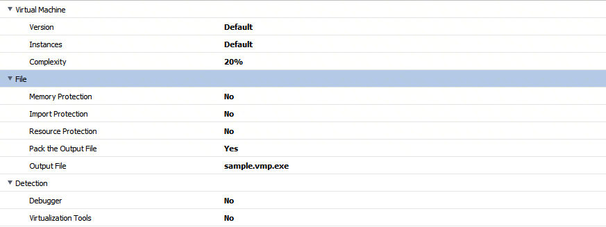
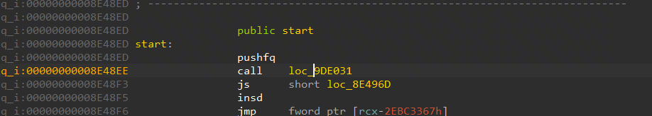
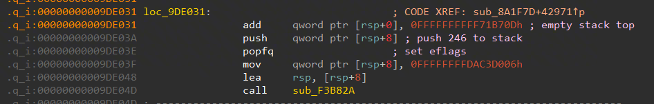

# VMProtect Analysis  
  
尝试分析VMProtect加固，当前分析版本为v3.9.6 Demo  
为方便测试，关闭完整性校验。  
<br>  
  
## IDA API Gist  
  
前期的准备/调研工作，用来支撑后续研究。  
[IDAPython](https://github.com/MG1937/InformalNotes/blob/main/Windows/VMProtect/IDAGist/ida_python_apis.md)  
<br>  
  
## TODO List  
  
- 遍历函数基本块  
	  
  
基于example library里的代码改写即可。  
<br>  
  
- 清除基本块切割指令  
	  
  
vmp主函数的很多基本块均被`jmp $+5`指令切割，但该指令实际上不会改变控制流方向，因此需要配合基本块遍历能力去除这类短跳转，以此重建基本块。  
已完成，Patch后可运行，代码写于`rebuild_bb_erase_jmp5.py`内。  
  
```Python  
import ida_gdl  
import ida_funcs  
import ida_bytes  
import idautils  
  
ea = idc.here()  
f = ida_gdl.FlowChart(ida_funcs.get_func(ea))  
  
erase_jmp_list = []  
  
for block in f:  
    ea = block.start_ea  
    while ea != block.end_ea:  
        insn = idautils.DecodeInstruction(ea)  
        if ida_bytes.get_bytes(ea, insn.size) == b'\xe9\x00\x00\x00\x00':  
            # erase jmp $+5  
            erase_jmp_list.append(ea)  
            print("erase jmp insn in %x" % ea)  
        ea += insn.size  
  
for j in erase_jmp_list:  
    ida_bytes.patch_bytes(j, b'\x90'*5)  
  
print("DONE!")  
```  
  
<br>  
  
- 修改底部分发器  
	  
  
vmp函数控制流图的底部位置，于`0000000140147CB2`处由指令`push rax`以及`retn`负责推入下一个vmp指令处理函数，这明显扰乱了IDA的函数分析，修改为`jmp rax`指令重建分发器。  
  
已完成，Patch后可运行，jmp rax指令字节码为b'\\xff\\xe0'  
  
  
可见重建分发器后，IDA可以根据跳表分析出更多基本块。  
<br>  
  
- 学习SSA for machine code论文  
	- [论文解读 - 在机器码上进行SSA分析](https://github.com/MG1937/InformalNotes/blob/main/SMLNJ/Paper_Analyse/SSA_for_machine_code.md)  
		  
	- SMLNJ MLRISC编译器后端分析  
		  
- TODO 因为工作缘故严重Delay！！！    
<br>  