# VMProtect Analysis

尝试分析VMProtect加固，当前分析版本为VMProtect Professional v3.8.1 Build 1695
为方便测试，关闭完整性校验。
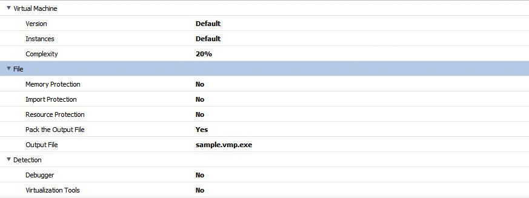
<br>

## Resource

https://bbs.kanxue.com/thread-277117-1.htm
暂时无法在飞书文档外展示此内容
暂时无法在飞书文档外展示此内容
暂时无法在飞书文档外展示此内容
<br>

## VMP Trace

暂时无法在飞书文档外展示此内容
暂时无法在飞书文档外展示此内容
暂时无法在飞书文档外展示此内容
vmp\_trace\_handler.py

```Python
import re
import json
import sys

trace_insn = []

analyse_result = {}

file = sys.argv[1]

with open(file, "r") as file:
    trace_insn = file.read().split("\n")
    file.close()

def get_addr_counter():
    if "addr_counter" not in analyse_result:
        analyse_result["addr_counter"] = {}
    return analyse_result["addr_counter"]

def addr_counter_add(addr):
    if addr.strip() == "":
        return
    if "+" in addr:
        addr = addr.split("+")[0]
        
    addr_list = get_addr_counter()
    if addr not in addr_list:
        addr_list[addr] = 1
    else:
        addr_list[addr] += 1

def get_varaddr_map():
    if "varaddr_map" not in analyse_result:
        analyse_result["varaddr_map"] = {}
    return analyse_result["varaddr_map"]

def varaddr_add(addr, var):
    if var == None:
        return
    varaddr_map = get_varaddr_map()
    varaddr_map[addr] = var

def get_var_from_insn(insn):
    match = re.search("\\b((?:arg|var)_[0-9A-Z]+)\\b", insn)
    if match == None:
        return None
    return match.groups()[0]

# sample: 000082F4        D47B94                          lea     rcx, [r9+2B17B15h]              RCX=000000000C029C09                            
def handle_trace(insn):
    if insn.strip() == "":
        return

    info = insn.split("\t")
    if info[0].startswith("Thread"):
        return # skip banner
    tid = info[0].strip()
    addr = info[1].strip()
    insn = info[2].strip()
    if len(info) > 3:
        value = info[3].strip()
    addr_counter_add(addr)
    varaddr_add(addr, get_var_from_insn(insn))

for i in trace_insn:
    handle_trace(i)

print("done")

with open("./analyze_trace.json", "w") as file:
    file.write(json.dumps(analyse_result, indent=2))
    file.close()
```

<br>

## IDA API Gist

前期的准备/调研工作，用来支撑后续研究。
[IDAPython](https://bytedance.larkoffice.com/docx/RtyAdoM5yo2iFtxnxl2cWEHknPe)
<br>

## Analysis

VMP执行入口位于00000000008E48ED，序言部分进行EFLAGS设置，一般用于配置反调试标记位
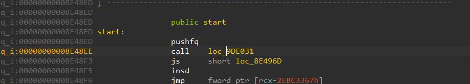
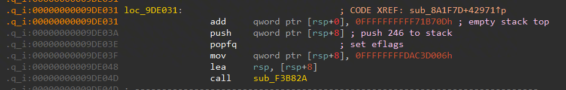
<br>

尝试从trace中找到分发器，猜测vmp指令分发器的结构应该类似方法跳表，vmp解释器在进入指令handler前，一定有某个寄存器存储vmp opcode，通过前置的位运算或者其它运算指令计算出目标handler的地址，随即调用jmp进入handler。那么jmp目标就不能够为固定值，而是不确定的寄存器，否则前置的位运算就没有意义。最终处理出的符合条件的jmp trace列表如下：
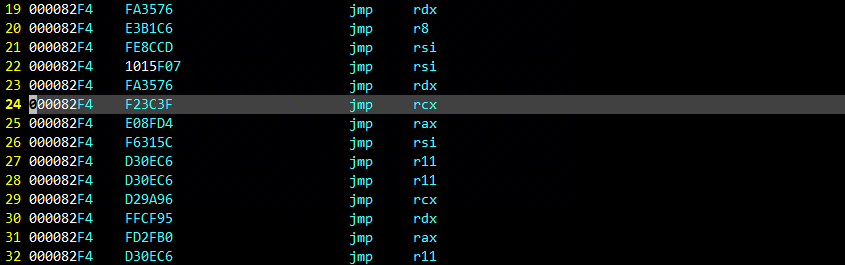
暂时无法在飞书文档外展示此内容
再次大胆猜想，作为指令分发器，它执行前后一定与虚拟机pc以及opcode处理高度关联，因此在虚拟指令相关的大部分执行路径中，分发器一定是出现频率最高的节点之一，并且必然要在整个vmp流图中支配大部分路径，拥有很高的出入度，那么接着通过地址过滤每个jmp指令被执行的次数，结果如下，其中最高频的执行位置为E04260，被执行过203次：
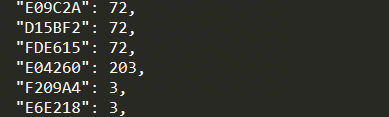
暂时无法在飞书文档外展示此内容
<br>

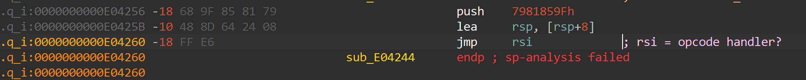
E04260位置的指令是"jmp rsi"，假设此处rsi指向的就是opcode handler，那么如果要执行下一个虚拟指令，一定会从handler再次跳回E04260，经过验证，无论是从trace记录上看，还是直接静态跟踪引用，随机选取的任意opcode handler中，执行流最终都会通过某种方式回到E04260，结果符合预期假设与VMP的设计直觉，此结论也可以反向验证E04260位置的rsi的确指向opcode handler。
<br>

此外，在观察trace时，有部分opcode handler在执行完毕后虽然会跳回E04260位置，但紧接着数百条指令后，执行流在不更新rsi寄存器的情况下又回到E04260，紧接着开始执行大部分相同的指令，中间有部分指令不同，应该是执行了handler内不同的分支，猜测此处是在处理opcode的操作数，因此需要反复回到handler内处理额外操作，同时更新vmp pc，在操作数完全处理完毕后，才会更新rsi。
<br>

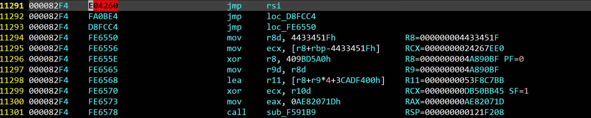
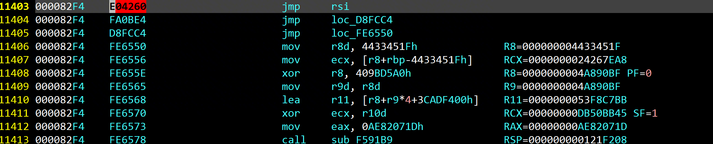
检查vmptrace\_addr.asm中的执行记录，发现11291~11403，以及11403~11515这两段的执行记录中，执行过程均未更新rsi寄存器，且两段执行记录的序言部分均一致，证明两次执行均在同一个opcode handler内执行，并且两段执行记录的指令执行长度均为112，因此猜测大部分执行流未改变。根据理论上设想的vmp结构，如果在同一个handler内反复执行，那么应该在处理操作数，处理过程中应该会额外操作虚拟寄存器/栈/内存空间，接着在该过程前后移动vmp pc，若执行流无较大变化，则可以假设几种情况：

1. 该handler处理操作数以及寄存器的方法较为简单且无额外分支
	
2. 该handler仅仅在移动vmp pc，因此不执行额外分支
	
3. 该handler仅执行了类似push/pop的指令，因此只移动了vmp sp
	

总之，接下来尝试观察这两段trace的diff情况，根据实际情况尝试从中提取额外信息。
<br>

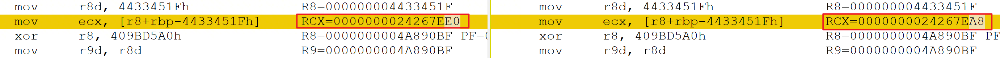
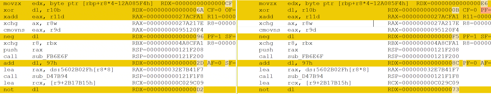
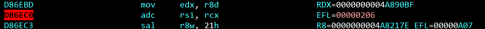
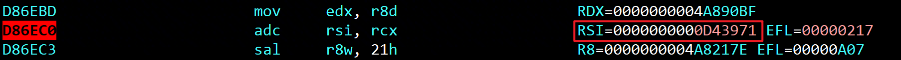
初次diff发现两段执行的主要区别均集中在rsp/rbp参与计算的栈上操作，栈上数据会间接影响其它寄存器，其中最可疑的是rcx与rdx寄存器。前者在12214行指令执行处，也就是在当前opcode handler被反复执行的某一时刻，于handler内的D86EC0地址参与了rsi寄存器的运算，并生成了下一个handler的地址，该位置指令为“adc rsi,rcx”，而在此之前，该位置的指令均未生成新值，rcx的值也未曾发生变化。后者的具体作用暂时比较模糊，但每次该handler被执行，rdx的值均会发生数值上的变化。
结合这两种情况，rdx在每次handler执行均发生改变，而rcx基本不变，仅仅在某一时刻handler准备跳出时发生变化，此时合理的解释应该是当前opcode已经处理结束，所以需要移动到下一个handler进行处理，那么猜测rdx应当会间接影响rcx，而rdx或许与vmp pc相关。
此外，rdx与rcx之间的关联不太明确，这主要是由于栈上操作导致的，当前handler内，二者值的获取与栈上内存相关，栈上内存的写入有时也直接或间接取决于两个寄存器，因此第二个猜测是，vmp应该在栈上维护了某种与执行上下文强相关的数据结构，因此两个寄存器是通过栈上操作间接关联而非直接关联，这是关联模糊的主要原因。
<br>

由于vmp本身做了大量对抗和混淆，导致栈上的内存操作以及类似的寻址操作并不透明，因此为了方便接下来的数据结构分析，首先需要转换栈上变量，再利用trace得到的数据将所有指令内的复杂操作数运算进行简化，例如结合trace数据将“\[rbx+rdi-333248A9h\]”简化为“\[rbx\]”，其中index+disp部分是vmp主动生成的冗余计算，当然并非所有的不透明内存操作都可以直接将冗余计算部分去除，应该结合上下文进行处理，尽可能降低分析成本。详细过程以及简化规则可见Analysis Tips节的“内存操作数简化”。
<br>

# Analysis Tips

本节用以记录分析过程中应对VMP对抗，或者简化分析流程的技巧，本节的内容是分析过程的优化环节，但并非必须环节，因此与分析节区分开来

## 帧栈过大对抗

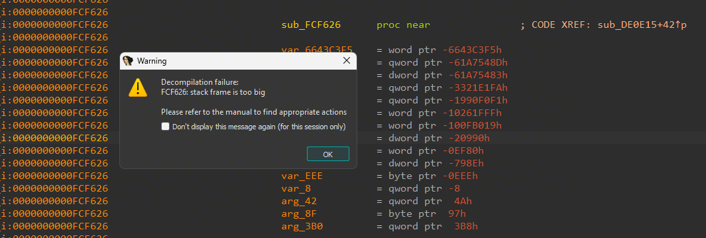
部分方法块无法被ida转化为伪cpp代码且抛异常“stack frame is too big”，这是因为VMP使用了一些技巧让一些非常巨大的数值参与rsp地址的计算，例如指令“movzx ebx, \[rsp+rbp+var\_10261FFF\]”，即便最终实际运行时计算后的rsp地址不会超出栈大小的合理值，但静态分析情况下，ida依然会因此尝试构造一个非常巨大栈空间，随即导致抛错。
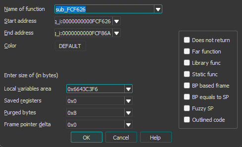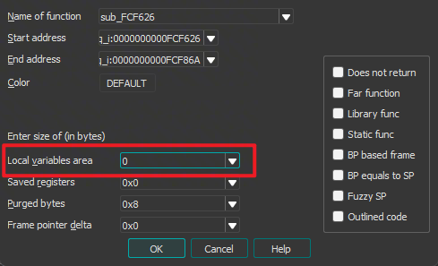

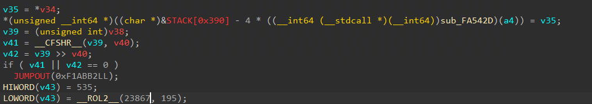
此时可以手动将栈空间设置为0，让一些特意构造的数值不再被识别为栈上变量而参与栈大小计算，从而让ida将指令转换伪代码的过程能够被正常执行。

## 栈上变量转换

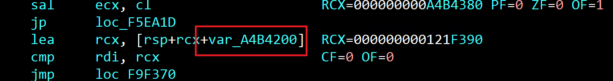
部分有rsp/rbp参与计算的指令，指令操作数中的立即数被IDA转换为栈上变量，不利于trace分析和自动化处理，因此需要写脚本将栈上变量全处理回立即数。首先用vmp\_trace\_handler.py处理出所有带有栈上变量的地址，再利用IDA的脚本执行功能将对应地址的栈上变量转换为16进制数，随后导出trace得到干净的处理记录。
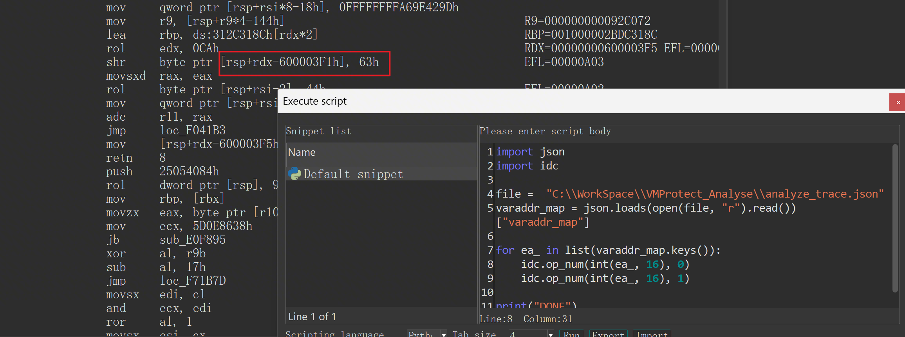

```Python
import json
import idc

file =  "D:\\TempWorkSpace\\WindowSoftwareAnalyse\\VMProtect_Demo_Analysis\\analyze_trace.json"
varaddr_map = json.loads(open(file, "r").read())["varaddr_map"]

for ea_ in list(varaddr_map.keys()):
    idc.op_num(int(ea_, 16), 0)
    idc.op_num(int(ea_, 16), 1)

print("DONE")
```

暂时无法在飞书文档外展示此内容
<br>

## 内存操作数简化

虽然VMP对大部分指令的内存操作进行了混淆，但将所有内存操作数均视为处理对象并不合适，去除冗余计算的初衷是为了方便解析寄存器所指内存或栈上的数据结构，因此有部分操作数并不适合简化，例如当ModRM.mod=11时仅有寄存器或纯内存操作（r/m），这类操作数没有简化意义。而编码格式ModRM.rm=100且满足SIB格式的操作数可以进行部分简化，理由是SIB格式结构清晰，大部分index\*scale结合disp部分的运算几乎可以肯定是VMP控制的冗余计算，简化后余下的base + disp结构基本符合数据结构的分析直觉。在trace得到的6万余次执行中，涉及内存操作数的指令为20804条，而这之中完全符合SIB格式的操作数有17938条，占比达到86%。
<br>

然而，即便操作数符合SIB格式，也不意味着操作数结构一定完全匹配\[base + index\*scale + disp\]，对于这一部分符合SIB格式但结构不清晰的操作数，可以仅提示操作数计算结果但不进行简化处理；以下是根据osdev.org内对ModRM/SIB的描述整理得到的操作数结构表格：https://wiki.osdev.org/X86-64\_Instruction\_Encoding#ModR/M\_and\_SIB\_bytes
SIB格式匹配：`\[(?:((?:r|e)(?:ax|bx|cx|dx|si|di|bp|sp|[8-9]|1[0-5]))\b\+\b((?:r|e)(?:ax|bx|cx|dx|si|di|bp|sp|[8-9]|1[0-5]))\b|[^\]]*\*(?:2|4|8))[^\]]*\]`

```Plain
| ModRM.mod | ModRM.rm | SIB.base | SIB.index | Desc                        |
| --------- | -------- | -------- | --------- | --------------------------- |
| 00        | 100      | ≠101     | ≠100      | base + index*scale          |
| 00        | 100      | 101      | ≠100      | disp32 + index*scale        |
| 00        | 100      | ≠101     | 100       | base                        |
| 00        | 100      | 101      | 100       | disp32                      |
| 01        | 100      | *        | ≠100      | base + index*scale + disp8  |
| 10        | 100      | *        | ≠100      | base + index*scale + disp32 |
```

1. 在匹配得到的SIB格式操作数中，符合以下结构的操作数不做简化处理，也不提示操作数计算结果：
	

- base (mod=00, rm=100, SIB.base!=101, SIB.index=100)
	
- disp (mod=00, rm=100, SIB.base=101, SIB.index=100)
	

2. 在匹配得到的SIB格式操作数中，符合以下结构的操作数做部分简化处理，并提示操作数计算结果：
	

- base + index\*scale (mod=00, rm=100, SIB.base!=101, SIB.index!=100)
	- 简化并提示计算结果
		
- disp + index\*scale (mod=00, rm=100, SIB.base=101, SIB.index!=100)
	- 不简化但提示计算结果
		

3. 在匹配得到的SIB格式操作数中，符合以下结构的操作数进行简化，并提示操作数计算结果
	

- base + index\*scale + disp (mod=01/10, rm=100, SIB.base=\*, SIB.index!=100)
	

<br>

在剔除条件1的情况后，可以得到下面几例正则表达式用来匹配合适的SIB格式操作数
条件2匹配：`(?:[a-z]s\:){0,1}[\d|\w]*(?:h){0,1}\[`
`(?:r|e)(?:ax|bx|cx|dx|si|di|bp|sp|[8-9]|1[0-5])(?:(?:\*[2|4|8])|\+)(?:(?:r|e)(?:ax|bx|cx|dx|si|di|bp|sp|[8-9]|1[0-5])(?:\*[2|4|8]){0,1}){0,1}\]`

- 占比：1276/20804=6%
	

条件3匹配：`\[(?:r|e)(?:ax|bx|cx|dx|si|di|bp|sp|[8-9]|1[0-5])\+(?:(?:r|e)(?:ax|bx|cx|dx|si|di|bp|sp|[8-9]|1[0-5])(?:\*[2|4|8]){0,1})[\+|\-][\d|\w]*[h]{0,1}\]`

- 占比：16661/20804=80%
	

<br>

以上几类特定的SIB格式操作数需要简化处理或提示计算结果，除此之外，部分编码格式为ModRM.rm!=100，且结构为\[base + disp\]的内存操作数也有可能是VMP特意构造的冗余计算，原因在于，这类操作数中有一部分的disp值异常偏大，例如"\[rax-777B9FE5h\]"显然为冗余计算，对于这类操作数，不进行简化处理但提示计算结果。
\[base + disp\]格式匹配：`\[(?:r|e)(?:ax|bx|cx|dx|si|di|bp|sp|[8-9]|1[0-5])[\+|\-][0-9A-F]+[h]{0,1}\]`
经过匹配，该格式的操作数总量为2323个，占全部内存操作数总量的11%，但这之中仍有大部分操作数的disp值在合理范围内，例如"\[rsp+8\]"，这一部分操作数无需简化或提示计算结果，为了排除这类情况，规定仅对disp值超过0xFF的操作数进行处理，最终匹配到480个操作数，占比为2%。
\[base + disp(>0xFF)\]格式匹配：`\[(?:r|e)(?:ax|bx|cx|dx|si|di|bp|sp|[8-9]|1[0-5])[\+|\-][0-9A-F]{3,}[h]{0,1}\]`
<br>

最终，可以进行处理的内存操作数总量为18417个，占比达到88%，其中至少有80%的操作数需要简化冗余计算部分，有8%左右的操作数仅需要进行计算结果提示。
<br>

暂时无法在飞书文档外展示此内容
暂时无法在飞书文档外展示此内容
<br>

- 锚点：20260125，学习并应用抽象解释技术，对trace出的指令结果进行语义优化，尝试在“语义”层面从内存操作数中提取出更多或更清晰的信息，尤其是栈上操作或者特定的数据结构，而非简单化简操作数结构，后者提取出的信息有限且可解释性不足。
	

<br>

# Notes

记录一些额外的想法或者其它人所发表的论文/议题，拓展思路，提供参考

- Virtual Deobfuscator - a DARPA Cyber Fast Track funded effort
	- BHUSA13年的议题，说是把VMP的解释器指令部分全都聚合为“簇”，保留执行结果的同时将“簇”全部抽离，简化执行后利用NASM重新编译回二进制，从而简化分析流程。可行性待研究
		
	- https://media.blackhat.com/us-13/US-13-Raber-Virtual-Deobfuscator-A-DARPA-Cyber-Fast-Track-Funded-Effort-WP.pdf
		

<br>

# Deprecate

以下内容为针对3.9.6 Demo版VMP的部分分析，废弃

## ~~TODO List~~

- ~~遍历函数基本块~~
	

~~基于example library里的代码改写即可。~~ 
<br>

- ~~清除基本块切割指令~~
	

~~vmp主函数的很多基本块均被~~~~`jmp $+5`~~~~指令切割，但该指令实际上不会改变控制流方向，因此需要配合基本块遍历能力去除这类短跳转，以此重建基本块。~~ 
~~已完成，Patch后可运行，代码写于~~~~`rebuild_bb_erase_jmp5.py`~~~~内。~~ 

```Python
import ida_gdl
import ida_funcs
import ida_bytes
import idautils

ea = idc.here()
f = ida_gdl.FlowChart(ida_funcs.get_func(ea))

erase_jmp_list = []

for block in f:
    ea = block.start_ea
    while ea != block.end_ea:
        insn = idautils.DecodeInstruction(ea)
        if ida_bytes.get_bytes(ea, insn.size) == b'\xe9\x00\x00\x00\x00':
            # erase jmp $+5
            erase_jmp_list.append(ea)
            print("erase jmp insn in %x" % ea)
        ea += insn.size

for j in erase_jmp_list:
    ida_bytes.patch_bytes(j, b'\x90'*5)

print("DONE!")
```

<br>

- ~~修改底部分发器~~
	

~~vmp函数控制流图的底部位置，于~~~~`0000000140147CB2`~~~~处由指令~~~~`push rax`~~~~以及~~~~`retn`~~~~负责推入下一个vmp指令处理函数，这明显扰乱了IDA的函数分析，修改为~~~~`jmp rax`~~~~指令重建分发器。~~ 
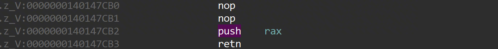
~~已完成，Patch后可运行，jmp rax指令字节码为b'\\xff\\xe0'~~ 
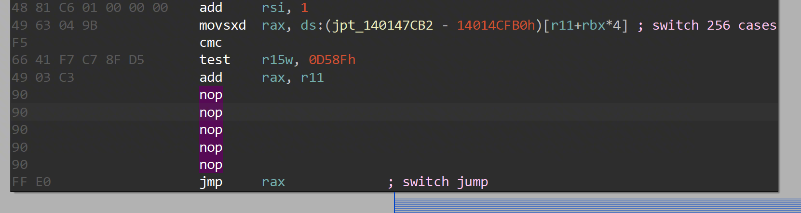
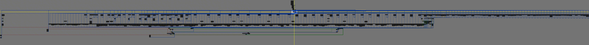
~~可见重建分发器后，IDA可以根据跳表分析出更多基本块。~~ 
<br>

- ~~学习SSA for machine code论文~~
	- ~~[论文解读 - 在机器码上进行SSA分析](https://bytedance.larkoffice.com/docx/BWP5djNVIoExdQxKVGocP7gonBf)~~
		
	- ~~SMLNJ MLRISC编译器后端分析~~
		

<br>

- ~~TODO 因为工作缘故严重Delay！！！~~ 
	

<br>